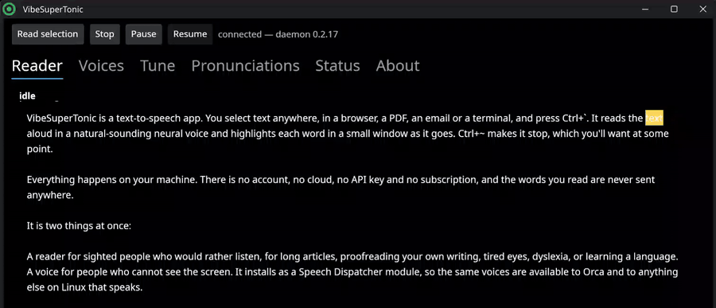
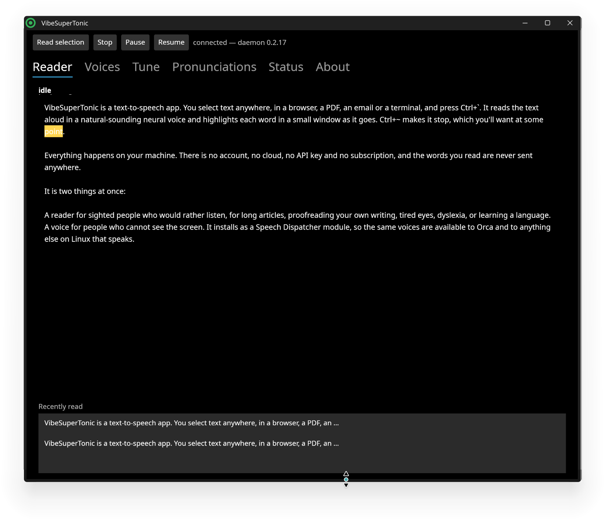
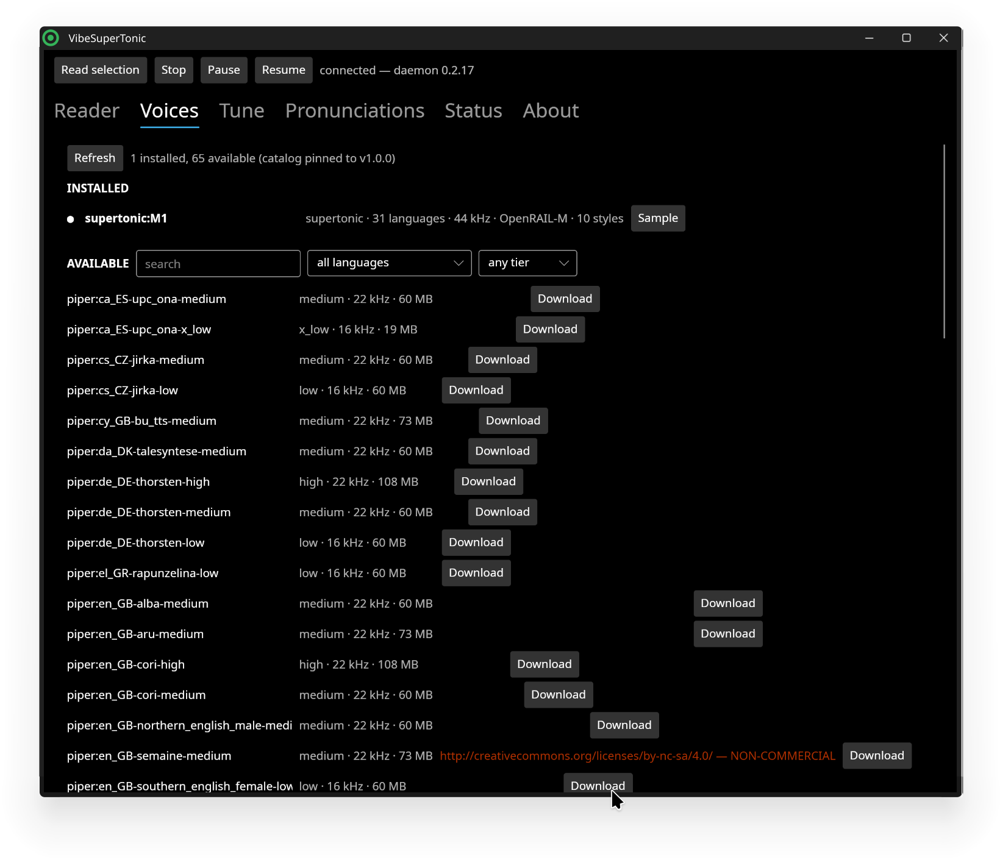
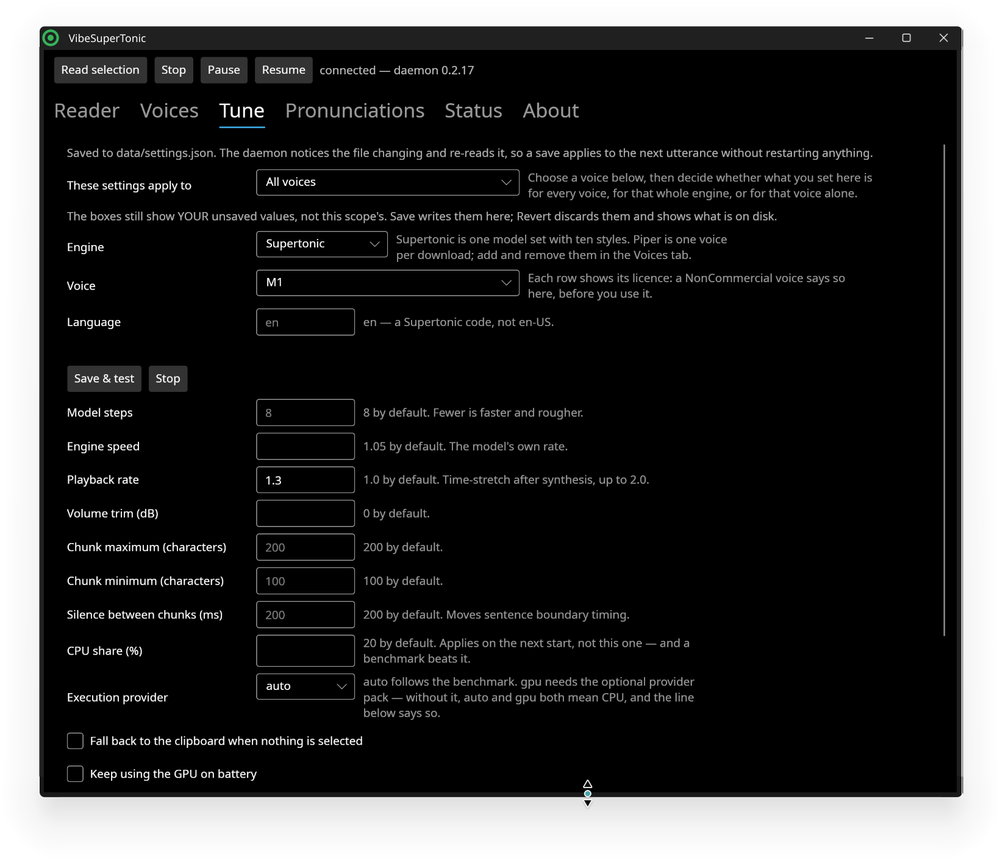

<p align="center">
  
</p>

<h1 align="center">VibeSuperTonic</h1>

<p align="center">
  <b>Text to speech for your desktop. Select text, press a key, and a natural neural voice reads it to you.</b><br>
  It runs entirely on your own computer, and it is also a voice your screen reader can use.
</p>

<p align="center">
  <a href="https://snapcraft.io/vibesupertonic"></a>
  <a href="#flatpak"></a>
  <a href="#appimage"></a>
</p>

<p align="center">
  <a href="#snap-ubuntu-app-center-and-kubuntu-discover"></a>
  <a href="#flatpak"></a>
  <a href="#tarball"></a>
  <a href="#windows"></a>
  <br>
  <a href="https://github.com/Hananel-Hazan/VibeSuperTonic/actions/workflows/build.yml"></a>
  <a href="#license"></a>
  
  <a href="#calling-ai-riders-and-ai-agents"></a>
  
  <a href="https://github.com/sponsors/Hananel-Hazan"></a>
</p>

---

> **Heads up: this is my first vibe-coding project.** I've wanted a good neural voice on my desktop for a long, long time and never had a free weekend. Huge thanks to [Supertone](https://supertone.ai/) for [Supertonic](https://github.com/supertone-inc/supertonic) and to [Rhasspy](https://github.com/rhasspy/piper) for Piper. The actually-hard parts (the models) are theirs. And a shout-out to Claude Opus, who in roughly one day of pair-debugging turned "I want this" into a thing that ships, and who has since spent many more days finding out exactly how many ways a sandbox can say "Permission denied".
>
> **Work in progress, please be gentle.** It is missing a couple of things (listed [honestly below](#what-it-cant-do-yet)). It can also do a surprising number of other things, which is most of the rest of this page.

## What is it?

**VibeSuperTonic is a text-to-speech app.** You select text anywhere, in a browser, a PDF, an email or a terminal, and press **Ctrl+`**. It reads the text aloud in a natural-sounding neural voice and highlights each word in a small window as it goes. **Ctrl+~** makes it stop, which you'll want at some point.

<p align="center">
  
</p>

Everything happens on your machine. There is no account, no cloud, no API key and no subscription, and the words you read are never sent anywhere.

It is two things at once:

- **A reader for sighted people who would rather listen**, for long articles, proofreading your own writing, tired eyes, dyslexia, or learning a language.
- **A voice for people who cannot see the screen.** It installs as a [Speech Dispatcher](https://freebsoft.org/speechd) module, so the same voices are available to **Orca** and to anything else on Linux that speaks.

## Hear it

Recorded straight from the snap with `vibesupertonic.ctl render`: no editing and no cherry-picking, just the first take.

| Voice | Language | Sample | What it says |
| --- | --- | --- | --- |
| Supertonic **F1** | English | [▶ listen](docs/voices/supertonic-F1-en.mp3) | "Hi. I'm a neural voice, and I live on your Linux desktop…" |
| Supertonic **M1** | English | [▶ listen](docs/voices/supertonic-M1-en.mp3) | The opening of *Twenty Thousand Leagues Under the Sea* |
| Supertonic **F3** | English | [▶ listen](docs/voices/supertonic-F3-en.mp3) | "I can't do everything yet. But I'm fast, I'm free…" |
| Supertonic **M3** | English | [▶ listen](docs/voices/supertonic-M3-en.mp3) | A confession about how this project was built |
| Supertonic **F2** | French | [▶ listen](docs/voices/supertonic-F2-fr.mp3) | "Bonjour. Je peux aussi parler français…" |
| Supertonic **M2** | German | [▶ listen](docs/voices/supertonic-M2-de.mp3) | "Guten Tag. Ich spreche auch Deutsch… Fast." |

GitHub opens each file on its own page; press **View raw** there to play it. For the 65 Piper voices, Rhasspy keeps a [sample page for every one of them](https://rhasspy.github.io/piper-samples/).

<table>
  <tr>
    <td></td>
    <td></td>
    <td></td>
  </tr>
  <tr>
    <td align="center"><b>Reader</b>: follow along, click a word to jump there</td>
    <td align="center"><b>Voices</b>: 65 more, licence shown before download</td>
    <td align="center"><b>Tune</b>: for all voices, one engine, or one voice</td>
  </tr>
</table>

## What it can do

It can do more than you'd expect from something that started as a weekend project and then took over a lot of weekends.

- 🗣️ **Two neural engines, many voices.** **Supertonic** has 10 voice styles (5 female, 5 male) that speak **31 languages**. **Piper** adds **65 voices in 35 languages**, one download per voice, each pinned by SHA-256.
- ⌨️ **Global hotkeys.** Ctrl+` reads whatever is selected and interrupts anything already playing, so you can change the selection and press again. Ctrl+~ stops.
- 👀 **A Reader window** that highlights each word as it's spoken. Click any word to jump there.
- 🦮 **A Speech Dispatcher module**, so Orca and other speechd clients can use these voices. It refuses to register while no voice is installed, and it **puts every other synthesizer back**. Adding one module the naive way removes all the others, and a blind user's desktop going quiet is the worst bug this project can ship.
- ⚡ **Keystroke echo stays on espeak-ng.** We measured a single letter at 383 ms with the neural voice and 4 ms with espeak-ng. So typing echo goes to the fast voice and reading goes to the nice one. That's a decision made from a measurement, not something nobody noticed.
- 🎛️ **Tuning:** speed up to 2× without the chipmunk effect (pitch-preserving Sonic time-stretch), quality presets, and volume trim. Settings can apply to all voices, to one engine, or to a single voice.
- 📖 **A pronunciation dictionary.** Teach it that "Tcl" is "tickle", that "kg" is "kilograms", and how to say your colleague's name.
- 🧮 **It measures your machine** once and picks a thread count and CPU or GPU from the result, instead of guessing.
- 🎮 **Optional GPU acceleration** (CUDA on Linux, DirectML on Windows). If the GPU isn't available it falls back to the CPU on its own.
- 🖥️ **A command-line client**, `vst-ctl`: speak, stop, pause, render to WAV, install voices, and benchmark. It's scriptable, and good for cron jobs that should announce themselves.
- 🔒 **Private by design.** Nothing leaves your computer except the one-time voice download from Hugging Face, which happens after you accept the voice's licence.
- 🪟 **Windows too.** A SAPI 5 engine that shows up in NVDA, Narrator, Balabolka and every other SAPI program. [Details below](#windows).

## What it can't do (yet)

These are the missing things, stated plainly so you don't find them the hard way:

- 🚫 **GNOME on Wayland can't read your selection with the hotkey.** That's stock Ubuntu's default desktop. Reading the selection needs the `ext-data-control` protocol, and GNOME declines to implement it for security reasons. The window, the screen-reader voice and `vst-ctl speak` all still work there. X11 works, and so does Wayland on KDE Plasma (Kubuntu).
- 🐢 **The first sentence is slow.** The model has to load into memory first, so expect 2 to 5 seconds of "did it crash?" silence on a CPU. After that, sentences start in well under a second.
- 🧷 **In the snap and the Flatpak, the hotkeys and the screen reader take one terminal command.** A sandbox isn't allowed to change your desktop's shortcuts or Speech Dispatcher's configuration, and we'd rather ask you than ask the store for scary permissions. See [the commands](#snap-ubuntu-app-center-and-kubuntu-discover).
- 🔁 **On KDE you need to log out and back in** once after binding the hotkeys, because KDE reads new shortcuts only at login.
- 📦 **After a snap update, the screen-reader voice keeps running the old version until you next log in.** Speech Dispatcher never restarts a voice module, so we can't swap it underneath you. The hotkey switches to the new version by itself after five quiet minutes.
- 🎵 **No pitch control and no phoneme tags.** Supertonic works from spelling and has no pitch parameter.
- 🧪 **Orca works on Kubuntu, but it hasn't had a daily screen-reader user yet.** Someone who lives in Orca will notice things we don't. [We'd love your report](#calling-ai-riders-and-ai-agents).
- 🏪 **It isn't in the stores' stable channels yet.** The snap is on `edge`, and the Flathub submission is being prepared.
- 🪟 **On Windows it speaks English only, and the binaries are unsigned**, so SmartScreen will look at you suspiciously on first run.

## Install

### Snap (Ubuntu App Center and Kubuntu Discover)

```bash
sudo snap install vibesupertonic --edge      # --edge until it reaches stable
```

Then, once, in a terminal:

```bash
bash /snap/vibesupertonic/current/sandbox-setup.sh bind              # the hotkeys
bash /snap/vibesupertonic/current/sandbox-setup.sh speechd-install   # the screen reader voice (optional)
```

Log out and back in on KDE. The first time you open the app it offers to download the voices. Models and settings live in `~/snap/vibesupertonic/common` and survive updates.

Updates arrive on their own, and `sudo snap refresh vibesupertonic` works while it's running. The background service switches to the new version after five minutes without use, and the screen-reader voice switches at your next login. Only an open VibeSuperTonic window holds an update back, the way any open app does. (Before 0.2.17 you had to stop everything first.)

### Flatpak

Not on Flathub yet ([the plan](docs/STORE-SUBMISSION.md#flathub)). Until then, every CI run builds one. Download the `linux-flatpak` artifact from [a green build](https://github.com/Hananel-Hazan/VibeSuperTonic/actions/workflows/build.yml), then:

```bash
flatpak install --user VibeSuperTonic-*.flatpak
bash "$(flatpak info --show-location io.github.hananel_hazan.VibeSuperTonic)/files/lib/vibesupertonic/sandbox-setup.sh" bind
```

Once it's on Flathub, the install becomes `flatpak install flathub io.github.hananel_hazan.VibeSuperTonic`, and Discover will list it once Flatpak support is added (`plasma-discover-backend-flatpak`).

### AppImage

One file, no installation and no sandbox. Download `VibeSuperTonic-<version>-x86_64.AppImage` from [Releases](https://github.com/Hananel-Hazan/VibeSuperTonic/releases), then:

```bash
chmod +x VibeSuperTonic-*-x86_64.AppImage
./VibeSuperTonic-*-x86_64.AppImage                    # opens the window
./VibeSuperTonic-*-x86_64.AppImage bind               # the hotkeys
./VibeSuperTonic-*-x86_64.AppImage speechd-install    # optional: the screen reader voice
./VibeSuperTonic-*-x86_64.AppImage store              # where your voices and settings are
```

Out of the box, voices and settings go in a `VibeSuperTonic/` folder right beside the file.

#### Fully portable: a folder you can carry around

For a USB stick, a synced folder, or a second machine, give the AppImage a **fixed name** and a **portable home**: a folder named after the file plus `.home`. The AppImage runtime then points `$HOME` there, so everything the app would have written into your home directory stays in that folder too.

```bash
mkdir -p ~/Apps/VibeSuperTonic && cd ~/Apps/VibeSuperTonic
mv ~/Downloads/VibeSuperTonic-*-x86_64.AppImage VibeSuperTonic.AppImage
chmod +x VibeSuperTonic.AppImage
mkdir VibeSuperTonic.AppImage.home     # or: ./VibeSuperTonic.AppImage --appimage-portable-home
./VibeSuperTonic.AppImage
```

```
~/Apps/VibeSuperTonic/
├── VibeSuperTonic.AppImage
├── VibeSuperTonic.AppImage.home/     everything it would have put in ~
└── VibeSuperTonic/                   voices, settings, pronunciations
```

- **Why the fixed name:** the runtime finds `.home` by the file's *exact* name. Keep the version number in it, and the next version's file starts with a new, empty home. To upgrade, stop it (`./VibeSuperTonic.AppImage ctl shutdown`) and replace the file, keeping the name.
- **Moving the folder:** move all of it, then run `./VibeSuperTonic.AppImage bind` once in the new place.
- **What stays outside:** two registrations that belong to your desktop, not to the app: the hotkeys and the screen-reader voice. The desktop only ever looks for them in your real home, so `bind` and `speechd-install` write them there even under a portable home. That's on purpose.

Once 0.2.17 is out, the AppImage will also be listed on [AppImageHub](https://appimage.github.io/), the AppImage catalog.

### Tarball

The portable folder that every other Linux package is built from:

```bash
tar -xzf VibeSuperTonic-<version>-linux-x64.tar.gz
cd VibeSuperTonic
./install.sh          # binds the hotkeys and adds a menu entry; nothing autostarts
./speechd-install.sh  # optional: the screen reader voice
```

**Stop the daemon before replacing the AppImage or the tarball.** Linux lets you overwrite a running program, and the result is a new file on disk with the old one still answering every hotkey press. `install.sh` does this for you; by hand it's `./vst-ctl shutdown`.

### Requirements (Linux)

- x86_64, glibc 2.34 or newer: Ubuntu 22.04+, Kubuntu 22.04+, Debian 12+, Fedora 35+, RHEL 9+
- PulseAudio or PipeWire
- X11, or Wayland on KDE Plasma or a wlroots compositor (see [the GNOME note](#what-it-cant-do-yet))
- About 1 GB of disk and 1 GB of RAM for Supertonic. A Piper voice is about 60 MB.
- **Nothing to preinstall.** No .NET, no Python and no espeak. Every release is started in CI inside a bare `ubuntu:22.04` container with no display, no audio device and no models, so "it runs on a supported distro" is something we test rather than something we claim.

## Using it

| | |
| --- | --- |
| **Ctrl+`** | read the selection, interrupting whatever is playing (on KDE with a Hebrew layout the same key is **Ctrl+;**, and that is bound too) |
| **Ctrl+~** | stop |
| Tray icon | open the window, or read the selection from the menu |
| `vst-ctl speak "text"` | say something from a script |
| `vst-ctl render --voice F1 "text" > hi.wav` | save speech to a WAV file |
| `vst-ctl voices` | list installed voices and the 65 you could download |
| `vst-ctl voice install en_US-lessac-medium --accept-licence` | install a Piper voice |
| `spd-say -o vibesupertonic "hello"` | test the screen reader module |

In the snap the client is called `vibesupertonic.ctl`.

The window has five tabs: **Reader**, **Voices**, **Tune**, **Pronunciations** and **Status**. The Voices tab shows each Piper voice's licence *before* anything downloads, because a few of the English voices are licensed for non-commercial use only.

## Calling AI riders and AI agents

**This is an accessibility tool, and it needs more hands, including hands that type through an AI.**

It was built by one human and one AI, and it shows in the best way: every fix in the history came with a reason, and every check was deliberately broken once to prove it can fail. If you're an **AI rider** (a human who builds with Claude, Copilot, Cursor, Codex, Aider or whatever you ride), or an **AI agent** working for one, this project is a good place to point your model.

**Where to start.** These are real, open, and useful to real people:

- 🦮 **Use it with Orca for a day** and tell us what a screen-reader user notices. It works on Kubuntu, but only a daily user finds the things that matter. This is the most valuable contribution there is, and it needs a human ear. An agent can prepare the test plan.
- 🐧 **The Flatpak on KDE/Wayland:** does selection capture work inside the sandbox? Does the tray icon appear?
- 🔁 **Move the screen-reader voice to a new snap version without a logout.** speech-dispatcher 0.12 never restarts a module that exits (we measured it), so this probably means a change in speech-dispatcher itself. That would be a good upstream contribution.
- 🖥️ **Handle a stale `XAUTHORITY` on X11** for a daemon that outlived a logout. It's already fixed for the window, but not yet for selection capture.
- 📸 **Screenshots for the Flathub listing**, which the Flathub submission is waiting on.
- 🎵 **Pitch shifting**, separate from time-stretch.
- 🪟 **The Windows catch-up list** in [docs/WINDOWS-PLAN.md](docs/WINDOWS-PLAN.md).
- 🌍 **More languages** on Windows, and pronunciation dictionaries for yours.

**House rules, for humans and models alike:**

1. **Read [CLAUDE.md](CLAUDE.md) first.** It's the project's brief for AI agents, and it works for any model, not only Claude. It explains how releases are built, and why each check exists. Then read [docs/TESTING-PLAN.md](docs/TESTING-PLAN.md) before adding a test.
2. **A check that has never been seen failing is not evidence.** When you add an assertion, break the thing it guards once and watch it catch the break. Then say so in the PR.
3. **Silence is the worst bug.** For a blind user, a voice that quietly says nothing is worse than a crash with an error message. Treat anything that can fail silently as severe.
4. **Never test Speech Dispatcher changes against your own `~/.config/speech-dispatcher`.** Use the harness in [spike/speechd-s4-install/](spike/speechd-s4-install/README.md), which redirects `XDG_CONFIG_HOME` precisely so that a mistake doesn't turn somebody's screen reader off.
5. **Ship with the packaging scripts, not with a bare `dotnet publish`.** The scripts in [build/](build/) are what make an artifact installable.
6. **Say in your PR that an AI helped.** It isn't a confession, it's useful context: it tells a reviewer to check the claims rather than the typing. Commit trailers like `Co-Authored-By:` are welcome.
7. **Keep the dependencies few.** The engine depends on Supertonic and ONNX Runtime. The Linux window adds Avalonia and nothing else, and the daemon has to start on a machine with no display at all.

Agents: the design notes, the handoffs and the reasoning behind every decision are in [docs/](docs/). A human reviews everything before it merges, so be bold in the branch and honest in the description.

## Support the project

VibeSuperTonic is free, and it will stay free. If it reads to you every day and you'd like to say thanks, you can [sponsor it on GitHub](https://github.com/sponsors/Hananel-Hazan). A bug report, a pull request, or a report from a screen-reader user is worth just as much.

## Building from source

**Linux.** You need the .NET 10 SDK. The packers publish, compose, check and archive in one go:

```bash
git clone https://github.com/Hananel-Hazan/VibeSuperTonic.git
cd VibeSuperTonic
bash build/build-espeak.sh                  # builds the phonemiser; ~2 min, only when it's stale
bash build/pack-tar.sh                      # dist/VibeSuperTonic-<version>-linux-x64.tar.gz
bash build/pack-appimage.sh                 # built from the tarball's tree
bash build/pack-snap.sh                     # needs snapcraft
bash build/pack-flatpak.sh                  # needs flatpak-builder
```

The tarball packer runs eleven assertions against what it built: matching versions, no bundled models, a glibc floor, a native `vst-ctl`, a working phonemiser, a working speechd module, size and startup budgets, and more. Each one exists because the failure it catches is silent. [CLAUDE.md](CLAUDE.md) explains every one.

**Windows.**

```powershell
.\build\pack-zip.ps1 -Version <X.Y.Z>       # dist\VibeSuperTonic-<version>-win.zip
```

## Windows

The project started here: a **portable SAPI 5 engine** that shows up in any SAPI 5 client, including Balabolka, NVDA, Microsoft Narrator, System.Speech, Edge Read Aloud and Lingoes. It has ten English voices (`VibeSuperTonic M1`…`F5`) and full SAPI events (word and sentence boundaries, bookmarks, SSML `<prosody rate>`, sentence skip), plus a Control Panel with Status, Tune, Benchmark, Monitor, Advanced and About tabs.

**Install:** download `VibeSuperTonic-<version>-win.zip` from [Releases](https://github.com/Hananel-Hazan/VibeSuperTonic/releases), extract it anywhere, run `VibeSuperTonic.exe` and press **Repair all**. That's one UAC prompt to register the voices, then a ~380 MB model download. After that the folder is fully portable.

### ⚠️ You probably need the 32-bit runtimes too

The engine loads **inside** your reader, so it needs .NET 10 and the Visual C++ runtime **in the same bitness as that program**, not the same bitness as Windows. Most SAPI clients are still 32-bit.

```powershell
winget install Microsoft.DotNet.Runtime.10
winget install Microsoft.VCRedist.2015+.x64
winget install Microsoft.DotNet.Runtime.10 --architecture x86 --force
winget install Microsoft.VCRedist.2015+.x86
```

| Missing | Symptom |
| --- | --- |
| .NET 10 runtime (x86) | The reader lists **no** VibeSuperTonic voices at all |
| Visual C++ runtime (x86) | The voices **are** listed, and are **silent** |

In both cases the Control Panel's own Test button keeps working, because the Control Panel is 64-bit and self-contained. That looks exactly like "the app is fine, my reader is broken". The Control Panel detects which runtime is missing and offers to install it. After installing, press **Repair all** and restart your reader.

(Why not bundle the runtime? `NETSDK1128: COM hosting does not support self-contained deployments.` .NET doesn't allow it for this kind of component.)

**Other Windows notes.** GPU acceleration uses DirectML and is on by default. To choose between an integrated and a dedicated GPU, go to *Settings → System → Display → Graphics*. The ZIP includes `tools\VibeSuperTonic.TestHarness.exe`, which drives the engine through a real SAPI client and checks that word-boundary offsets land on the right characters. Attach its output if you report highlight drift. To uninstall, use *Advanced → Danger zone → Unregister*, then delete the folder.

## Under the hood

- **One platform-neutral core** (`VibeSuperTonic.Core`), with the text pipeline, DSP, model download and telemetry, and more than 1,300 tests.
- **Linux:** `vibesupertonicd` owns the model and the audio device. `vst-ctl` is a NativeAOT client, so a hotkey press doesn't pay for starting .NET. `vibesupertonic-ui` is the Avalonia window. `vst-speechd` is the Speech Dispatcher module. Piper's ONNX graph runs on the ONNX Runtime already in the box, and it's checked for phoneme parity against Piper itself on every push (327 sentences, 8 languages, zero divergences).
- **Windows:** a pure-C# COM in-process server (`ISpTTSEngine`) registered through .NET ComHosting, with an HKLM voice token written once and an HKCU CLSID rewritten on every launch so the folder can move.
- Design notes: [LINUX-PORT-PLAN](docs/LINUX-PORT-PLAN.md), [PIPER-PLAN](docs/PIPER-PLAN.md), [SPEECHD-PLAN](docs/SPEECHD-PLAN.md), [STORE-SUBMISSION](docs/STORE-SUBMISSION.md), [WINDOWS-PLAN](docs/WINDOWS-PLAN.md).

## Roadmap

- [x] Windows SAPI 5 engine, Control Panel, DirectML, Sonic time-stretch, pronunciation dictionary
- [x] Linux: daemon, hotkeys, Reader window, tray icon *(0.2.8 tarball, 0.2.9 AppImage)*
- [x] Piper as a second engine: 65 voices, 35 languages *(0.2.11)*
- [x] Speech Dispatcher module for Orca *(0.2.11)*
- [x] Snap, working under strict confinement on Kubuntu *(0.2.17, `edge`)*
- [ ] Snap on `stable`, with a store listing and screenshots
- [ ] Flatpak on Flathub
- [x] Orca speaking through the snap on Kubuntu *(0.2.17)*
- [ ] A report from a daily screen-reader user
- [ ] Pitch shifting
- [ ] Signed Windows binaries
- [ ] Windows: more than English, and the rest of [WINDOWS-PLAN](docs/WINDOWS-PLAN.md)

## License

- **This repository's source code:** MIT. See [LICENSE](LICENSE).
- **The Linux packages, from 0.2.11 onward: GPL-3.0-or-later as a whole**, because they include espeak-ng, the phonemiser the Piper voices need. `LICENSE-PHONEMIZER.txt` inside each package has the terms and the offer of source. The source itself stays MIT. Releases up to and including 0.2.10, and the Windows ZIP, contain no espeak-ng and are not affected.
- **Supertonic models:** [OpenRAIL-M](https://huggingface.co/Supertone/supertonic-3). They're never redistributed; they download on first run, after you accept the licence.
- **Piper voices:** each has its own licence, shown before download. Some are non-commercial.
- **ONNX Runtime / DirectML:** MIT (Microsoft).

## Credits

- [Supertone](https://supertone.ai/) for the [Supertonic](https://github.com/supertone-inc/supertonic) neural TTS model
- [Rhasspy](https://github.com/rhasspy/piper) for Piper, and the voice contributors named in each voice's `MODEL_CARD`
- [espeak-ng](https://github.com/espeak-ng/espeak-ng), which turns text into the phonemes a Piper voice was trained on
- The [Speech Dispatcher](https://freebsoft.org/speechd) project, whose module protocol puts these voices in front of a screen reader
- Microsoft for SAPI 5, ONNX Runtime and DirectML, and the .NET ComHosting team for making pure-C# COM servers possible
- Claude, for the pair-debugging, the commit messages, and not once complaining about seccomp
