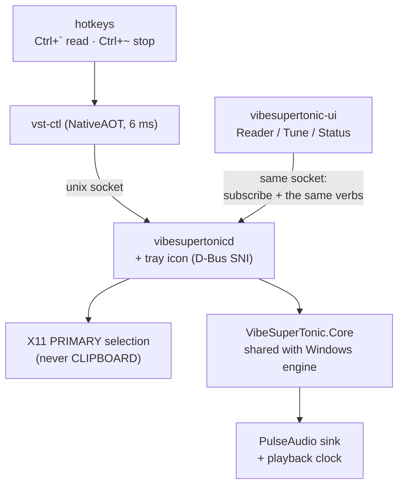

# VibeSuperTonic on Mint — port plan

Status: **Phases 0–5 done, the five seam fixes are done, the silent-daemon defect
is fixed, and [8a — `vst-ctl benchmark`](#phase-8a) landed 2026-08-16.**
**[Phase 6](#phase-6) is done — 2026-08-18.** The `vibesupertonic-ui` window,
the Reader, the tray icon on rung 1, both settings writers and the first-run
screen, with every exit criterion verified on hardware
([the record](#phase-6-landed)). It also closed the hole Phase 7 was carrying:
**the models download on Linux now**, through Core's own downloader, behind the
licence acceptance.
**[Phase 7](#phase-7) is done — 2026-08-22**: `build/pack-tar.sh`, `install.sh`,
and a 51 MB tarball verified by extracting it and running what came out.
**[Phase 8b](#phase-8b-landed) is done — 2026-08-24, and with it the port.** Its
gated GPU spike passed by a mile — first audio **802 ms → 77 ms** on an RTX
A2000 — so CUDA is a shipped path behind an opt-in 3.1 GB provider pack, the
daemon changes provider between utterances (on battery, on a setting, on a fresh
benchmark) without restarting, and the Tune tab's benchmark button is wired.
956 Core tests. See [What to do next](#next).

**The port is done; two more Linux phases follow it, and neither is a port.**
Decided 2026-08-24 with the user. This branch was rebased onto the Windows-side
work the same day (`origin/Dev` — [WINDOWS-PLAN.md](WINDOWS-PLAN.md), W0–W2),
which moved `BenchmarkStore`, `Measurement`, `ModelSet` and `BenchSwitches` into
Core and stamps `<VstVersion>` on every assembly in the tree. 956 tests green
after the rebase, 897 of them ours.

- **[Phase 9](#phase-9) — an AppImage beside the tarball.** Both artifacts, not
  one. It is a phase rather than a packer edit because it defeats the invariant
  the whole product is built on: *everything lives beside the executable*.
- **Piper as a second engine** — its own document,
  [PIPER-PLAN.md](PIPER-PLAN.md), written 2026-08-19 and given its settled
  decisions 2026-08-24. Nothing in it starts before Phase 9 ships.

**The target machine changed underneath this document on 2026-08-22, and two of
its assumptions died with it.** It was reinstalled as **Ubuntu 26.04 / KDE Plasma
6.6.6 / Wayland**, with no X11 session available at all. Cinnamon's `gsettings`
keybinding schema does not exist there — and, the expensive one, **a native
Wayland client's selection never reaches X11 PRIMARY**, so `X11SelectionSource`
was blind to every application on that desktop except one Electron app. Both are
fixed: `build/keybindings.sh` grew a KDE backend, and the daemon grew
`WaylandSelectionSource` on ext-data-control-v1. [The record](#kde-wayland).

**The Windows product was re-verified on real hardware 2026-08-17 and nothing the
Mint work did has reached it** — build, both RID publishes, 881 Core tests and all
eleven TestHarness steps green against a freshly built COM engine **in both
bitnesses**, on a physical Windows 11 box rather than the VM. Three things changed
as a result: the **32-bit engine has been executed at last**, by anything, ever
([how](#x86-executed)); **DirectML is no longer unexercised** ([trap 14](#traps));
and a Windows-side upgrade gap turned up that nothing had looked for
([trap 16](#traps)). [The record](#windows-check).

The completed record — build notes, every measurement, the defect accounts, the
full review write-ups — is in
[LINUX-PORT-ARCHIVE.md](LINUX-PORT-ARCHIVE.md). **Everything that still binds
future work is in this file.** Needing the archive to make a decision is a bug
in this document; fix it here rather than reading there twice.

**Windows work now has its own plan — [WINDOWS-PLAN.md](WINDOWS-PLAN.md), started
2026-08-19.** The trigger was 8a: the Linux side measures its thread count per
machine and the shipping platform still guesses, which is the first time this port
has left the product it was ported *from* behind. That document also inherits the
Windows convergence, which was written [here](#convergence) and should not have
been. This file keeps only what binds Linux work.

Port target is Linux Mint. The Windows product integrates with SAPI; the Linux
product does not integrate with anything. It is a background daemon with a
global hotkey that speaks whatever text you have highlighted, a separate window
you can open to follow along, and a CLI that can do everything the window can.

Deliberately **not** a speech-dispatcher module — analyzed and deferred in
[Non-goals](#non-goals-for-v1).

Written 2026-08-14; last worked 2026-08-17.

---

<a name="decisions"></a>

## Decisions — settled. Do not re-litigate these

Each was decided by the user after using the product, or measured. Each is cheap
to reverse by accident and expensive to reverse on purpose. A phase that finds
itself arguing with one of these has misunderstood it — check the archive link
before changing it.

| Decision | What it means in practice |
| --- | --- |
| **The product is portable** | All state lives beside the executable. No XDG *data* path is used anywhere. Phase 4b specified `$XDG_CONFIG_HOME` and was wrong — [the correction](LINUX-PORT-ARCHIVE.md#portable) |
| **Two keys, and the primary one always speaks** | Ctrl+backtick reads the selection *now*, interrupting anything playing — it never means stop. Ctrl+tilde stops, from any state. The one-key press-to-speak/press-again-to-stop contract survives only as the `toggle` verb, for the tray — see [the hotkey contract](#the-hotkey-contract) |
| **The UI is its own process** — 2026-08-16 | `vibesupertonic-ui`, not a window inside the daemon. It is the Linux convention (PipeWire/`pavucontrol`, NetworkManager/`nm-applet`, CUPS, systemd) and the only shape that keeps the daemon startable with no display. See [Phase 6, decision 1](#phase-6-pass2) |
| **CLI and GUI at parity** — 2026-08-16 | Anything the window can do, `vst-ctl` can do, through the *same verb*. The GUI never gets a private path to the daemon. This is [R-1](#constraints) restated as a product rule |
| **Nothing autostarts** — 2026-08-16 | No entry in `~/.config/autostart`. The daemon starts on the first hotkey press via [R-5](LINUX-PORT-ARCHIVE.md#r-5); the UI starts only when the user opens it. Consequence accepted: **no tray icon until first use** — [the arrangement](#startup) |
| **The daemon owns the tray icon** — 2026-08-16 | It has to exist while the UI is closed. StatusNotifierItem is D-Bus, not X11, so this does not cost the daemon its headless property — but it must subscribe to the event stream like any other client, never read pipeline state directly |
| **A first-run window, triggered by "no models present"** — 2026-08-16 | One screen carries the OpenRAIL-M acceptance, the model download, and the explanation that the daemon self-starts from now on. No marker file: the folder may be read-only |
| **One version for all three binaries** — 2026-08-16, **widened to every binary 2026-08-19** | `vibesupertonicd`, `vibesupertonic-ui` and `vst-ctl` share `<VstVersion>`. The packer **publishes all of them from source in one run and asserts the versions match** — the guard is against a stale binary surviving in an output folder, which is the same hazard the win-x86 and native-ELF assertions already cover. `Directory.Build.props` now stamps it on the **Windows** assemblies too, which it never did: 0.2.8 shipped a Control Panel whose About tab read `1.0.0.0`. See [W0](WINDOWS-PLAN.md#w0) |
| **Configuration is a file, not a verb** | There is deliberately no `config set`: the UI writes `settings.json`, the daemon only reads it, so there is exactly one writer and no concurrency story. The CLI equivalent is editing the file — the daemon picks it up on mtime with nothing sent. Parity above is about *actions*, and this is the one stated exception |
| ~~**First Linux release is 0.3.0** — 2026-08-16~~ **Superseded 2026-08-24** | The number is shared with Windows and Windows spent it: `<VstVersion>` is already **0.2.8**, which shipped there. So the three releases now in front of us are **0.2.8 — the Linux tarball**, **0.2.9 — [the AppImage](#phase-9)**, **0.3 — [Piper](PIPER-PLAN.md)**. The rule underneath is unchanged: the user decides the bump, the packer is told the number, and `<VstVersion>` is updated *after* the release ships, per [CLAUDE.md](../CLAUDE.md) |
| **Two Linux artifacts, permanently** — 2026-08-24, by the user | The tarball **and** an AppImage. The tarball stays the canonical one — `install.sh`, the GPU pack and all five packer assertions are verified against it, and a headless or server install has no use for a single-file GUI bundle. The AppImage is what a person downloads. Neither is allowed to become the only one that is tested |
| **`InterChunkSilenceMs` is implemented, not dropped** — 2026-08-16 | Windows parity. It changes chunk timing and therefore boundary scheduling, so it landed *before* Phase 6 and the highlight is verified once, not twice. **Built the same day**; the gap is written through the same paced, cancellable, clocked path as speech, and counted into the stream position before the next chunk is planned — which is the half that would otherwise have made every boundary early |
| **The benchmark is a verb first, a button later** — 2026-08-16 | **The verb shipped 2026-08-16** and works headless. The Tune tab ships the control disabled with a note, and wiring it to this same verb is an [8b](#phase-8) exit criterion — the parity rule does not allow a dead button to ship in v1 |
| **Core takes zero `PackageReference`s** | The DirectML and CPU builds of ORT ship the same managed assembly name with different managed API surfaces. A hard constraint, not a preference — [R-13](#constraints) |
| **Way 2 is the shipping shape** | Its [gate](#the-gate) opened 2026-08-16 and is deliberately not taken until after v1 |
| **Lazy model load is the default**, `--preload` is a flag | The daemon acknowledges in 28 ms either way, so the tray has something to react to immediately |
| **Linux never writes — or reads — `UseDirectML`, `DirectMLDeviceId`, `OnnxThreads`** | Phase 0 measured any manual thread value as ~2x worse on Linux. The Tune tab must not offer threads as a knob. **Superseded 2026-08-16 by [8a](#phase-8a)**, which replaced the guess with a per-machine measurement in `data/benchmark.json` — still not a knob, and now not a guess either |

---

<a name="where-to-pick-up"></a>

## Where to pick up

### Status by phase

| Phase | State |
| --- | --- |
| 0 · Prove the model runs | **Done.** RTF 0.193 vs a ≤ 0.5 gate; ~25% faster than Windows. [Record](LINUX-PORT-ARCHIVE.md#phase-0) |
| 1 · Extract Core | **Done, gate fully cleared 2026-08-16** when CI ran Core.Tests on Windows. 14 files in Core, TestHarness all-green, R-2 and R-14 verified. Two optional items left — `SpeechSession` and `Onnx.DirectML`, both in [the convergence](#convergence). [Record](LINUX-PORT-ARCHIVE.md#phase-1) |
| 2 · Audio + playback clock | **Done.** Worst clock residual 24.2 ms over two minutes vs an 80 ms gate, no accumulation; stop flushes in 0.6 ms. [Record](LINUX-PORT-ARCHIVE.md#phase-2) |
| 3 · Daemon + IPC | **Done.** Acknowledge 28 ms, stop 40 ms vs a 100 ms budget, auto-start 228 ms. First-audio criterion restated against measurement. [Record](LINUX-PORT-ARCHIVE.md#phase-3) |
| 4 · Selection capture | **Done 2026-08-16.** PRIMARY capture works, including from a daemon with no `$DISPLAY`; R-9 cap measured; the four-application sweep passes, plus Brave. One documented limit: an in-frame viewer that never claims PRIMARY — `Ctrl+C` then the hotkey. [Record](LINUX-PORT-ARCHIVE.md#phase-4-apps) |
| 4b · Linux host config | **Done 2026-08-15.** Portable data layout, pronunciation rules applied at last, `reload` + `config`, the DSP stage. One gap left and now scheduled: `InterChunkSilenceMs`. [Record](LINUX-PORT-ARCHIVE.md#phase-4b-built) |
| 5 · Hotkeys | **Done 2026-08-15, in daily use.** `build/keybindings.sh`; bind / re-bind / conflict / unbind verified against Cinnamon 6.6.9. [Record](LINUX-PORT-ARCHIVE.md#phase-5-built) |
| — · Audio-device loss | **Fixed 2026-08-16.** A daemon whose audio server restarted stayed silent forever, invisibly. Detected, recovered and logged. [The record](#audio-loss) |
| — · Seam fixes before 6 | **Done 2026-08-16.** All five: notice on the stream, `[JsonExtensionData]`, the daemon log, the PRIMARY measurement (**R-6 does not fire**), `InterChunkSilenceMs`. Plus one crash found while verifying. [The record](#seam-fixes) |
| — · Windows regression check | **Clean 2026-08-17**, on physical Windows for the first time. No Linux change reaches the Windows product; **x86 engine executed at last** and green; DirectML exercised at last; one upgrade gap found. [The record](#windows-check) |
| — · `vst-ctl` crashed on a flag with no verb | **Fixed 2026-08-18.** `vst-ctl --version` — or any mistyped flag — indexed an empty array after the options were filtered out, and a NativeAOT binary turns that into SIGABRT, a core file and exit 134. Now one sentence on stderr, the usage, and exit 2: the same refusal shape the daemon's over-long socket path was given |
| 8a · `vst-ctl benchmark` | **Done 2026-08-16.** The sweep, the profile, the verb, and `config`'s provenance. Two guards were wrong on first contact with a real machine and both are fixed. [The record](#phase-8a) |
| 6 · App + tray | **Done 2026-08-18.** Window, Reader, tray (rung 1 held), Tune and Pronunciations as writers, and the first-run screen — which downloads the models. Every exit criterion verified on hardware; one D-Bus trap cost most of a day. [The record](#phase-6-landed) |
| 7 · Packaging | **Done 2026-08-22.** [build/pack-tar.sh](../build/pack-tar.sh) publishes all three binaries into emptied directories, composes the layout, writes `install.sh`/`uninstall.sh`/`INSTALL.txt`/`LICENSE-MODELS.txt`, ships `models-manifest.json` and no models, and asserts three things against the composed tree. 51 MB, 238 files, verified by extracting and running it. **Not yet released as 0.3.0** — the user took it as a personal install at 0.2.7.5, so the release number is still unspent. [The record](#phase-7-landed) |
| — · A press silenced by the stop before it | **Fixed 2026-08-24.** Reported twice from daily use: the text appears in the window, the highlight never moves, no sound, and the next press works. A stop landing as an utterance ENDS left the sink's flush flag with nobody to consume it, and the next utterance's first write tripped it. [The record](#stale-flush) |
| 8b · Fit the machine, the rest | **Done 2026-08-24.** The GPU gate passed by a mile — first audio 802 ms → 77 ms — so the CUDA path is built, behind an opt-in 3.1 GB provider pack. Battery rule, provider switching between utterances, the Tune control wired. R-13 corrected with evidence. [The record](#phase-8b-landed) |
| — · Rebase onto the Windows work | **Done 2026-08-24.** Twelve Linux commits replayed onto `origin/Dev`; five conflicts, all resolved in favour of the newer side rather than ours: upstream's Core `BenchmarkStore` (now file-path keyed), its `out bool gpuActive` on `Helper.LoadTextToSpeech`, its `Spread` field on a failed row, its 0.2.8 `<VstVersion>`, and its per-component About tab — which kept our prose. Build green, **956 tests** |
| — · **Release 0.2.8 — the tarball** | **Next, and it is not code.** Everything is built and verified except [two things only a person can do](#phase-8b-landed): unplug the laptop and press the hotkey, and click the Tune tab's benchmark button once |
| 9 · [AppImage](#phase-9) | **Done — shipped as 0.2.9 on 2026-08-24.** The gate passed by more than expected (+14.7 ms), the store left the executable's directory, the packer builds from the tarball's own tree, and the hotkey client is copied out and kept current. The one piece of planned work that disappeared was the container build — [measured away](#glibc-floor) |
| — · [Piper](PIPER-PLAN.md) | **Not started.** Ships as 0.3. Its own plan, with P0/P1 as pure research and a go/no-go on phoneme parity before anything is committed |

<a name="windows-check"></a>

### The Windows side, checked on real hardware — 2026-08-17

Every "verified on Windows" claim in this document and the archive was made on a
**Win11 VM**. This is the first run on the user's physical Windows machine, and
the question it was asked was narrow: *has any of the Mint work reached the
shipping product?* It has not.

| Check | Result |
| --- | --- |
| `dotnet build VibeSuperTonic.slnx -c Release` | 0 errors. 5 warnings, all pre-existing — one `CS0219` in the harness, four `xUnit2031` in Core.Tests |
| `dotnet test VibeSuperTonic.slnx -c Release` | **881 passed, 0 failed**, 3 s. Same count as Mint |
| Engine publish `win-x64` / `win-x86` | Both clean. `onnxruntime.dll` present in each (16.5 MB / 14.5 MB) — the [trap 4](#traps) pin holds |
| Launcher `win-x64` self-contained single-file | Clean |
| RenderHost + TestHarness `win-x64` | Clean |
| Core through the real seam, no Windows engine | `spike/linux-render` **runs on Windows** against the installed models. Warm RTF **0.294** vs the ≤ 0.5 gate; cancellation interrupted inference in 236 ms |
| **TestHarness, all 11 steps, live COM engine (x64)** | **ALL TESTS PASSED**, exit 0 |
| **TestHarness, all 11 steps, live COM engine (x86)** | **ALL TESTS PASSED**, exit 0 — the first time the 32-bit engine has ever been executed by the harness on any machine |
| **TestHarness `--stress`, 12 scenarios (x64)** | **ALL PASSED**, exit 0 |
| **TestHarness `--stress`, 12 scenarios (x86)** | **ALL PASSED**, exit 0 — also a first |
| RenderHost export, out-of-process | `wav` / `mp3` / `aac` all exit 0, correct sizes. Media Foundation reports `128 kbps (mono 44.1 kHz)` for a 192 kbps MP3 request — MF picking the nearest supported mono rate, logged rather than silent |

That is **every automated check the repository has for Windows**, plus both
bitnesses of the two that can only run on a real install. The only thing not run
locally is `pack-zip.ps1`, which CI composes on every push and which is a release
action requiring a version decision ([CLAUDE.md](../CLAUDE.md)).

Machine: Windows 11 Pro 26200, i7-12800H (14C/20T), Intel Iris Xe + NVIDIA RTX
A2000 8GB, .NET SDK 10.0.204.

**Why the isolation actually held**, rather than merely appearing to:

- **One `#if` in the entire Windows tree** — `ORT_DIRECTML` at
  [SupertonicSdk.cs:794](../src/VibeSuperTonic.Engine/Synth/SupertonicSdk.cs#L794).
  Nothing else in `src/` is conditionally compiled, and the only
  `[SupportedOSPlatform]` attributes sit on the two Linux-only projects.
- **The Windows engine imports five Core namespaces and no others**: `Core.Text`,
  `Core.Audio`, `Core.Diagnostics`, `Core.Synthesis`, `Core.Telemetry`. It never
  touches `Core.Ipc`, `Core.Session` or `Core.Selection` — so `Protocol.cs`
  (22 KB), `SpeechSession.cs` (30 KB), `ToggleGate`, `SelectionFreshness` and the
  8a benchmark types are compiled into the 231 KB `VibeSuperTonic.Core.dll` that
  now ships in `engine\`, and are never reached by a SAPI host.

That last point is the honest shape of the guarantee: the Linux code does not
*execute* on Windows, but it does *ship* there, and the shared assembly is what
every SAPI host loads. Core growing is a Windows cost, paid in bytes rather than
behaviour. Way 3 is what would stop that, and it is still [correctly
deferred](#the-gate).

<a name="x86-executed"></a>

**The 32-bit engine has now been executed, and it passes.** This closes the gap
every previous record left open: the VM ran x64, CI *publishes* x86 and asserts
`onnxruntime.dll` survived, and nothing anywhere had ever loaded the 32-bit
engine into a SAPI client and checked what it did. Publishing the harness for
`win-x86` and running it is all it takes — SAPI then loads the x86 engine
because the client is 32-bit, which is the whole mechanism:

```powershell
dotnet publish src\VibeSuperTonic.TestHarness\VibeSuperTonic.TestHarness.csproj `
    -c Release -r win-x86 --no-self-contained
```

**All eleven steps green, exit 0**, including the offset steps (8, 9, 10) that
are the reason the harness exists. The 32-bit engine agrees with the 64-bit one
about every boundary. It also appended DirectML — `DirectML provider appended
(device 0)` — which was not expected and is worth knowing: the DML path is live
in 32-bit hosts too, not just the Control Panel's.

x86 is consistently **~20% slower** than x64 on the same machine and the same
text — `Speak()` 6997 ms vs 5838, SSML 5468 vs 4517, prosody 7618 vs 6130, cancel
451 ms vs 246. Not a defect, and nowhere near a gate; recorded because most SAPI
clients are 32-bit, so **this is the number real users experience**, and every
timing in this repo until now was measured on the half of the product fewer
people run.

**This should be in CI's Windows job as a publish step**, next to the existing
x86 assertion — the harness needs registered voices and models so CI cannot
*run* it, but publishing `win-x86` at least keeps it buildable. And
[pack-zip.ps1](../build/pack-zip.ps1) ships only the x64 harness in `tools\`,
which means a user diagnosing a 32-bit reader has no way to test the engine that
reader actually loads. Shipping both is a small change to the packer and the
obvious follow-up.

**Still not covered:** a *real* DirectML device loss — a TDR or driver reset, as
opposed to the injected one `--stress` drives. See [trap 14](#traps), which was
corrected the same day: the recovery path turned out to have had coverage all
along, through the `InternalsVisibleTo` hook, and this run is the first time it
executed with a device that had genuinely been acquired first.

<a name="next"></a>

### What to do next, in order

<a name="audio-loss"></a>

**0 · A daemon that lost its audio device stayed lost — fixed 2026-08-16.**
Found in daily use, not in a test, and it is the most consequential defect the
Linux side has had.

The daemon opened its PulseAudio stream once and assumed it would live as long
as the process. PipeWire restarted forty minutes after it started, and **every
press for the next five hours did nothing at all.** Everything looked healthy:
`status` answered, `config` answered, `speak` was accepted and acknowledged with
`read: speak`. The write then failed on a worker thread with *"pa_simple_write
failed: Connection terminated"*, reported as an `Error` on the event stream —
which nothing subscribes to yet — and logged nowhere.

**Where the assumption came from.** It is inherited from the Windows engine,
where it is true and harmless: a SAPI engine lives as long as its host, which is
one utterance to a few minutes. `LazyAudioSink`'s own documentation carried it
forward in as many words — *"once the device opens it stays open for the life of
the process"* — into a process designed to run for a week. **This is the general
hazard of the port**: Core is shared, so a Windows lifetime assumption travels to
Linux silently and expires there.

It is also [R-5](LINUX-PORT-ARCHIVE.md#r-5) arriving through an unwatched door.
That rule reads *anything the daemon refuses to start for is a hotkey that
silently does nothing*; this daemon did not refuse anything. It started,
accepted, acknowledged, and could not speak. **The rule should be read as:
anything that makes a press produce no sound must be visible somewhere a person
will look.**

| Part | Fix |
| --- | --- |
| Distinguish loss from other failures | `AudioDeviceLostException`. Only device loss reconnects — treating every write failure as loss would turn a permanently-rejecting sink into an unbounded reconnect loop |
| Detect it *before* an utterance | `IAudioSink.IsAlive`, defaulted to true, implemented by `PulseAudioSink` via `pa_simple_get_latency`. `TryOpen` verifies a cached device instead of trusting it — this is what makes the **first** press after a restart work rather than the second |
| Recover | `LazyAudioSink` drops the dead sink and reopens on the next request. **Between utterances, never inside one**: a fresh stream has written nothing while the clock and every scheduled boundary are counted against the old one, so resuming mid-utterance would desynchronise the highlight permanently — [trap 12](#where-to-pick-up) |
| Make it visible | The daemon logs both the reconnect and — new, and the reason this hid for five hours — **every `Error` event**, which previously went only to an empty room |
| Survive shutdown | `LazyAudioSink.Dispose` guards the inner dispose. Logout tears down PipeWire and its clients together, so closing a stream whose server has already gone is the *ordinary* exit path. Found by a test, not by reasoning |

**Verified by A/B against a real stream loss**, destroying only the daemon's own
PipeWire node so nothing else on the desktop is disturbed:

```
                        pre-fix        fixed
baseline                SPOKE          SPOKE
first press after loss  FAILED         SPOKE
second press            FAILED         SPOKE
first press after loss  FAILED         SPOKE
logged                  nothing        "audio device was lost — reopened"
```

**Two lessons about the harness, both paid for during this fix.** The first
version of the stress test restarted `pipewire`/`pipewire-pulse`/`wireplumber`,
which takes down *every* application's audio, not just ours — destroying the one
node is both surgical and a better reproduction. The second used `pkill -f`
patterns that matched neither the relatively-launched daemon nor anything else,
so a previous daemon kept the socket and answered on behalf of the build under
test: **both builds reported identical results and the fix nearly passed as
verified against a daemon that did not contain it.** Launch by absolute path,
kill by `/proc/<pid>/exe`, and distrust an A/B whose two halves agree.

<a name="seam-fixes"></a>

**1 · ~~Five small things, before Phase 6 rather than during it.~~ Done
2026-08-16.** The two seams that went in this way earlier — `SessionEvent.Text`
and `seek` — are why Phase 6 has a chance of coming in on estimate, and these
five went in for the same reason. What each turned out to be:

| Fix | Outcome |
| --- | --- |
| `Notice` on the **event stream** | Done. Carried on the Preparing transition beside `Text`, where both notices are already true of the utterance being started. `Response.Notice` kept — a scripted caller and a tooltip are different readers. Verified end to end: a 150,000-character PRIMARY selection produces *"reading the first 102,338 and dropping 47,662"* on the stream, which previously reached nobody |
| `[JsonExtensionData]` on the Linux settings type | Done, before any writer exists. `LinuxSettingsRoundTripTests` pins the mechanism against the daemon's own generator options — which differ from the Windows context's, and the generator decides per context |
| The daemon's log | Done. `data/logs/daemon.log`, rotated at 4 MB through Core's `LogRotation`, tee'd to stderr. Falls back to `/tmp` on a read-only install and never throws |
| Does an Avalonia window claim PRIMARY? | **Measured: no.** See [R-6 below](#r-6-measured) — it is now a footnote rather than code, and the topology decision gets cheaper rather than harder |
| `InterChunkSilenceMs` | Done, and it does move boundary timing — which is why it went first. Measured through the real daemon: sentence boundaries shift by exactly one gap per chunk, source offsets unchanged, no trailing gap |

**One crash found while verifying, and fixed.** A `$XDG_RUNTIME_DIR` long enough
to push the control socket past the kernel's 108-byte cap threw
`ArgumentOutOfRangeException` out of `Bind` — which is not a `SocketException`,
so it escaped every handler as an unhandled exception: no log line, exit 134 and
a core file, which is what journald and a restart policy read as a crash. It now
takes the same path as every other startup refusal — one sentence naming the
cause and the fix, logged, exit 1. Same shape as the missing models and the
unreachable audio server, and the same lesson: the daemon has one honest way to
fail and everything should use it.

<a name="phase-8a"></a>

**2 · ~~`vst-ctl benchmark`.~~ Done 2026-08-16, on its one-day estimate.** The
sweep and its pick rule are in Core (`BenchmarkSweep`, `BenchmarkProfile`), the
machine facts are in the daemon where platform paths belong ([R-12](#constraints)),
the profile is `data/benchmark.json`, and the daemon applies it at startup in
preference to `MaxCpuPercent` whenever it still describes the machine.

**It reproduced the premise of the phase independently**, which is the first
thing worth saying about it. Swept on the i7-12800H against 5.8 s of audio per
run:

```
  threads   median      RTF   cores   core-s
  1          2.28 s  0.394     1.0      2.3
  2          1.19 s  0.206     2.2      2.6   <- picked
  3          1.22 s  0.212     3.3      4.0
  4          1.20 s  0.208     4.4      5.2
  6          1.65 s  0.286     6.6     10.9
  8          3.06 s  0.529     8.4     25.8
  auto       1.95 s  0.337    14.7     28.6
```

**Eight threads is slower than one.** `auto` spends 28.6 core-seconds to finish
1.6x *later* than two threads spending 2.6 — eleven times the machine for a worse
answer. This is the same shape the 2026-08-16 CPU work found at a different
sample length, measured by the product on itself rather than by hand.

**Two guards were wrong on first contact with a real machine.** Both had passed
every test, because both were wrong about the world rather than about the code:

| Guard | What happened | Fix |
| --- | --- | --- |
| The tie band | Two consecutive sweeps of an idle machine picked **2 threads, then 3**. Both applied the rule correctly. Rows 2/3/4 sat within 2% of each other while the same rows moved **15–18% between runs** — so a 5% band was *narrower than the measurement error* and was discriminating on noise | Band widened to 15%, at or above the measured noise. Pinned by a test that asserts the *relationship*, not the number, and by a second test carrying both real tables |
| The load window | `/proc/stat` sampled over 300 ms read **15% then 24%** on a desktop that 1 s windows measured at a steady 5–9%. It refused two legitimate sweeps before the first one ran | Window widened to 1 s. A guard that fires on an idle desktop gets `--force` typed permanently, which is worse than not having one |

The lesson generalises and is worth carrying into Phase 6: **a threshold is a
claim about the world, and the only place to check it is the world.** Neither of
these could have been found by reading the code, and both were found in the first
five minutes of running it.

**One criterion was measurable and wrong, in [trap 13](#traps)'s exact shape.**
"Completes in under a minute" — measured at **52, 53, 56, 58 and 61 s** across
five sweeps. It is *about* a minute, and the minute is nearly all inference:
7 configurations x (1 warm-up + 3 timed) x ~1.5 s. The options were to shorten
the sample, which raises the noise the tie band just had to be widened to absorb,
or to drop candidates, which assumes the answer this phase exists to measure. So
**the criterion is restated as "about a minute, measured 52–61 s"** rather than
met by making the measurement worse.

Verified end to end against the real daemon, on an isolated socket so the daily
install was never touched: three consecutive sweeps agree on 2 threads; a
restart applies the profile and logs *"inference CPU, 2 threads (benchmark
2026-08-17)"*; editing `TotalStep` to 6 makes `config` report *"measured at
TotalStep 8, this daemon runs 6"* and the next start fall back to the percentage
with the reason attached; a profile edited to carry another machine's identity is
refused with *"measured on a different machine"*.

**A `shutdown` verb came with it, and it was not scope creep.** The profile
cannot reach the session that measured it, so the sweep needed a way to take
effect — and [Phase 6's conflict 2](#phase-6-pass2) needed exactly the same verb
for the tray's fourth menu item, which had no verb behind it and therefore broke
the parity rule. One verb closed both. Verified mid-utterance: the daemon was
`Speaking` at offset 29, the reply came back in 3 ms, the process exited 0
through the same path a signal uses, and the socket was cleaned up. `shutdown`
with nothing running is a success and never starts a daemon in order to stop one.

**One environmental finding worth keeping.**
`Environment.ProcessorCount` honours CPU affinity, so a sweep run under
`taskset`, a cgroup or a container records the *restricted* core count — this was
noticed because a shell here was pinned to 12 of 20 cores and the daemon
correctly swept 12. That is the right behaviour and the staleness check already
covers the consequence: running unrestricted later reports *"measured on 12
logical processors, this machine has 20"* and falls back rather than applying a
number measured under a limit that no longer holds.

**Phase 8's note 2 is discharged**: `config` now reports `Provider`,
`IntraOpThreads`, `ThreadsReason` and a `Benchmark` block carrying the stored
profile, whether it is applied, and why not. The reason travels with the number,
which is the whole point — *"CPU, 2 threads (benchmark 2026-08-17)"* and
*"CPU, 4 threads (20% of 20 logical processors, never benchmarked)"* are the
same field answered two different ways and only one of them is a measurement.

**3 · ~~[Phase 6](#phase-6) — app and tray.~~ Done 2026-08-18**, on the top of
its 3–4 day estimate. [The record](#phase-6-landed) has the measurements, the
verification and the one trap that cost most of a day.

Two corrections it produced, both found by doing the work:

- **"Avalonia 11.3.20 restores offline" was true only of the core packages.**
  `Avalonia.Themes.Fluent` was not in the local cache and downloaded on first
  build. The tray's rung-1 claim held exactly as recorded.
- **"Nothing on Linux can download the models" is no longer true.** Core has had
  a downloader since 0.2.7 — the Windows launcher's — and the first-run screen
  uses it. Measured: 383 MB fetched and hash-verified in about two minutes, and
  a daemon that started with no models loaded them afterwards without a restart.

**4 · ~~[Phase 7](#phase-7) — packaging, then the rest of [Phase 8](#phase-8).~~
Both done — 2026-08-22 and 2026-08-24.** [The tarball](#phase-7-landed);
[the GPU path, the battery rule and the Tune control](#phase-8b-landed).

**5 · Ship 0.2.8 — the tarball.** The only work left in it is two manual checks
that need hands on the machine, both listed at the end of
[the 8b record](#phase-8b-landed): unplug the laptop and press the hotkey (the
rule is verified through `VST_POWER` and by unit tests; what is unverified is
that *this* box's `/sys/class/power_supply/AC/online` goes to 0 when the lead
comes out), and click the Tune tab's benchmark button once (the client path was
driven headlessly against a real daemon; the click could not be, on a Wayland
session with no input-injection tool installed).

Then `bash build/pack-tar.sh -v 0.2.8`, and update `<VstVersion>` after it
ships — except that Windows already moved it to 0.2.8, so this release *inherits*
the number rather than spending a new one. That is the shared-version rule
working, not an accident.

**6 · [Phase 9](#phase-9) — the AppImage.** Ships as 0.2.9.

**7 · [Piper](PIPER-PLAN.md).** Ships as 0.3. Start at P0, which is half a day
and can only produce good news or a dead end — and do not start it before 9 is
out, because Piper's per-voice store has to be designed against the data
directory the AppImage decides on, not the one it replaces.

### What exists today, and how to drive it

```bash
vibesupertonicd --models <dir> --preload &
vst-ctl speak "The sea is everything."
vst-ctl subscribe | jq          # in another terminal
# highlight some text in any application, then:
vst-ctl read                    # read the selection now
vst-ctl toggle                  # press: speak, or stop if speaking
vst-ctl seek 42                 # start again from character 42
vst-ctl config                  # which folder is this instance actually using
vst-ctl benchmark               # measure this machine; ~1 min, writes data/benchmark.json
vst-ctl benchmark --force       # ... even if the machine is busy (worth less)
vst-ctl shutdown                # stop the daemon; the next press starts it again

vibesupertonic-ui &             # the window. Starts a daemon if none is running,
                                # exactly once — a reconnect never does
```

**`benchmark && shutdown` is how a measurement takes effect.** ORT sizes its
thread pool when the session is built, so a profile written at 11:00 governs the
daemon started at 12:00 and not the one that measured it. `shutdown` exists for
that and for [Phase 6's tray menu](#phase-6-pass2), which needed a fourth item
with a verb behind it. It is not "quit": [R-5](LINUX-PORT-ARCHIVE.md#r-5) brings
the daemon back on the next press, so what it really does is stop holding 830 MB
until you need it. `vst-ctl shutdown` with nothing running is a **success** —
that is the state you asked for — and it never starts a daemon in order to stop
one.

`benchmark` prints its table and progress on **stderr** and the profile as one
JSON line on **stdout**, the same split `status` and `config` already use, so
`vst-ctl benchmark | jq .Threads` works while a human watching sees the rows
arrive. It is the only verb that answers more than once.

**Nothing is bound on this machine by the repository** —
[build/keybindings.sh](../build/keybindings.sh) is Phase 5's deliverable and the
real bind belongs to Phase 7's `install.sh`, which sources it. The user's own
portable install at `~/Apps/VibeSuperTonic` *is* bound, and is what "in daily
use" refers to.

**Phase 7's layout is settled: binaries at the root** of the portable folder,
`models/` and `data/` beside them. Linux has no COM bitness problem, so the
`engine/` split the Windows packer needs has no purpose here — and `BaseDir`
resolves directly to the folder with no walk-up.

### Verifying your work

```bash
dotnet build VibeSuperTonic.linux.slnx -c Release       # Linux half
dotnet test  VibeSuperTonic.linux.slnx -c Release       # 881 tests, ~0.7 s

# Windows half — builds from Linux, but the RID is NOT optional (see trap 2)
dotnet build src/VibeSuperTonic.Engine/VibeSuperTonic.Engine.csproj  -c Release -r win-x64
dotnet build src/VibeSuperTonic.Engine/VibeSuperTonic.Engine.csproj  -c Release -r win-x86
dotnet build src/VibeSuperTonic.Launcher/VibeSuperTonic.Launcher.csproj -c Release -r win-x64

# End-to-end on Linux through the real seam (models from the Phase 0 spike)
dotnet run --project spike/linux-render/LinuxRender.csproj -c Release -- \
    spike/phase0-linux/out/linux-x64/models /tmp/out.wav

# Phase 2: playback clock accuracy. No model needed — plays a click track and
# reports the residual against real time. This is the Phase 2 exit measurement.
dotnet run --project spike/linux-play/LinuxPlay.csproj -c Release -- --calibrate 120

# Phase 2: real speech with the word readout, and the stop path
dotnet run --project spike/linux-play/LinuxPlay.csproj -c Release -- \
    spike/phase0-linux/out/linux-x64/models
dotnet run --project spike/linux-play/LinuxPlay.csproj -c Release -- \
    spike/phase0-linux/out/linux-x64/models --stop-at 3000

# Phase 3: the daemon. NOTE the client is NativeAOT, so it only exists after a
# publish — `dotnet build` produces a daemon that cannot be driven.
dotnet publish src/VibeSuperTonic.Ctl/VibeSuperTonic.Ctl.csproj -c Release -r linux-x64 -o out/
```

**The AOT publish works on this machine with no `clang` installed** — measured
2026-08-16, ILC drove `gcc-13` and produced a 3.8 MB stripped ELF. Phase 7 names
`clang` as a prerequisite because that is what the .NET documentation asks for;
the actual requirement is *a working linker driver and the platform headers*,
and Mint 22.3 has them. Worth knowing before someone `apt install`s a toolchain
to fix a failure that is really something else.

**CI is the other half of verification, and it now runs.** Both jobs pass on
`Dev` as of 2026-08-16: `windows-latest` runs Core.Tests **on Windows** — the
Phase 1 item this document carried as ⚠️ for a day — then publishes the engine
for win-x64 and win-x86 and asserts `onnxruntime.dll` survived the x86 publish;
`ubuntu-latest` builds the Linux solution, runs Core.Tests, and publishes
`vst-ctl` with a `file … | grep ELF` assertion. Push before assuming green:
these two guards exist precisely because the failures they catch are silent
locally.

**On the Windows box itself**, the check that CI cannot do — added 2026-08-17
after [the first run on real hardware](#windows-check). CI proves the tree
*builds* and *packages*; only a machine with registered voices and models on it
proves the engine *works*, which is [trap 11](#traps) in operational form.

```powershell
dotnet build VibeSuperTonic.slnx -c Release      # Windows half; 0 errors
dotnet test  VibeSuperTonic.slnx -c Release      # 881 tests, ~3 s

# Core + the CPU backend, end to end, WITHOUT the SAPI engine. The spike is named
# linux-render and runs perfectly well on Windows — it is named for the execution
# provider's origin, not a platform restriction. Point it at any install's models.
dotnet run --project spike\linux-render\LinuxRender.csproj -c Release -- `
    "<install>\models" out.wav

# The decisive one: a real SAPI client driving the real COM engine.
# Requires the freshly built engine to be the REGISTERED one — see trap 16 before
# copying over a live install, and close every SAPI client first.
<install>\tools\VibeSuperTonic.TestHarness.exe   # exit 0 = all 11 steps green

# And the same thing for the OTHER half of the product. A win-x86 harness is a
# 32-bit process, so SAPI loads engine\x86 into it — that is the entire trick,
# and it is the only way the 32-bit engine ever gets executed. Needs the .NET 10
# x86 runtime (the engine needs it anyway; see trap 5).
dotnet publish src\VibeSuperTonic.TestHarness\VibeSuperTonic.TestHarness.csproj `
    -c Release -r win-x86 --no-self-contained
```

Note that `git` is **not** on `PATH` on this Windows box. Nothing in the build or
verification path needs it, but a script that assumes it will fail here.

Shipping is `build/pack-zip.ps1` only — never a hand-rolled `dotnet publish`. Ask
the user for the version first; see [CLAUDE.md](../CLAUDE.md).


```bash
# Phase 6: the window, against a daemon that is not your daily one. $XDG_RUNTIME_DIR
# selects the socket, and it must be SHORT — the 108-byte cap is real and the
# daemon refuses with one sentence when it is exceeded. PULSE_SERVER has to be set
# back to the real session, because overriding XDG_RUNTIME_DIR also hides Pulse.
export XDG_RUNTIME_DIR=/tmp/vstrig PULSE_SERVER=unix:/run/user/$(id -u)/pulse/native
./vibesupertonic-ui &

# Phase 6, finding 5: what a highlight costs at the R-9 cap. Opens a window,
# prints a table, exits.
./spike/avalonia-bigtext/bin/Release/net10.0/bigtext --moves 60
./spike/avalonia-bigtext/bin/Release/net10.0/bigtext --strategy selectable --still --noscroll
```

**Kill test processes by `/proc/<pid>/exe`, never `pkill -f`.** The pattern
matches the shell running the test as readily as the binary under test — during
this phase it killed the harness shell outright, and during the audio-loss fix it
nearly certified a build that did not contain the fix. The [audio-loss
record](#audio-loss) says the same thing from the other direction.

### Traps

**The D-Bus writer is a struct, and passing it anywhere loses the bytes.** Added
2026-08-18. `Tmds.DBus.Protocol.MessageWriter` is a mutable struct: hand it to a
helper or a callback and everything written lands in a copy, so the message goes
out declaring a signature over an empty body. The bus does not reply with an
error — it disconnects the sender — so the symptom is a tray icon that registers
and vanishes, with success reported at every layer above the socket. Write the
body where the writer is declared, or take it `ref`. [The full
account](#ref-struct-trap), including the three tools that found it.

Each of these has already cost time.

1. **Core takes zero `PackageReference`s. Ever.** The DirectML and CPU builds of
   ONNX Runtime ship the *same managed assembly name* with *different managed API
   surfaces*, so an assembly shared by both hosts can reference neither. This is
   [R-13](LINUX-PORT-ARCHIVE.md#r-13) and it is a hard constraint, not a preference.
2. **The engine needs an explicit RID when built on Linux.** Without `-r win-x64`
   it fails `NETSDK1091` because the SDK cannot tell it is targeting Windows and
   `EnableComHosting` gives up. Only that project; nothing in the shipping path
   hits it, because the packer and CI always pass a RID.
3. **`VstPortable` strictness lives in `Directory.Build.targets`, not `.props`.**
   Props is imported before the project sets its own properties, so the condition
   evaluates against an empty value and silently does nothing — with the build
   green and the rule apparently in force. It was written in the wrong file first
   and only found by deliberately adding a `Registry` call to Core to watch it
   *not* fail.
4. **ORT is pinned at 1.22.1. Do not bump it without checking win-x86.** 1.23.0
   dropped the win-x86 native from the package; publish still succeeds and the
   32-bit engine dies with `DllNotFoundException` on first Speak. CI asserts
   `onnxruntime.dll` survives into the x86 publish — that step is the only thing
   standing between a Linux-motivated bump and a silently broken 32-bit product.
5. **Windows needs FOUR prerequisites, and getting this wrong is invisible.**
   .NET 10 runtime *and* the Visual C++ redistributable, **each in both
   architectures**. The engine is a COM in-process server, so it inherits its
   host's bitness — and most SAPI clients are still 32-bit. Missing .NET x86 means
   *no voices are listed*; missing VC++ x86 means *voices are listed and silent*.
   Three releases were spent on this. The Status tab checks all four and can
   install them. Do not "simplify" it away.
6. **The engine cannot be made self-contained.** `dotnet publish --self-contained`
   with `EnableComHosting` fails with `NETSDK1128`. This is why the prerequisites
   above cannot simply be bundled, and it is worth knowing before someone proposes
   it again. The Linux daemon *is* self-contained precisely because it is not an
   in-process component.
7. **`MaxChunkChars` / `MinChunkChars` are live as of 0.2.7.** They were dead
   settings for years. Defaults reproduce the old constants exactly (pinned by a
   test), but a non-default `settings.json` now re-chunks.
8. **Do not move `TelemetryWriter` into Core**, despite the older text in Phase 1
   listing it. Reasoning under [slice 3](LINUX-PORT-ARCHIVE.md#phase-1).
9. **CI runs on `Dev` and both jobs are green** — updated 2026-08-16, replacing
   "CI has never actually run". The prediction that the first run would need a
   fix or two was right and cheap: one failure, a test that inherited the
   ambient socket path instead of selecting a branch, fixed in `84f16f2`. What
   it bought is larger than the fix — Core.Tests on **Windows** was the last
   open Phase 1 exit item, and it is the first of the three conditions on
   [the Way 3 gate](#the-gate).
10. **Version bumps are the user's decision.** Never infer one. `<VstVersion>` in
    `Directory.Build.props` is the *last shipped* version and is updated after a
    release, not before.
11. **Green Core.Tests does not mean the engine is right.** R-14 shipped broken
    in five consecutive releases while every relevant unit test passed, because
    each component was correct in isolation and the defect lived at the
    *composition point* in `SapiEngine` — a chunk index was resolved through one
    rewrite when two had been applied. Core.Tests cannot see that seam. When you
    touch anything that maps offsets between coordinate spaces, the TestHarness
    is the only thing that will tell you, and `--verify`-style unit coverage will
    happily agree with you while you are wrong.
12. **The audio is no guide to offset bugs.** A wrong word-boundary offset sounds
    exactly like a right one. Every offset defect in this repo was found by
    reading numbers, never by listening.
13. **Exit criteria written before measurement can be wrong, and one was.**
    Phase 3's "hotkey to first audible feedback under 150 ms" turned out to
    conflate acknowledgement (28 ms, achievable) with first speech (~750 ms,
    bounded by the model, with a ~600 ms floor no engineering removes). It was
    not a stretch goal that was missed — it was two different requirements
    written as one number, and the fix was to measure, split them, and restate.
    When a criterion is missed, check whether it was *measurable and wrong*
    before treating it as work outstanding. Phase 4's application criteria were
    since measured and passed (2026-08-16). **8a's "completes in under a minute"
    was the second one to fall** — measured 52–61 s, where the only ways to buy
    those seconds were to shorten the sample (raising the noise the tie band had
    just been widened to absorb) or to drop candidates (assuming the answer the
    sweep exists to measure), so it was restated with the measurement attached.
    **Phase 6's "the tray shows Preparing within 150 ms of a press" is the last
    unmeasured one, and it has the same smell**: nothing in the product can
    currently observe it — the press happens in one process and the icon repaints
    in another — so the criterion needs an instrument before it can be met or
    restated. See [Phase 6 pass 2](#phase-6-pass2).

15. **A threshold is a claim about the world, and only the world can check it.**
    New with 8a, where both guards shipped correct-looking and wrong: a 5% tie
    band that was narrower than the 15–18% run-to-run noise it had to see
    through, and a 300 ms load sample that read 15% and 24% off a desktop
    measuring a steady 5–9% over 1 s. Every test passed both times, because the
    code did exactly what it said. Run anything with a threshold in it against
    the real machine before believing it, and prefer a threshold derived from a
    measurement you took to one that looks reasonable.

    **It is not discharged — 8b carries two more, and one of them is worse.**
    Noted 2026-08-19. The GPU gate asks for "30% off first-audio latency" with no
    run count, on a machine this phase measured at 15–18% run-to-run; and
    `Pick`'s 15% tie band is a figure derived from *CPU-row* noise, which has no
    reason to describe a GPU row. The gate is the worse of the two because its own
    wording makes a failure permanent — *"recorded, and not revisited until the
    hardware changes"* — so where a bad tie band is corrected by the next sweep, a
    gate failed on luck closes the question in writing and the correction never
    comes. [The full warning](#lucky-gpu).

    The general form, worth carrying into any phase with a number in it: **a
    threshold is only as fine as the noise it is measured through, and a decision
    that is expensive to revisit deserves a spread printed beside it.** The same
    warning applies to the Windows Benchmark tab, which ranks presets on a single
    run each — [WINDOWS-PLAN.md](WINDOWS-PLAN.md#w3), phase W3.
14. **DirectML is half-exercised — narrowed 2026-08-17, was "unexercised
    everywhere".** The Win11 VM has no GPU (`C0262002 Specified display adapter
    handle is invalid`), so every harness run there silently took the CPU branch.
    The user's physical Windows box has two real adapters (Intel Iris Xe + NVIDIA
    RTX A2000), `UseDirectML: true` in its `settings.json`, and on
    [2026-08-17](#windows-check) the harness printed **`DirectML provider
    appended (device 0)`** and went on to pass all eleven steps at an engine-side
    RTF of 0.28. So the DML *append* path, which had never run anywhere, now has
    a machine that runs it — **in both bitnesses**: the 32-bit run appended it
    too, so DML is live inside ordinary 32-bit readers and not just the 64-bit
    Control Panel.

    **The device-loss recovery is tested too, and the claim that it was not was
    simply wrong.** `--stress` has covered it all along, through the
    `_testInjectDeviceLossOnNextCall` hook the engine grants the harness — which
    is exactly why that `InternalsVisibleTo` exists. Stress 10 injects a loss and
    checks the rebuild-on-CPU retry; stress 12 drives the watchdog and a second
    loss inside 60 s, and checks the latch (*"GPU disabled for this process"*).
    Both pass, **on both bitnesses**, on a machine where DirectML genuinely
    appended first — which is what makes this different from the VM, where the
    same code was "recovering" from a device that had never been acquired.

    What remains genuinely uncovered is narrower than the original trap implied:
    **a real device loss** — a TDR, a driver update, a GPU reset — as opposed to
    an injected one. Injection drives the handler; it does not prove the engine
    *detects* an actual loss. And nothing here measured GPU-vs-CPU execution: a
    clean append is not proof of where the ops ran.

16. **An in-place upgrade silently skips whichever engine bitness a SAPI host has
    loaded — found 2026-08-17.** The engine is a COM in-process server, so a
    running client holds its DLLs open. Copying a new `engine\` over a portable
    install while **Lingoes** was running failed on `engine\x86\` with a sharing
    violation and succeeded on `engine\x64\`. The result is a **split-bitness
    install**: 64-bit hosts on the new engine, 32-bit hosts still on the old one,
    no warning anywhere, and the two halves disagreeing about exactly the offset
    and chunking behaviour the last five releases were spent fixing.

    Nothing in the product owns this. `pack-zip.ps1` produces a ZIP; the *unpack*
    is the user's, and `INSTALL.txt` says "Move folder anywhere. Re-run
    VibeSuperTonic.exe" without ever mentioning that a reader must be closed
    first. The failure is quiet in the worst way — the user sees the Control
    Panel's Test button speak correctly (it is x64) while their actual reader
    runs months-old code.

    Two consequences, both real work rather than notes. **Windows:** the Status
    tab already knows how to detect and repair a broken registration; detecting
    *"engine\x86 is older than engine\x64"* is the same shape of check and the
    same place to surface it. At minimum `INSTALL.txt` must say to close SAPI
    clients before upgrading. **Linux ([Phase 7](#phase-7)):** the same hazard
    with a different mechanism — the daemon is long-lived by design and holds its
    own binary, so an upgrade over a running `vibesupertonicd` has to be thought
    about before the packer ships, not after. There is no bitness split to save
    us there; there is one binary, and it is the one that stays running for a
    week.

<a name="kde-wayland"></a>

### KDE and Wayland — 2026-08-22

The machine was reinstalled as Ubuntu 26.04 / Plasma 6 / Wayland. Two things
broke, one cosmetically and one completely.

**Hotkeys: a missing schema, and a crashed desktop.** `build/keybindings.sh`
wrote `org.cinnamon.desktop.keybindings`, which does not exist on KDE, so it
refused and printed the manual instructions — the correct behaviour, and useless
to the user. Plasma binds a key to a *command* by pointing kglobalaccel at a
`.desktop` file, so the KDE backend writes two artefacts: the launcher in
`~/.local/share/applications` with a `[Desktop Action]` per verb, and a
`[services][<id>.desktop]` section in `kglobalshortcutsrc` **keyed by action
name** (`_launch` is only for entries with no actions — read off
`org.kde.spectacle.desktop` and `org.kde.kate.desktop`, not guessed).

**The route not to take, learned the hard way.** Registering the same shortcut
over D-Bus — `org.kde.kglobalaccel` `setShortcutKeys`, signature `asa(ai)u` —
with a hand-marshalled `busctl` message **SIGABRT'd `kwin_wayland` and took the
session down**: Zoom and Brave died with it inside five seconds, because on
Wayland every client dies with its compositor. In Plasma 6 kglobalaccel is hosted
*inside* kwin, so a malformed body does not bounce off a daemon. This is the
[MessageWriter trap](#traps) from the other end of the socket. Configure KDE
through files; if a live API must be exercised, use a **nested** compositor.

The price of the file route is that shortcuts load when kglobalaccel next
starts — i.e. at the next login. There is no way to force a reload that does not
risk restarting the compositor, and the script says so rather than pretending.

**One defect found in the new code by testing the guard rather than the
feature.** The conflict scanner returned nothing for *every* accelerator,
because `printf '%s'` with no trailing newline makes `while read` skip its only
field. Every key scanned "free", so the first real conflict would have been
silently stolen. It was caught by asserting the scanner **finds** a known
conflict (kate's `Meta+Shift+T`); a test that only checks "our keys are free"
agrees perfectly with a scanner that can see nothing. Same shape as
[trap 15](#traps), and worth generalising: **a guard that cannot fire is worse
than no guard, because it also reports success.**

<a name="wayland-selection"></a>

**Selection capture: the feature, not a detail.** Measured on the new machine,
`vst-ctl read` answered *"nothing is selected"* for everything. The reason is
that `X11SelectionSource` reads X11 PRIMARY and a native Wayland client's
selection never reaches it. Xwayland is running and `$DISPLAY` is set, so nothing
*looks* wrong — and `xlsclients` found exactly **one** X11 client on the whole
desktop. The product was, in practice, blind.

`ext-data-control-v1` is the fix and the only one: `zwp_primary_selection_*`
only delivers to the client holding keyboard focus, which a daemon never has.
KWin advertises ext-data-control; `wl-paste` from wl-clipboard 2.2.1 does **not**
use it — it predates the rename from `wlr-data-control` and falls back to
spawning an invisible surface and stealing focus, which is why an early test
wrongly suggested the compositor could not do this. *Measure the tool before
concluding something about the system.*

Built in [spike/wayland-selection](../spike/wayland-selection) first, deliberately:
libwayland has no ABI for a protocol it does not define, so the `wl_interface`
and `wl_message` tables `wayland-scanner` normally generates are built by hand in
unmanaged memory, and a wrong offset is a **SIGSEGV with no stack trace** rather
than an exception. It worked first run. Then it moved into the daemon as
`WaylandSelectionSource` behind the existing `ISelectionSource` seam — which is
the second time that seam has paid for itself.

| Measured | Result |
| --- | --- |
| Native Wayland selection, through the daemon | `read: speak` — **the case that was broken** |
| XWayland (X11 client) selection, through the *Wayland* source | works — KWin bridges X11 selections into Wayland |
| Capture cost | **30 ms** including process start, against a 300 ms budget |
| X11 source, forced with `VST_SELECTION=x11` | still works — X11 sessions are not regressed |

**The Wayland source therefore replaces the X11 one on a Wayland session rather
than joining it.** It is a strict superset there, and running both would only add
a way for them to disagree. Which one is used is decided by *asking the
compositor* (`wl_display_connect`), not by trusting `$XDG_SESSION_TYPE`, because
a daemon started from a service or an ssh login may never have inherited it —
and the daemon logs which source it chose, because the failure this replaces was
invisible.

**Still open:** GNOME refuses to implement ext-data-control on security grounds,
so a GNOME/Wayland box has no path at all and the source says so in one sentence
rather than failing silently.

<a name="stale-flush"></a>

### A press silenced by the stop before it — fixed 2026-08-24

The second defect found in daily use rather than by a test, and the second one
whose symptom is *a hotkey that does nothing*. Reported as: press the key, the
text appears in the window, the highlight never moves, nothing is spoken — and
the press after it works.

**It is the tail of a bug that was already fixed once.** `Stop()` sets the sink's
flush flag from the stopping thread; only the writer consumes it, between blocks.
The teardown in `SpeechSession.Run` clears a flag the writer never saw, which
covers a stop arriving during `Preparing` — that is the earlier fix, and its
comment is still the best description of the mechanism.

What it does not cover is a stop arriving as the utterance **ends**. `Stop()`
reads the state, finds `Speaking`, cancels, and sets the flag *afterwards* — and
a worker in its last moments can run the whole teardown in between. The flag then
belongs to nobody. The next utterance's first write trips it, flushes and throws;
that utterance dies silently, and tripping the flag is also what clears it, which
is exactly why the press after always works.

That window is not exotic. It is a press landing as the reading ends, which is
when people press: to cut off the tail, or to read something new.

| Part | Fix |
| --- | --- |
| The invariant | An utterance never begins under a flush request. Cleared on the writer thread at the start of `Run`, which makes it independent of how two threads interleaved rather than dependent on one of them winning |
| Why `Flush` rather than a new verb | Dropping whatever the device still holds from a previous utterance is also correct, and after a stop it is required |
| Make a recurrence say so | A cancellation with no stop behind it now emits an `Error`, which the daemon logs. `Stop()` is the only thing that cancels an utterance or requests a flush, and it sets `Stopping` before doing either — so any other way out is a defect, and the next report will name it instead of describing a silent hotkey |

**The test is the part worth copying.** A 40-attempt timing loop, written first,
passed every time — it agreed with the race instead of reproducing it, which is
the [vacuous guard](#kde-wayland) in its other form. What reproduces it is a gate
inside the fake sink that holds `Stop()`'s `RequestFlush` until the worker has
finished unwinding: the few-instruction window in production becomes a line in a
test, and both new tests fail before the fix.

**R-5 again, in the form the audio-device loss taught**: anything that makes a
press produce no sound must be visible somewhere a person will look. This one was
visible nowhere — no error, no log line, correct state throughout — which is why
it survived two rounds of being reported as "sometimes the hotkey does nothing".

<a name="phase-8b-landed"></a>

### Phase 8b landed, and the GPU gate passed by a mile — 2026-08-24

The last phase, and the one whose central question was open when it started:
whether a GPU is worth anything to a model this small. [Phase 0](LINUX-PORT-ARCHIVE.md#phase-0) had the
same shape and the same treatment — a spike and a gate before any commitment —
and this is the answer.

**The gate, measured on the development machine** (RTX A2000 8GB Laptop, driver
595.84, `TotalStep` 6, CPU at four threads), by
[spike/gpu-cuda](../spike/gpu-cuda):

| Gate | Result |
| --- | --- |
| ≥ 30% off first-audio latency | **PASS — 90% off.** 802 ms → 77 ms |
| No RTF regression | **PASS.** 0.180 → 0.018, ten times faster than real time instead of five |
| Clean fall back to CPU when the driver or libraries are missing | **PASS.** A catchable exception naming the missing library, with the CPU path unaffected in the same process — run with the libraries hidden, twice, deliberately |

That first row is the ~600 ms fixed model cost [Phase 3](LINUX-PORT-ARCHIVE.md#phase-3) measured and called
the only remaining lever on first audio. It turns out a GPU moves it, and the
plan's own note 5 had the shape of the question exactly right — "does a GPU win
on a single small inference, including everything it costs to get there" — while
guessing the wrong answer, which is what gates are for.

<a name="r13-corrected"></a>

**[R-13](LINUX-PORT-ARCHIVE.md#r-13) does not apply to CUDA on Linux, and the package graph is the
proof.** The rule says a GPU backend must be a separate project because the GPU
package publishes the same managed assembly name with a *different managed
surface*. That is exactly true of DirectML: `AppendExecutionProvider_DML` does
not exist in the CPU package, so the split has to be made at build time. It is
not true here — `Microsoft.ML.OnnxRuntime` and
`Microsoft.ML.OnnxRuntime.Gpu.Linux` both depend on the **same**
`Microsoft.ML.OnnxRuntime.Managed 1.22.1`. One managed assembly, one API,
`AppendExecutionProvider_CUDA` in both.

So the split moved down a layer, to the native files, where two measurements
settled the shape:

- **The CPU package's `libonnxruntime.so` does not export the CUDA entry point.**
  Building the mixture — CPU runtime, GPU provider library beside it — fails with
  `EntryPointNotFoundException`. So a GPU-capable build has to ship even for
  CPU-only users. It costs them **1 MB**, 21 → 22, and the archive went 51 → 52 MB.
- **A native library loads once per process**, and the battery rule needs the
  provider to change *between utterances* in a daemon that runs for a week. Two
  `libonnxruntime.so` files in two directories cannot both be live, so "ship both
  and pick one" was never available.

`VibeSuperTonic.Onnx.Cpu` is therefore now `VibeSuperTonic.Onnx.Ort`, with
`OrtSynthesizer(modelsRoot, provider, threads)` — one backend, provider chosen at
runtime. The name lost its provider suffix because the provider stopped being a
build-time axis.

**The 330 MB that must not ship.** `libonnxruntime_providers_cuda.so` arrives
with the GPU package and is useless without CUDA and cuDNN, which are gigabytes
more. `build/install-gpu.sh` fetches all of it on request — the provider from
nuget.org, CUDA and cuDNN from PyPI, which is where NVIDIA publishes them —
into `runtime/cuda/` and the install root. 2.8 GB installed, 22 libraries,
verified by installing it into an extracted tarball and running what came out.

The removal is in [Directory.Build.targets](../Directory.Build.targets), repo-wide,
**and that is the finding**: the first version was a target inside the backend
csproj, it looked right, `dotnet build` was clean — and the packer caught 330 MB
sitting in the composed tree. A target in a project governs that project's
output, not the publish of the daemon that references it. Assertion 4 in
[build/pack-tar.sh](../build/pack-tar.sh) is what fired, and it is now permanent,
along with a fifth check that the ORT version `install-gpu.sh` downloads equals
the one the daemon links — they are one build split across two files, and a drift
between them fails on the user's machine and nowhere else.

<a name="preload-heap"></a>

**Pre-loading the CUDA libraries corrupts the heap; `LD_LIBRARY_PATH` does not.**
`libonnxruntime_providers_cuda.so` carries no RPATH, so its seven NEEDED sonames
are resolved by the loader or not at all. Loading them first by absolute path
*does* satisfy those references — measured, it works, CUDA initialises and
renders — and then the process aborts at exit with `malloc(): unsorted double
linked list corrupted` in three runs out of three. The identical directory
reached through `LD_LIBRARY_PATH` ran clean in three out of three. Tried with
`NativeLibrary.Load`, and again with `dlopen(RTLD_GLOBAL | RTLD_NODELETE)` to
rule out unloading order: same abort. Something in that stack expects to be
brought in by the loader as a dependency.

So the daemon **re-execs itself once** when it finds a provider pack, with the
pack on `LD_LIBRARY_PATH` — `execv`, so same pid, same parent, and
`/proc/<pid>/exe` still points at the binary `install.sh` looks for. It is one
`execv` on a daemon that starts once per login, and it buys the arrangement that
was actually measured not to die. Every ordinary install skips it: no pack, no
re-exec, one directory check.

**A guard that always fires is as bad as one that never does.** `install-gpu.sh`
reported *"No NVIDIA driver found"* on the first run, on a machine with an RTX
A2000 in it: `ldconfig -p | grep -q` under `set -o pipefail` — `grep -q` exits on
the first match, `ldconfig` dies of SIGPIPE, and the pipeline returns 141. The
mirror image of the [KDE conflict scanner](#kde-wayland) that could never fire,
found the same way — by running the guard against the case it is supposed to
pass. `grep -c` reads its input to the end; the packer's version of the same
construct is now `awk`.

#### What the daemon does with all this

**One decision, four ways to lose the GPU, and a different sentence for each.**
`ExecutionDecision.Decide` layers preference (`auto | cpu | gpu`), the probe's
answer, and the power lead — and the vetoes compose in one direction only, so
nothing can talk a machine onto a GPU it does not have:

```
CUDA, 2 threads (benchmark 2026-08-24)
CPU, 2 threads (on battery, benchmark 2026-08-24)
CPU, 2 threads (cpu requested, benchmark 2026-08-24)
CPU, 2 threads (no GPU available — OnnxRuntimeException: ... Failed to load shared library, benchmark 2026-08-24)
CPU, 4 threads (20% of 20 logical processors, never benchmarked)
```

All five are real output from the shipped binary. The GPU-availability answer is
the **probe's own sentence** — `AppendExecutionProvider_CUDA` on a throwaway
`SessionOptions` — not an inventory of hardware, because "the pack is not
installed", "cuDNN is missing", "the driver is too old" and "there is no device"
all have to be told apart and only that call knows.

**A vetoed GPU lands on a measured thread count, not back on the percentage.**
The sweep measures every CPU row on its way to picking the GPU, so unplugging
applies the best CPU row from the same profile. Throwing a measurement away
because of an unrelated one would be the same mistake staleness handling exists
to avoid.

**The provider changes between utterances, and so does the thread count — which
means `vst-ctl benchmark` now applies without a restart.** This is the sentence
that was in [Program.cs](../src/VibeSuperTonic.Daemon/Program.cs) as a fact of
life since Phase 3: *ORT sizes its thread pool when the session is built, so a
benchmark run at 11:00 governs the daemon started at 12:00.* It is still true of
a session; the answer was to build another one.
`ProviderSwitchingSynthesizer` sits behind `ISynthesizer` — so `SpeechSession`,
the boundary planner and every test above them are untouched — asks again at the
start of each utterance, and rebuilds only when the answer changed. **Never
inside an utterance**: it returns immediately unless the session is idle, which
is the same rule, for the same reason, as the audio-device reconnect.

**It costs nothing at acknowledge time, and that is not luck — it is the lazy
load.** Measured on the shipped binary: an ordinary press acknowledges in 32 ms,
a press that switches provider in **17 ms**. Building an `OrtSynthesizer` does
not load the model; the first render does, on the session's worker thread. So a
switch moves ~0.4 s of model load to where a cold first press already pays it,
and R-3's 100 ms budget is never in danger. The old session is disposed off the
gate, after the swap.

**Tearing down a CUDA session in a live process is safe** — the thing that had to
be true for any of this. Three rounds of build CUDA → render → dispose → build
CPU → render → dispose in one process, then four more switches through the real
daemon, no crash. Worth measuring rather than assuming: the heap corruption above
proves this stack has opinions about lifetimes.

<a name="appimage-store"></a>

#### What has landed — 2026-08-24

**The store.** `LinuxDataPaths` grew `StoreRoot` beside `BaseDir`, and the rule
above is implemented with the existing-store preference as its first clause. The
daemon, `config` and the first-run download all follow it; every install that is
not an AppImage sees the same directory it always did.

Verified by running an AppImage built from the composed tree, in an isolated
runtime directory, in the three states that matter:

| Case | Result |
| --- | --- |
| Fresh | Store created beside the file — *"new, beside the AppImage"* — and XDG untouched |
| Moved with its folder to another directory | Store **found**, not recreated: the reason came back as *"beside the AppImage"* rather than *"new"*, and a `settings.json` written before the move (`DefaultVoice: F3`) was read back after it |
| From a `chmod a-w` directory | Falls back to XDG **and starts**, naming the reason — refusing would be a hotkey that silently does nothing |

`config` now answers with `BaseDir /tmp/.mount_VibeSuJEEDga/usr/lib/vibesupertonic`
beside `StoreRoot /tmp/vst9/apps2/VibeSuperTonic`, which is the phase in one line
of output: two different answers to what used to be one question.

**A test project came with it** — `VibeSuperTonic.Daemon.Tests`, Linux-only and
in the Linux solution alone. Core.Tests is package-free so that it runs on both
CI runners, which is why it pins the Linux settings type through a replica; that
is the right tool for a *mechanism* and the wrong one for a *rule*, because a
copied rule agrees with itself. Nine tests, and the ones worth having are the
moved AppImage and the read-only directory.

**Known limit, and it belongs in `INSTALL.txt`:** moving the `.AppImage` *without*
its `VibeSuperTonic` folder orphans the store and starts a new one. Remembering
the last store in a marker file would cover it, at the cost of state outside the
two places state lives today. Not worth it — but the sentence "keep the AppImage
and its folder together" is.

**The packer.** [build/pack-appimage.sh](../build/pack-appimage.sh) — run after
`pack-tar.sh`, from the tree it composed, refusing to run when that tree is
absent or reports another version. **48 MB against the tarball's 52**, because
zstd beats gzip and also mounts faster, which is the axis that matters here.

No `appimagetool`: a type-2 AppImage is a 944 KB static runtime concatenated in
front of a squashfs image, and that is the entire format. The runtime is fetched
once and checked against a pinned SHA-256 **on every run, cached or fresh** — the
discipline `models-manifest.json` applies to the weights, because a cache trusted
because it is a cache can be poisoned once and believed forever.

Four of the tarball's five assertions are re-asked against the tree even though
they are inherited, and the reason is not belt-and-braces: the sequence that
actually happens is *a tarball built yesterday, a rebuild since, an AppImage
packaged from whatever is on disk now*. Then the image is checked by **running
it** — type-2 magic at offset 8, `--version`, and `ctl --version` separately,
because the default branch and the hotkey branch are different code and only one
of them is on the press path.

**`bind`, and the client that lives outside the image.** `<AppImage> bind`
installs `vst-ctl` to `~/.local/bin`, writes one line naming the image it came
from, and calls `keybindings.sh` — unchanged code, doing for `~/.local/bin` what
it already does for a tarball. Its only new input is `VST_KB_UI_COMMAND`, because
the menu entry has to open the window *inside* the image while every hotkey
action runs the copy.

The copy is re-checked by **both** the daemon and the window at startup, by
asking the installed binary its version rather than comparing timestamps. The
window is the second way in deliberately: the daemon repairs this on its own
start, but the daemon starts *from a press*, and the case that needs repairing is
a press that does nothing. One implementation, two callers —
`vibesupertonicd --ensure-client`, next to `--print-store`, which exists so
`AppRun` never becomes a second place where the store rule is decided.

Verified against an isolated `HOME` with the key writes in dry-run: the client
lands and reports this build, the sidecar records the image, the launcher `Exec`
is the AppImage while both action `Exec`s are the copy, **the copy autostarts a
daemon through the image and answers `status`** — R-5 intact with no
`vibesupertonicd` anywhere near it — and deleting the copy makes the next daemon
start put it back.

<a name="glibc-floor"></a>

#### The glibc floor: measured 2026-08-24, and the expensive fix disappeared

This phase carried *"build the AppDir in a container against an older glibc"* as
real work, on sound reasoning: a self-contained publish links the build machine's
libc, and this box runs **2.43**. Measuring it first turned out to be the whole
job.

Across every ELF in the composed tree:

```
  vst-ctl             GLIBC_2.34      <- the floor
  libonnxruntime.so   GLIBC_2.27
  libcoreclr.so       GLIBC_2.27
  everything else     GLIBC_2.17 or lower
```

**One 4 MB file sets it, and it is the only one compiled here.** NativeAOT links
locally; the runtime, Skia and ONNX Runtime all arrive prebuilt from NuGet, built
by Microsoft against an old glibc deliberately. And 2.34 is not this machine's
2.43 — it is where any modern link lands, because libpthread merged into libc
there.

**2.34 is Ubuntu 22.04+, Debian 12+, RHEL 9+, Fedora 35+.** What a container
would buy is Ubuntu 20.04, Debian 11 and RHEL 8 — all EOL — at the price of a
second build environment maintained for one binary. **Accepted rather than
chased, 2026-08-24.**

What the phase gets instead is [assertion 6](../build/pack-tar.sh): the floor is
a property of the toolchain rather than of this repository, so it can rise under
a distro upgrade with every test still green, and the symptom is a user on a
supported distro being told `GLIBC_2.39 not found` by a binary that ran
yesterday — a failure this machine cannot experience and no test here would see.
It lives in the tarball packer beside the other five, so the AppImage inherits it.

*The generalisable half, and it is the same lesson [8a](#phase-8a) paid for
twice:* the reasoning was correct and the conclusion was wrong, because the
premise ("a self-contained publish compiles against this libc") was true of one
file out of two hundred. Ten minutes of `objdump` replaced a day of container
plumbing.

**FUSE has two sentences now, in the two places that can say them.** Without
`/dev/fuse` the image never mounts, so `AppRun` never runs and nothing inside it
does — and the case that matters is a hotkey press, which has no terminal. So
`vst-ctl` says it when an autostart through an AppImage produces no daemon, and
`bind` says it while there is still a terminal to read. Both name
`--appimage-extract-and-run` as the way through and what it costs, rather than
leaving it to a forum.

<a name="appimage-untested"></a>

#### What was not tested, and why

**Desktop integration by `appimaged` or AppImageLauncher.** Neither is installed
on this machine, and installing a daemon that rewrites `~/.local/share/applications`
in order to watch it do so is a worse trade than saying this plainly. What *was*
verified is everything those tools read, by extracting the shipped image:

| They read | Present |
| --- | --- |
| `VibeSuperTonic.desktop` at the root | yes, and `desktop-file-validate` passes |
| `.DirIcon` | yes — the icon, so a file manager can show it without mounting |
| `Icon=vibesupertonic` resolving to a file | yes, at the root *and* under `usr/share/icons/hicolor/256x256/apps/` |
| `--appimage-offset` | 944632, the runtime's size |
| `--appimage-extract` | yes |

**A machine with no FUSE.** This one has `/dev/fuse`. The code path was written
from the failure's shape rather than from watching it, which is worth knowing
before trusting it — though `--appimage-extract-and-run` *was* measured (82 ms
warm, 247 ms cold) on the way to the gate.

**An older distro.** [The floor is 2.34 and asserted](#glibc-floor); no Ubuntu
22.04 box was available to run the image on. The assertion is what makes that
gap bounded rather than open.

#### Exit criteria

| Criterion | State |
| --- | --- |
| `benchmark` completes in about a minute and reproduces itself | **Held.** Eight rows now, seven CPU and one CUDA, ~40 s |
| No GPU, and a GPU with a broken driver, both benchmark cleanly to a CPU profile | **Done, both halves.** The broken half was measured by hiding `libcudnn.so.9` from an installed pack: the probe fails, the daemon says so, the sweep runs seven CPU rows and exits 0 |
| Unplugging changes the provider on the next utterance, visible in `status`, no glitch in the utterance in progress | **Done, and the physical unplug is done too — 2026-08-24.** `VST_POWER` remains the repeatable half, a diagnosis hook of the same family as `VST_SELECTION`; `status` grew an `Inference` field. [What the real lead did](#battery-verified) |
| The profile survives a portable-folder copy as a *stale* profile | Done in [8a](#phase-8a); unchanged |
| The Tune tab's benchmark control is enabled and calls the verb, and `config` reports the profile with its reason | **Wired.** The button calls the same verb `vst-ctl` does, over a new streaming client that reports each row as it lands, with a "measure anyway" button for the load guard's refusal. The tab also grew the `Provider` and `GpuOnBattery` controls, because a setting with no surface is the parity rule's other failure mode |

**Two things a person has to do**, both a few seconds, neither blocking:

<a name="battery-verified"></a>

- ~~**Unplug the laptop and press the hotkey.**~~ **Done 2026-08-24, and it
  passes.** `/sys/class/power_supply/AC/online` reads **0** with the lead out —
  that was the only genuinely unverified part, since a `sysfs` file that never
  changes would have made the rule dead code on this machine. A daemon that had
  been up for 1h38m rendering on CUDA logged, on the next utterance:

  ```
  inference: CUDA, 2 threads (benchmark 2026-08-24)
          -> CPU, 2 threads (on battery, benchmark 2026-08-24)
  ```

  **It landed on a measured thread count, not back on the percentage** — the same
  sweep's best CPU row — which is the part of this that was designed rather than
  inherited, and it had never been seen happen on hardware. No restart, and the
  switch is at the start of an utterance, never inside one.

  `MachineFacts` selecting the supply by `type == Mains` rather than by an `AC*`
  name glob is now tested rather than argued: this box also carries two Logitech
  device batteries and three USB-C supplies, one of which reports itself as
  charging, and a name-matching implementation would have had four candidates to
  be wrong about.
- ~~**Click the Tune tab's button once.**~~ **Done 2026-08-24, and it passes.**
  The window attached at 18:49:34 and the sweep began fifteen seconds later, which
  is what makes this the *button* rather than the verb — the daemon logs what was
  asked of it, not who asked, so the only proof available is that no other client
  existed at the time. 32 s, eight rows, `picked cuda 2 threads`, saved.

  The table is also the third independent reproduction of [8a](#phase-8a)'s
  finding, on a rebuilt tree and a fresh sweep:

  ```
    threads   median      RTF   cores
    1          1432 ms  0.254     1.0
    2           772 ms  0.137     2.3
    3           767 ms  0.136     3.4     <- best CPU row
    4           815 ms  0.144     4.6
    6          1012 ms  0.179     6.8
    8          1692 ms  0.300     8.5
    auto        932 ms  0.165    14.8
    cuda (2)    101 ms  0.018     1.0     <- picked
  ```

  Eight threads remain slower than one, and `auto` still spends **fifteen cores to
  finish slower than two**. CUDA wins by 7.6x rather than by a margin, so
  `PickAcross`'s tie band was never asked to adjudicate — which is the outcome the
  band was written down early to be safe from, not evidence that it is right.

<a name="phase-7-landed"></a>

### Phase 7 landed — 2026-08-22

`bash build/pack-tar.sh [-v X.Y.Z]`. 51 MB, 238 files, 123 MB uncompressed.
Verified by extracting the tarball into an empty directory and running what came
out, which is the only test that means anything here.

Both self-contained publishes land in the **same** root and share one copy of the
.NET runtime — safe only because they are built from one solution in one run,
which is exactly what the version assertion enforces.

Three assertions, run against the composed tree rather than the build outputs.
Each was checked for its ability to **fire**, after the keybinding scanner
above showed what a vacuous guard looks like:

| Assertion | Discriminates because |
| --- | --- |
| All three report one version | asked of the shipped files via `--version` — a flag none of them had, and which had to be added. `vst-ctl` also had no `<Version>` at all, so it reported `1.0.0`: the assertion **could never have passed** before this phase |
| `vst-ctl` is native | `file` reports **byte-identical** output for a managed apphost and an AOT binary — confirmed, so CI's `grep ELF` cannot tell them apart. The real discriminators: no companion `vst-ctl.dll`, and size (78 KB apphost vs 4 MB AOT, measured) |
| No models ship | `models/` empty **and** no `*.onnx` anywhere; both fire on a planted file |

`install.sh` stops a running daemon first, by `/proc/<pid>/exe` and never
`pkill -f` — a rule this session paid for twice, once when a `pkill -f wl-copy`
killed the shell running the test.

**The release number is still unspent.** This shipped as a personal install at
0.2.7.5; 0.3.0 remains the settled first Linux release. Note the packer refuses
to name an archive differently from what the binaries report, which means
shipping 0.3.0 requires bumping `<VstVersion>` *before* the pack rather than
after — a deliberate divergence from the Windows workflow, where a ZIP can be
named for a version its contents do not claim.

---

## Confirmed environment

**Superseded 2026-08-22 — the machine was reinstalled.** The original table is
kept below it because the Mint/Cinnamon/X11 path is still supported and still
what most of this document was designed against.

Verified on the target machine, 2026-08-22:

| Fact | Value | What it costs us |
| --- | --- | --- |
| Distro | Ubuntu 26.04 (Resolute Raccoon) | glibc current; `dotnet-sdk-10.0` **is** in the repos now, with `dotnet-sdk-aot-10.0` for NativeAOT |
| Desktop | KDE Plasma 6.6.6 | **no `org.cinnamon.*` gsettings schema** — `build/keybindings.sh` needed a KDE backend. The tray works untouched: StatusNotifierItem is D-Bus, and the daemon registered with `org.kde.StatusNotifierWatcher` first try |
| Session | `XDG_SESSION_TYPE=wayland`, **no `/usr/share/xsessions` at all** | **PRIMARY capture through Xlib sees almost nothing** — see [the record](#kde-wayland). Xwayland runs and `DISPLAY=:0` is set, which makes the failure look like a bug rather than a topology change |
| Audio | `PulseAudio (on PipeWire)` | unchanged; libpulse covers it |
| .NET 10 | `10.0.111` from apt | still shipped self-contained |

Verified on the previous target machine, 2026-08-14:

| Fact | Value | What it buys us |
| --- | --- | --- |
| Distro | Linux Mint 22.x (Ubuntu 24.04 base) | glibc 2.39, modern everything |
| Desktop | Cinnamon | tray via appindicator/XApp; gsettings keybindings |
| Session | `XDG_SESSION_TYPE=x11` | **PRIMARY selection and global hotkeys both work** |
| Audio | `PulseAudio (on PipeWire 1.0.5)` | one libpulse client API covers PipeWire *and* PulseAudio boxes |
| .NET 10 | not in Ubuntu repos | we ship self-contained; no user-side runtime install |

The old note here said "every design choice below assumes Wayland arrives
eventually and avoids anything that would be a dead end there." That aged well
for the tray and badly for the selection: nothing in the design was a dead end,
but the X11 selection path turned out to be **the whole feature**, and it needed
a second implementation rather than an adjustment.

---

## What we're building

Updated 2026-08-16 for the [process decisions](#decisions) — the window moved
out of the daemon and the keys changed meaning.



**Three binaries and one shared library**, all in the same portable folder:

- **`VibeSuperTonic.Core`** — `net10.0`, no Windows types, and **no packages at
  all** ([R-13](#constraints)). Model, chunker, DSP, settings, pronunciations,
  the session and the protocol. Used by *both* the Windows SAPI engine and the
  Linux daemon.
- **`vibesupertonicd`** — long-lived, started on the first hotkey press. Holds
  the warm ONNX session, owns the audio device, owns the **tray icon** — and
  does *not* own the window.
- **`vibesupertonic-ui`** — Avalonia, its own process, runs only when the user
  opens it. A client of the daemon like any other, which is
  [R-1](#constraints) enforced by a process boundary rather than by discipline.
- **`vst-ctl`** — tiny NativeAOT client. Writes one line to a socket and exits,
  and can do everything the window can ([parity](#decisions)).

The hotkeys are registered with the desktop (gsettings), not grabbed by us.
Selection is read from X11 `PRIMARY`, so the clipboard is never touched.

---

## The hotkey contract

**Revised 2026-08-15, on the user's call, after using it.** Two keys, and the
primary one always speaks:

| Key | Means |
| --- | --- |
| **Ctrl+`** | read what is selected *now*, interrupting anything playing |
| **Ctrl+~** | stop, from any state |

**What changed and why.** The original contract is below and was built on "one
key does everything", which forced the rule that *selecting new text while
speaking does not switch to it* — press to stop, press again to read the new
selection. Two presses for the commonest action there is.

That rule was only ever defensible because a key that always speaks leaves no
way to be quiet. With `stop` bound to a key of its own — which it already was,
and which cost nothing — the objection evaporates, and the obvious behaviour
becomes available: highlight something, press once, hear it.

The `read` verb is **new rather than a change to `toggle`**. `toggle` keeps its
contract for the tray menu's single Speak/Stop item (Phase 6) and for anything
scripted against it. The gate's debounce is shared between the two, so
alternating keys cannot produce a burst that neither allows alone.

**The selection is captured before anything is stopped.** A press when PRIMARY
has no owner at all therefore leaves the current reading alone, rather than
silencing it and then failing — losing the user's place for a mis-press would be
a poor trade for slightly simpler code.

**And a press that captures the text already playing does nothing** — added
2026-08-15 after the first version shipped without it and was immediately caught
in use. **X11 has no "nothing is selected".** PRIMARY keeps its owner after the
user clicks away, so a press with nothing newly highlighted still captures the
*last* selection: the capture succeeds, it just succeeds with the same text, and
the reading the user was in the middle of restarted from the top. Ordering the
capture before the stop could not cover this on its own, because nothing failed.

So the rule the key actually implements is: *read what is selected now; if that
is already what you are hearing, do nothing.* Restarting the same passage
deliberately is then Ctrl+~ followed by Ctrl+`, which is two presses for
something nobody does by accident. The guard applies only to a captured
selection — an explicit `read <text>` is a caller asking for something by name,
and re-reading it is a reasonable thing to have asked for.

*(The one-key contract this replaced is kept in
[the archive](LINUX-PORT-ARCHIVE.md#one-key)
— `toggle` still implements exactly it.)*

---

<a name="isolation"></a>

## Platform isolation — where the split lives

**Decided 2026-08-15.** Resolves the open question at the end of [R-13](LINUX-PORT-ARCHIVE.md#r-13):
*"Either Core multi-targets with per-RID PackageReference and compilation
symbols, or EP selection is hoisted out of Core into the two host projects."*

Neither, exactly. **Hoist ORT out of Core now; converge on two independent trees
over shared source.** Way 2 first because it is the smaller step and it defines
the seam; Way 3 as the end state because the goal is that a Linux change cannot
reach the Windows product *at all*, not that it merely shouldn't.

### What can actually leak

| Leak | Consequence |
| --- | --- |
| **The ORT package** | `Microsoft.ML.OnnxRuntime.DirectML` and the CPU package ship the same managed assembly name with *different managed API surfaces*. One project cannot hold both. Not a preference — a hard constraint, and the whole of R-13 |
| **The win-x86 pin** | ORT dropped the win-x86 native in 1.23.0. The Linux port is the single most likely future reason anyone bumps ORT, and the failure is silent until a user opens a 32-bit SAPI host |
| **Shared state** | `settings.json` is rewritten wholesale by whichever host saved last. Keys the writer doesn't know about are dropped |

Measured, so the scale is on the record rather than assumed:

- **`SapiEngine.cs` contains zero ONNX references.** The `SpeechSession`
  extraction in Phase 1 step 3 is *already* ORT-free — the seam exists, it has
  just never been named.
- ORT types appear in exactly two files: `SupertonicSdk.cs` (25 sites) and
  `SupertonicAdapter.cs` (7).
- Windows-only `using`s across the entire Phase 1 move list: two files.
  [SupertonicAdapter.cs:2](../src/VibeSuperTonic.Engine/Synth/SupertonicAdapter.cs#L2)
  (an unused import) and
  [EngineSettings.cs:4](../src/VibeSuperTonic.Engine/Settings/EngineSettings.cs#L4)
  (a real legacy-registry reader, already isolated in one method).

The leak surface is small and sits almost where we want it. What is missing is
anything that *enforces* it.

### Way 2 — the shape Phase 1 builds

Core takes **zero** `PackageReference`s. ORT moves down into two backend
projects that share their source rather than a binary:

```
Core                 net10.0, no packages, VstPortable=true
                     ISynthesizer, SpeechSession, SentenceChunker, AudioBuffer,
                     Sonic, TimeStretch, Pronunciations, LogRotation,
                     telemetry, Manifest, downloader
  │
  ├── Onnx.DirectML  DirectML pkg · ORT_DIRECTML
  │                  device-loss latch, GPU enumeration      ← R-12 by construction
  └── Onnx.Cpu       CPU pkg                                 ← built, renders on Linux
                     both compile SupertonicSdk.cs as linked source

Engine (SAPI COM)  → Core + Onnx.DirectML
vibesupertonicd    → Core + Onnx.Cpu
```

Named for the execution provider rather than the OS: the CPU backend runs fine on
Windows, it just has no DirectML. Note that `SupertonicAdapter` is **not** in the
shared set — see correction 1 under Phase 1.

The shared-source mechanism is not novel here — [Phase0.csproj:40](../spike/phase0-linux/Phase0.csproj#L40)
already compiles the real `SupertonicSdk.cs` into a Linux project unmodified,
and that is what cleared the Phase 0 gate.

What this buys, beyond tidiness:

- Core **cannot express a platform**. With no ORT reference it is not possible
  to break the win-x86 pin from Core, or to drag DirectML toward Linux.
- `Core.Tests` (R-3) needs **no native libraries**, so it is fast and runs on any
  runner. That matters because R-2's regression test ships the day the fix does.
- R-8 gets a home: `ISynthesizer.RenderAsync(…, CancellationToken)`, with each
  backend mapping cancellation onto `RunOptions.Terminate` in its own code.

Cost: Phase 1 designs a seam instead of only moving files. Budget the top of its
2–3 day range.

### Way 3, and the option that was rejected

Both are in [the archive](LINUX-PORT-ARCHIVE.md#way-3). Way 3 keeps the file
layout and dissolves the Core *assembly* into linked source compiled into each
platform's host, so the two trees share no restore graph, no assembly and no
NuGet resolution. The rejected option was one Core with two target frameworks,
which leaves both platforms in one project and so does not protect the win-x86
pin — it optimizes the step nobody is worried about.

### Way 2 must be written so Way 3 is a csproj edit

Four rules during Phase 1. Break any of them and the second migration becomes a
refactor rather than an afternoon:

1. **Core's sources live in one directory with no generated or per-project
   files.** Way 3 replaces a `ProjectReference` with a `<Compile Include>` glob;
   that only works if the glob is the whole truth.
2. **No `InternalsVisibleTo` across the Core boundary.** Under linked source
   `internal` becomes internal-to-each-host, which is simpler — but only if
   nothing depended on the cross-assembly form. The existing
   [InternalsVisibleTo to the TestHarness](../src/VibeSuperTonic.Engine/VibeSuperTonic.Engine.csproj#L56)
   stays inside the Windows tree, where it still works.
3. **No type from Core crosses a process or serialization boundary by assembly
   identity.** Type names are shared; `Assembly.GetType`, `typeof(x).AssemblyQualifiedName`
   in persisted data, and anything similar are not.
4. **`VstPortable=true` on every project that must build on both.** Promotes
   CA1416 to an error, so `using Microsoft.Win32;` fails on the machine that
   added it.

   The promotion has to live in [Directory.Build.targets](../Directory.Build.targets),
   **not** `Directory.Build.props`. Props is imported before the project sets its
   own properties, so a condition on `VstPortable` there evaluates against an
   empty value and does nothing at all — with the build still green and the rule
   apparently in force. It was written in the wrong file first and only found by
   deliberately adding a `Registry` call to Core to watch it fail; it did not.
   Verified working 2026-08-15: that probe now produces `error CA1416` and stops
   the build.

### The gate

Way 3 starts when all three hold, and not before:

- `Core.Tests` is green on Windows **and** on the Mint box, in CI, not locally.
- The Windows patch release carrying the R-2 fix has shipped from the Way 2
  layout and survived real use — Phase 1's existing exit criterion.
- The daemon speaks end-to-end on Linux (Phase 3 complete), so the seam has been
  exercised by a second host rather than only asserted.

Until then Way 2 is the shipping shape. If those never all hold, Way 2 is a
perfectly good place to stop — this is a sequence, not a commitment to arrive.

**All three now hold — 2026-08-16 — and the recommendation is still to wait.**
CI is green on both runners, 0.2.7.5 shipped from the Way 2 layout and has been
in daily use, and the daemon has spoken end to end since Phase 3. So the gate is
open, which is worth stating plainly rather than leaving someone to discover it
mid-Phase-6 and take it as an invitation.

*Second condition, narrowed 2026-08-17:* "in daily use" is **the VM**. The user's
physical Windows machine was still on a 0.2.5-era engine, in genuine daily use,
when [the Windows check](#windows-check) ran — so the condition holds on the
evidence it was written against, and on less evidence than the phrase suggests.
The check itself does not weaken the gate: the current tree passes all eleven
harness steps on real hardware. It is the *soak* that is thinner than recorded.

Do not take it yet. Way 3 dissolves the Core *assembly* into linked source in
two trees; it touches the build of the shipping Windows product, produces no
user-visible change, and its whole benefit is preventing a drift that has not
happened. Phase 6 is the phase with a contingency ladder and a person using the
output — the two properties that made Phase 1 overrun — and running a build-shape
migration underneath it is how a UI bug and a restore-graph bug get diagnosed as
each other. **Revisit after v1 ships**, on its own branch, with a TestHarness run
either side. Same conditions as [the Windows convergence](#convergence), and for
the same reason: both are correct, neither is urgent, and both are only safe with
nothing else in the diff.

<a name="mechanics"></a>

### Cross-cutting mechanics

Independent of the shape above; all four are worth having under any of them.

**1 · One version number — done.**
[Directory.Build.props](../Directory.Build.props) holds `<VstVersion>`, and
[pack-zip.ps1](../build/pack-zip.ps1) reads it instead of a hardcoded default.
It had carried `0.2.0` as its param default through the 0.2.1–0.2.5 releases;
every caller had to remember `-Version`. Phase 7's `pack-tar.sh` reads the same
element, so one number produces both artifacts.

**2 · Separate solutions — done.**
[VibeSuperTonic.linux.slnx](../VibeSuperTonic.linux.slnx) alongside the Windows
[VibeSuperTonic.slnx](../VibeSuperTonic.slnx), so a build on the Mint box does
not fail on a COM host and a WinForms launcher. `EnableWindowsTargeting` in
Directory.Build.props means the Windows projects still build and restore from
Linux when you want them to — verified 2026-08-15: the engine compiles clean for
both win-x64 and win-x86 on the Mint box, which it could not do before.

*One Linux-only wrinkle worth knowing:* the engine must be built with an
explicit RID (`-r win-x64`) on Linux. Without one, `EnableComHosting` fails with
NETSDK1091 because the SDK cannot tell it is targeting Windows. On Windows the
host RID supplies that implicitly, which is why this has never come up. Not a
regression and nothing in the shipping path hits it — pack-zip.ps1 and CI both
always pass a RID — but a bare `dotnet build VibeSuperTonic.slnx` on the Mint
box will fail on that project and only that project.

**3 · CI guards both directions — done, and corrected 2026-08-15.**
[build.yml](../.github/workflows/build.yml) has an `ubuntu-latest` job for the
platform-neutral half, and — more importantly — a step asserting
`onnxruntime.dll` exists in the win-x86 publish. The pin comment in the engine
csproj was the only thing protecting 32-bit users from a Linux-motivated ORT
bump. Now it fails the build.

Two gaps in the first version, both found by re-reading it against the gate it
is supposed to enforce:

- **It never ran on the branch the work happens on.** Triggers were `main`-only
  while every commit below is on `Dev`, so the gate "green in CI, not locally"
  was unreachable from where the code lives. `Dev` added to `push` and
  `pull_request`. `.github/**` dropped from `paths-ignore` at the same time — a
  workflow edit that breaks the workflow should not wait for the next source
  commit to be discovered.
- **`Core.Tests` ran on Linux only.** The gate says *both* runners. "It passes on
  Linux" is not evidence it passes on Windows for this suite in particular: it is
  the text and offset code, where line endings, path separators and string
  comparison all differ. The Windows job now runs `Core.Tests` too, before the
  publishes so a regression fails in seconds rather than after two RID publishes
  and a ZIP.

The Linux job's `if [ -d src/VibeSuperTonic.Core.Tests ]` guard is gone — it was
there so the step would activate by itself when Phase 1 landed the project, which
it has, and a permanently-true guard only hides a restore failure.

**4 · `settings.json` round-trips unknown keys — done 2026-08-15.**
[EngineSettings.cs](../src/VibeSuperTonic.Engine/Settings/EngineSettings.cs) uses
a source-generated `JsonSerializerContext`, which **drops unknown properties on
read**. The launcher then writes the whole object back — so any key the Linux
daemon adds was erased the next time the Windows Control Panel saved, and vice
versa. That matters the moment a portable data folder crosses platforms: a USB
stick, a dual-boot mount, a synced directory.

`[JsonExtensionData] public Dictionary<string, JsonElement>? Extra` now sits on
`EngineSettings` in **both** the engine copy and the launcher's mirror at
[src/VibeSuperTonic.Launcher/EngineSettings.cs](../src/VibeSuperTonic.Launcher/EngineSettings.cs)
— the duplication Core is meant to dissolve, and a good illustration of why.
`PerVoice` nests the same type, so it inherits the behavior. The launcher's
`Clone()` copies the dictionary rather than sharing it, because the UI clones
settings to build a candidate it may discard.

Covered by `SettingsRoundTripTests` in Core.Tests. The real types are internal to
`net10.0-windows` projects and cannot be referenced from there, so the tests pin
the *mechanism* instead — which is the half that can break invisibly:
`[JsonExtensionData]` is not supported by the source generator's fast
serialization path, so the generator must fall back to metadata mode for any type
declaring it. If an SDK bump, a `JsonSourceGenerationMode.Serialization`
annotation or a trimming setting changes that, unknown keys stop surviving with
the build still green and every declared property still saving correctly.

The related rule stands on its own: **Linux never writes `UseDirectML`,
`DirectMLDeviceId`, or `OnnxThreads`** — Phase 0 concluded the Linux Tune tab
should not offer threads as a knob at all.

---

<a name="constraints"></a>

## Live constraints — the review items that still bind

Sixteen review items were raised; most are fixed and their reasoning is in
[the archive](LINUX-PORT-ARCHIVE.md#review). These are the
ones that still constrain work not yet done. Read the archive only if you intend
to argue with one.

| ID | The constraint, in one line | Bears on |
| --- | --- | --- |
| **R-1** | Anything watching the pipeline is a subscriber and never an insider: it consumes `subscribe` and sends the same verbs any external client would | Phase 6. **Structural for the window** — it is a separate process and has no reference to reach for. **Discipline for the tray**, which is inside the daemon and must subscribe anyway |
| **R-5** | A hotkey with a dead daemon must never be silence — `vst-ctl` auto-starts one and retries inside a 5 s budget. Generalised: **anything the daemon refuses to start for is a hotkey that silently does nothing**, and that set should stay at "the socket is already held" | Phase 6, Phase 7 |
| **R-6** | ~~The Reader must not steal its own PRIMARY selection and re-read our own window~~ **Measured 2026-08-16: Avalonia never claims PRIMARY, so this cannot happen.** [The measurement](#r-6-measured) | Nothing. The daemon's existing pid check stays as a guard against a future toolkit, and Phase 6 owes it no design |
| **R-9** | 100 KB selection cap, truncated at a sentence boundary, reporting what was dropped. Built and measured; the tray tooltip that shows it is not | Phase 6 |
| **R-10** | The estimate has no slack — plan against the top of each range | [Effort](#effort) |
| **R-11** | X11 grabs (screen lockers, some fullscreen games, open menus) swallow the hotkey. Not fixable, not a bug, and it is documented rather than chased | Done |
| **R-12** | Dead weight must not follow us across. Enforced rather than intended: `VstPortable=true` promotes CA1416 to an error | Every new Core file |
| **R-13** | The DirectML/CPU split is **build-time**, not runtime, because the two ORT packages ship one assembly name with two managed surfaces. This is why Core takes zero packages | Any change to the backends |
| R-2, R-14, R-15, R-16 | Offset-mapping, chunk-offset, `WholeWord` and stop-during-Preparing defects. All fixed and verified on Windows; R-2 and R-14 are why [trap 11](#traps) exists | Archive |
| R-3, R-7, R-8 | Core.Tests exists and runs on both runners; the playback clock is honest during buffer fill; stop cancels in-flight inference | Done |

---

## Phases

Phases 0–5 are complete and their records are in
[the archive](LINUX-PORT-ARCHIVE.md#phases). What follows is
the work that remains.

<a name="phase-6"></a>

### Phase 6 — App and tray · 3–4 days

**Goal.** The window you open to follow along and change knobs.

**Work.** A second binary, `vibesupertonic-ui` — Avalonia 11, its own process
([decided](#decisions)). Tabs: **Reader** (new), Tune, Pronunciations, Status,
About. Monitor collapses into Status — with one daemon instead of N SAPI hosts,
per-host monitoring has lost its reason to exist.

Reader tab shows the selection text with a live highlight driven by the playback
clock, click-a-word-to-jump (the `seek` verb — **not** `ApplySkip`, see the
preparation note below), and a short history of what was
read. **The tray icon is the daemon's** ([decided](#startup)) and carries its
state — idle, preparing, speaking — so a press is never a guess, with a tooltip
showing "speaking N sentences" for long selections (R-9) and whatever the
stream's `Notice` says. Menu: Speak/Stop (the `toggle` verb), Open, and a fourth
item that is **not** Quit — the `shutdown` verb, which now exists, under a label
that says what it does; see [conflict 2](#phase-6-pass2). Clicking it opens
the Reader tab, not Status: this is a reader that has settings, not a control
panel that shows text.

**Nothing is autostarted** — no `~/.config/autostart` entry at all. The daemon
comes up on the first hotkey press and the UI only when opened; the arrangement
and why it is safe are under [startup and ownership](#startup).

**Two things this phase must honour that are not obvious from the tab list:**

- **Every control calls a verb the CLI also has** ([parity](#decisions)). The
  window is a client, not a privileged one. The single stated exception is
  configuration, which the UI writes as a file and the daemon re-reads on mtime.
- **The Tune tab's benchmark control ships disabled, with a note.**
  `vst-ctl benchmark` exists by then and works headless; wiring the button is a
  [Phase 8](#phase-8) exit criterion, because parity does not permit a dead
  control to reach v1.

**The UI is a subscriber, not an insider (R-1).** It consumes the Phase 3
`subscribe` stream and sends the same verbs any external client would — now
enforced by the process boundary rather than by discipline. Build the Reader tab
against that stream *before* wiring the tray, so the coupling never has a chance
to form. Adding the speech-dispatcher front-end later then costs nothing.

**What Phase 3 already gives it.** The first line of `subscribe` is a snapshot —
state, the full utterance text, current offset — so opening the window mid-read
needs no extra call and has no gap to race. The UI should render from that line
and then apply events. A batch of events in one read means the clock jumped
(priming, or a late poll); **paint the last one, do not animate through them** —
see `BoundaryScheduler`.

#### What was prepared ahead of this phase — 2026-08-15

Three things Phase 6 would have hit on day one, fixed before it started. The
full account is in [the archive](LINUX-PORT-ARCHIVE.md#phase-6-prep);
these are the conclusions that bind the work:

- **`SessionEvent.Text` rides on the `Preparing` transition, and only there.**
  Without it, a subscriber that stays connected across utterances is told offsets
  into a string it has never been shown. Preparing is the earliest moment — it
  arrives with the 28 ms acknowledgement, not the ~750 ms first audio — and the
  only one where the text changes; repeating a 100 KB selection on Speaking and
  Idle would triple it on the wire to say nothing new.
- **Click-a-word-to-jump is the `seek` verb, not `ApplySkip`** — this plan
  promised the latter and was wrong. `seek` renders `text[offset..]` and passes
  the offset as `BoundaryPlanner.PlanChunk`'s `sourceBase`, so boundaries stay in
  **whole-text coordinates**: exactly one coordinate space on the wire, which is
  the R-2/R-14 discipline. It snaps to the containing word's start via
  `SnapToWordStart` (sharing `IsWordChar` with the highlighter, so "well-known"
  is one click target), works after a reading has finished via
  `SpeechSession.LastText`, and is deliberately **not** debounced — a click is
  aimed at a word, and dropping it silently would leave the user having clicked
  and heard nothing.
- **`LazyAudioSink` defers opening the audio device to the first request that
  needs it.** `PulseAudioSink` used to be constructed in `Main`, so an
  unreachable PulseAudio server meant exit 134, a core file and no control
  socket — every verb that could have explained it died with the daemon. Apply
  the same rule to anything this phase adds.

**The tray has 28 ms to work with and ~750 ms to cover.** The daemon
acknowledges a press in 28 ms; first speech is ~750 ms and model-bound. That gap
is what the icon state and blip exist for. Drive the icon off `StateChanged`,
which arrives immediately — never off the first audio.

<a name="phase-6-pass2"></a>

#### Second readiness pass — 2026-08-16, six more things

The same exercise as the preparation above, repeated now that this phase is
actually next, and with every claim checked in the code rather than in this
document. Three are seam fixes of about an hour each, one is a decision that
shapes the whole phase, and two are criteria that cannot currently be met
because nothing can measure them.

**1 · ~~`Notice` cannot reach the tray, which is the reader it was built for.~~
Fixed 2026-08-16** — `SessionEvent.Notice`, on the Preparing transition, in
`ProtocolJson`, with `ProtocolTests` extended and the end-to-end truncation
verified through a real daemon. The account below is kept because the *pattern*
is what matters and it has now happened twice.
[Protocol.cs](../src/VibeSuperTonic.Core/Ipc/Protocol.cs) says so in as many
words — *"Phase 6's tray tooltip is the intended reader"* — and then declares it
a property of `Response`. A response goes to the client that sent the request,
and in the hotkey path that client is `vst-ctl`, which prints it to stderr and
exits; [Phase 4](LINUX-PORT-ARCHIVE.md#phase-4-apps) already recorded the consequence, that the
staleness notice is invisible in normal use. The tray is not a caller, it is a
**subscriber**, and `SessionEvent` has no notice field at all.

So both things a notice says about *speaking* — an [R-9](LINUX-PORT-ARCHIVE.md#r-9) truncation, and a
selection that never changed — reach nobody who can show them to the user. (The
config notices are fine: a malformed `settings.json` or an unwritable data
directory ride on the `config` response, and the UI calls `config` itself.)

It is the same pattern again: the stream was built before anything consumed it
([R-1](LINUX-PORT-ARCHIVE.md#r-1)), which was right, and then everything added afterwards was added to
the *request* path without asking whether the *stream* needed it too.

Fix it the way `SessionEvent.Text` was fixed: carry it on the `Preparing`
transition, where the text already rides and where both notices are true — they
are properties of the utterance being started. **Add the field to
`ProtocolJson`** ([Phase 3, finding 2](LINUX-PORT-ARCHIVE.md#phase-3)): a type the source-generated
context does not know about fails only on the shipped NativeAOT client and never
in a test, and `ProtocolTests.New_protocol_fields_reach_the_source_generated_serializer`
is the test to extend alongside it. Keep `Response.Notice` as well — a scripted
caller wants its own answer, and the two readers are genuinely different.

**2 · The process topology — DECIDED 2026-08-16: the UI is its own process.**

It was undecided, and this document assumed both answers:
[SessionEvent.cs](../src/VibeSuperTonic.Core/Session/SessionEvent.cs) stated it
as settled — *"The tray and the window live in the daemon process"* — while this
phase's exit criteria described two processes, since *"killing the UI window
leaves speech running"* is a tautology if there is only one. **Both have since
been corrected**: that comment now records which half survived, and the exit
criteria below are restated.

**The answer is a separate `vibesupertonic-ui`, and it is the Linux
convention.** A daemon with a GUI toolkit linked into it is a Windows shape;
every comparable thing on the target machine is split — PipeWire with
`pavucontrol` and `pactl`, NetworkManager with `nm-applet` and `nmcli`, CUPS
with its applet and `lpstat`, systemd with `systemctl`, and `xapp-sn-watcher`
with every applet that talks to it. **`SessionEvent.cs`'s comment must be
corrected** when this lands; it is the only place the old answer is written
down as fact.

Three things depended on the answer, and none was a matter of taste:

- **The daemon must start headless.** [Phase 7](#phase-7) generalised the rule:
  *anything the daemon refuses to start for is a hotkey that silently does
  nothing.* Avalonia in that process brings a toolkit that wants a display and a
  desktop lifetime that owns a thread. The `LazyAudioSink` lesson from the
  preparation above would have to be applied again, to a far larger dependency,
  and the failure it guards against is the one that produced exit 134 and a core
  file.
- **Xlib's error handler is process-global, and [Phase 4](LINUX-PORT-ARCHIVE.md#phase-4-built)
  already flagged the collision** — *"Avalonia installs its own and whichever
  runs last wins."* The daemon installs `XSetErrorHandler` because the default
  one calls `exit()`, and the `BadWindow` race it prevents is one the user wins
  routinely by closing a window after selecting in it. Across two processes that
  hazard does not exist. Inside one it is an ordering problem whose failure mode
  is the daemon vanishing mid-utterance, which is exactly what the handler was
  installed to stop.
- ~~**[R-6](LINUX-PORT-ARCHIVE.md#r-6) is the argument in the other direction**, and it is the only
  one. Its mechanism compares the selection owner's `_NET_WM_PID` against *our
  own pid*, which works when the window is in this process and silently does
  nothing when it is not.~~ **Void as of the 2026-08-16 measurement**: Avalonia
  never claims PRIMARY, so there is nothing for the mechanism to detect and
  nothing the split costs. [The measurement](#r-6-measured).

**What the decision buys.** All three constraints are now satisfied for free,
[R-1](LINUX-PORT-ARCHIVE.md#r-1) is enforced by a process boundary instead of by
discipline, the 830 MB resident daemon does not also carry a UI toolkit, and the
exit criterion becomes something you can actually run.

**What it costs, stated plainly.** One more binary to publish, install and
version. That is the whole list — the R-6 cost that used to sit here was
measured away. `hello` is still wanted, but for
[conflict 3](#phase-6-pass2) alone: the daemon cannot currently tell a UI from
any other subscriber.

<a name="startup"></a>

**Startup and ownership — decided 2026-08-16.** Nothing autostarts:

| Question | Answer |
| --- | --- |
| What is in `~/.config/autostart`? | **Nothing.** `install.sh` writes no autostart entry and `uninstall.sh` removes none — Phase 7 gets smaller |
| How does the daemon start? | On the **first hotkey press**, through `vst-ctl`'s existing [R-5](LINUX-PORT-ARCHIVE.md#r-5) auto-start. Also when the UI is opened and connects |
| How does the UI start? | Only when the user opens it. It is not running and does nothing until then |
| Who owns the tray icon? | **The daemon**, because it must exist while the UI is closed. The icon carries daemon state, and changes appearance while a UI is attached |
| So there is no tray until first use? | Correct, and accepted. The **first-run window** covers it — see below |

**The first-run window is what makes "nothing autostarts" safe.** On a fresh
install the UI comes up once and explains the arrangement: the two keys, that
the daemon loads itself on the first press from then on, and that either the CLI
or the GUI can change it. It is also where the OpenRAIL-M acceptance and the
model download live ([Phase 7](#phase-7)), so one screen discharges the licence
obligation, fetches the models, and teaches the hotkey — the three things a
fresh install needs and the only moment the user is definitely paying attention.

**Trigger it on "no models present", not on a marker file.** The daemon already
makes exactly that check, it is self-healing if the folder is copied to a new
machine, and it needs no write — which matters, because Phase 4b measured a
legitimate `DataDirWritable: false` case and a marker file would either fail
there or re-show the screen forever.

**Three conflicts this arrangement creates.** All are cheap here and expensive
later:

1. **The tray is now inside the daemon, which is exactly what
   [R-1](LINUX-PORT-ARCHIVE.md#r-1) warns about.**
   [SessionEvent.cs](../src/VibeSuperTonic.Core/Session/SessionEvent.cs) says it
   in as many words: the tray living in the daemon process "makes it trivially
   easy for them to read pipeline state directly". The window escaped that by
   moving out; the tray did not. **Rule: the daemon's tray code subscribes to the
   same `SessionEvent` channel every external client gets, and touches no
   `SpeechSession` field.** The comment was corrected in place on 2026-08-16
   rather than deleted — it had become half true, and a half-true comment is
   worse than a wrong one, because a reader has no reason to doubt it.
2. **~~The tray's Quit has no verb, so it breaks
   [parity](#decisions).~~ Resolved 2026-08-16: `shutdown` exists.** It was
   built alongside [8a](#phase-8a) rather than inside Phase 6, because the
   benchmark needed it too — ORT sizes its thread pool when the session is built,
   so a freshly measured profile cannot reach the daemon that measured it, and
   `vst-ctl benchmark && vst-ctl shutdown` is how a measurement takes effect. One
   verb, two customers, and the tray's fourth item now has something to call.

   **Label it for what it does.** [R-5](LINUX-PORT-ARCHIVE.md#r-5) brings the
   daemon straight back on the next press, so this is "stop holding 830 MB until
   I need you", not Quit — the product has no off switch and the menu should not
   pretend otherwise. Phase 6 picks the wording; the verb is deliberately named
   for the mechanism rather than the label so the two can differ.
3. **The daemon cannot currently tell a UI from any other subscriber.**
   `_subscribers` is keyed by `Guid` and holds only a writer — so "change the
   icon while a UI is attached" is unimplementable, and `vst-ctl subscribe | jq`
   would look identical to the window. **A `hello` on connect** — kind and pid —
   is what fixes it. This used to be shared with R-6, which wanted the same pid;
   R-6 has since [measured away](#r-6-measured), so `hello` now has exactly one
   customer and should be built no larger than that customer needs.

<a name="r-6-measured"></a>

**3 · ~~Measure whether an Avalonia window claims PRIMARY.~~ Measured
2026-08-16: it does not. R-6 cannot fire.** The rig is
[spike/avalonia-primary](../spike/avalonia-primary/Program.cs) — a themeless
window holding a `SelectableTextBlock`, and a second X connection asking the
server who owns PRIMARY after each way of selecting.

The owner never moved: not when the window opened, not after `SelectAll()`, not
after a range selection, not over an eight-second poll. Two independent checks
agree, which matters because the first one alone would only have covered
*programmatic* selection:

- **Empirically**, PRIMARY stayed with the window that already held it
  throughout. (Incidentally that window carried `_NET_WM_PID` and **no**
  `WM_CLASS` — the blind spot Phase 4 recorded, sitting on the desktop right
  now.)
- **In the toolkit**, `Avalonia.X11.dll` interns exactly one selection atom,
  `CLIPBOARD`, and only the clipboard implementation calls
  `XSetSelectionOwner`. `XA_PRIMARY` appears solely as one of 69 auto-generated
  predefined-atom field names, beside `XA_CUT_BUFFER0`–`7`. There is no code
  path to claim it, so no input path can reach one.

**What this changes.** R-6 becomes a footnote rather than a design constraint,
and Phase 6 saves the work. The daemon's `OwnerIsThisProcess` stays as it is —
it costs one property read per capture and is the right guard if a future
Avalonia starts publishing selections — but nothing depends on it being correct.

**And it removes the one argument against the topology decision.** R-6 was
listed below as "the argument in the other direction" for keeping the window
inside the daemon, because its pid mechanism only works in-process. That
argument is now void: there is nothing to detect. The split was already decided
on stronger grounds; it now costs nothing at all.

**4 · ~~The Tune tab makes the UI a second writer of `settings.json`, and none of
[mechanic 4](#mechanics)'s discipline exists on the Linux side.~~ Fixed
2026-08-16** — `[JsonExtensionData]` on `LinuxSettings`, plus
`LinuxSettingsRoundTripTests`, which pins the daemon's own generator options
rather than reusing the Windows test: the generator's fast-path decision is made
per context, so a context that round-trips unknown keys is no evidence about
another one. Verified against a real `settings.json` carrying `UseDirectML`,
`OnnxThreads` and `PerVoice` through a daemon read. The reasoning below still
stands as the reason it was done first.
[HostConfig.cs](../src/VibeSuperTonic.Daemon/HostConfig.cs) is explicit: *"The
daemon never writes this file … so the round-trip problem that
`[JsonExtensionData]` solves on the Windows side cannot arise here."* True today,
and false the moment this phase saves a setting.

Phase 4b decided there is no `config set` precisely *because* the UI writes the
file and the daemon reads it — which means the writer this phase builds inherits
the exact defect mechanic 4 was created to fix, on the exact medium that makes it
matter: a portable folder that crosses platforms. Every key the Linux writer does
not know about — `UseDirectML`, `DirectMLDeviceId`, `OnnxThreads`, `PerVoice`,
and anything a later Windows release adds — is erased on the first save.

The Linux settings type needs `[JsonExtensionData]` before the Tune tab saves
anything, and a Linux-side equivalent of `SettingsRoundTripTests`. Note the test
pins a *mechanism* that can break invisibly under an SDK bump — the source
generator must fall back to metadata mode for any type declaring the attribute —
which is why it is a test and not a comment.

**5 · Nothing has measured what rendering the R-9 cap costs.** The Reader tab
shows the selection with a live highlight; [R-9](LINUX-PORT-ARCHIVE.md#r-9) caps a selection at
100 KB, and the measured truncation in Phase 4 was **102,338 characters** of real
text. A highlight moves three to four times a second, and a control that
re-measures a 100 KB document on every move will not keep up — while a 200-word
test paragraph will look perfect. Measure with the cap, on the first day, and
choose the control from the measurement. The same applies to the "short history
of what was read": bound it explicitly, because nothing else will.

**6 · The tray-latency criterion has no instrument, which is
[trap 13](#where-to-pick-up)'s exact shape.** *"The tray shows Preparing within
150 ms of a press"* spans two processes and a repaint, and nothing in the product
can currently observe either end. It is also almost certainly already met — the
daemon acknowledges in 28 ms and `StateChanged` is emitted on that path — so the
risk is not failing it, it is *claiming* it from a stopwatch and an opinion.

Restate it as something measurable: **log a monotonic timestamp in the UI when
`StateChanged(Preparing)` arrives and again after the icon update returns**, and
report press → ack (already 28 ms, measured) plus ack → icon separately. Two
numbers that can each be wrong on their own beat one number that cannot be
checked.

<a name="phase-6-landed"></a>

#### What landed — 2026-08-18

The window, the Reader tab, and the two seams the tab needed. Built in the order
the phase prescribes — the Reader against the `subscribe` stream *before* any
tray — so the coupling R-1 warns about never had a chance to form.

**Finding 5 is measured, and it changed the design.** `spike/avalonia-bigtext`
moves a highlight through 102,338 characters — the truncation Phase 4 recorded,
not a round number — and times each move two ways: UI-thread milliseconds to
apply and lay out, and the interval between composited frames. Per move, at the
cap:

```
  strategy      first frame    apply p50    apply p95    apply max   new document
  inlines            456 ms      94.6 ms     168.8 ms     206.2 ms        64.0 ms
  selectable         610 ms     109.5 ms     191.2 ms     347.0 ms        69.0 ms
  windowed           230 ms      10.4 ms      39.4 ms      45.2 ms         4.3 ms
```

**The clever option is not better than the naive one.** `selectable` holds the
whole document and only moves `SelectionStart`, so layout should happen once —
and it does. It buys nothing: a selection change invalidates a visual the size of
the document, which costs 64 ms on its own (measured with `--noscroll`) and
109 ms with the scroll that keeping the word on screen requires. Rebuilding
`Inlines` from scratch, which throws the whole layout away, is *cheaper*. Both
sit at three quarters of a 250 ms budget for one word, and both look perfect on a
test paragraph — exactly the trap the finding predicted.

**What the daemon holds costs nothing; what changes costs everything.** With
`--still` — same offset re-applied, nothing actually different — the 100 KB
control reports **0.0 ms p50**. There is no per-frame document tax. The whole
cost is invalidation, which is why bounding what can be invalidated is the fix
and bounding what is loaded is not.

So the Reader gives the control a **12,000-character slice** around the offset
and nothing else. The slice size is a knob with a measured shape — 3,000 →
17 ms p95, 12,000 → 84 ms, 25,000 → 155 ms, 50,000 → 159 ms with a 301 ms tail —
and 12,000 is the largest that keeps 3x headroom while still being three or four
screenfuls, so scrolling around the word being read stays inside it. The shipped
control re-cuts only when the offset comes within 3,000 characters of an edge,
which the measurement did not assume, so the real thing is cheaper than the
table.

**A second thing the spike had to be corrected about**, and it is the same
lesson as 8a's two guards: the first "new document" column read **0.1 ms** for
`selectable`, which would have been a remarkable result. Avalonia compares `Text`
by value, so handing a control a fresh instance of an identical string changes
nothing and measures nothing. With genuinely different content it is 69 ms. A
measurement that reports the number you hoped for is the one to distrust.

**Finding 6 now has an instrument and a number.** The UI stamps a monotonic
timestamp when `StateChanged(Preparing)` arrives and reads it back inside
`RequestAnimationFrame` — the frame that actually showed it, not the line after
the property was set. Measured **1.3–12.5 ms** across utterances. With Phase 3's
28 ms press → acknowledge, the criterion is met at roughly 40 ms against 150 ms,
as two numbers that can each be checked rather than one that cannot.

**`hello` landed** (conflict 3): `ClientKind` and `ClientPid` on the subscribe
request rather than a verb of its own — a subscriber sends exactly one request
and then reads forever, so a separate greeting would either precede the snapshot
and add a round trip to the one path Phase 3 made gapless, or follow it and
arrive after the icon had decided. Verified in the daemon log: *"ui attached
(pid 116566)"*, and *"ui detached"* when the window closes. `ProtocolTests` pins
both fields through the source-generated context.

**Verified end to end on this machine**, against a daemon on an isolated socket
so the daily install was never touched:

| Exit criterion | Result |
| --- | --- |
| Open the window mid-read and the highlight snaps to the correct word | **Yes.** Killed the window mid-utterance, reopened it: the highlight came back on "here" in *Marker 0006 is here*, offset 411 — the daemon's own reported offset, from the snapshot line alone |
| Killing the UI leaves speech running | **Yes.** Daemon stayed `Speaking` at offset 323 with no window attached |
| ~~Killing the daemon takes both down~~ → the window stays, visibly disconnected | **Yes.** Window stayed open showing *"not connected — the next hotkey press starts the engine again"*, with the text still on screen. It did **not** resurrect the daemon, which is the point: a reconnect is not a person asking for the product, and the tray's shutdown item would otherwise be undone a second later |
| The tray shows Preparing within 150 ms | **UI side measured: 1.3–12.5 ms** from the event arriving to the frame that showed it, on top of Phase 3's 28 ms press → acknowledge. The **tray** side emits `NewIcon`/`NewToolTip` on that same `StateChanged`, so its own cost is a socket write — but the repaint after it belongs to `xapp-sn-watcher` and the applet, in two other processes, and is **not instrumentable from here**. Observed to track state correctly; not timed, and not claimed |
| Every control has a verb | **Walked, both surfaces.** Window: Read, Stop, Pause, Resume, Reload, and Seek behind a click in the text. Tray: `toggle` (labelled for what the next click does) and `shutdown`. The two known exceptions stand and are both deliberate — the benchmark button ships disabled with a note ([Phase 8](#phase-8) wires it), and the tray's "Open the window" launches a process, which is not a thing a daemon can be asked for over a socket |

**Click-a-word-to-jump works, including across a slice boundary.** Driven with
`xdotool` at 60,000 characters into an 85,800-character document — where the
slice base is ~54,000 and the local-to-whole-text conversion is doing real work —
a click produced a `seek` to the word actually clicked, with the daemon snapping
to the word start.

<a name="tray-landed"></a>

**The tray — rung 1, and it held.** StatusNotifierItem over D-Bus, served by the
daemon, which owns the icon because it has to exist while the window is closed.
`Tmds.DBus.Protocol` 0.21.3 is the daemon's first `PackageReference` — allowed,
since [R-13](#constraints) binds Core rather than the hosts — and it is the
version Avalonia.FreeDesktop already resolves, so both halves of the product
share one D-Bus stack and one cached package.

What it does, all verified against the live `xapp-sn-watcher`:

| Behaviour | Verified |
| --- | --- |
| The icon appears in the panel | `xapp-sn-watcher` converts it to an XApp status icon: `Name: vibesupertonic`, `Visible: true`, with the tooltip rendered |
| State is legible without a window | Idle is a ring, preparing adds the centre, speaking fills it — a progression rather than three unrelated pictures. **Drawn in code**, no icon files: the product is a folder you copy, and a themed icon name needs an install step this product does not have |
| A window being attached changes the icon | A thin outer ring. Confirmed by the pixmap bytes changing when the Reader opens and again when it closes |
| The tooltip carries R-9's answer | `speaking 3 sentences` while reading, back to `idle — press the hotkey…` after `stop`, and the panel's own copy tracked both |
| Menu, over `com.canonical.dbusmenu` | Four rows. `GetLayout` returns them correctly and `Event(clicked)` runs them |
| Every row is a verb | `toggle`, `shutdown`, and the labels change with state. "Open the window" is the one row that is not a verb, because launching a process is not something a daemon can be asked to do over a socket |
| The fourth row is not Quit | *"Stop the engine (the next press starts it again)"* — clicked it, the daemon exited, and [R-5](LINUX-PORT-ARCHIVE.md#r-5) brings it back |
| No session bus is not fatal | The daemon starts, `status` reports `Tray: no tray icon: DBUS_SESSION_BUS_ADDRESS is not set…`, and the hotkey works |
| A panel restart does not lose the icon | **Added after seeing it happen.** The watcher's bus name is polled every 15 s; when the owner changes the item re-registers itself. Killed `xapp-sn-watcher` and restarted it — the icon came back by itself, exactly one of it |

<a name="ref-struct-trap"></a>

**The trap that cost most of the day, and it is worth the space.** The icon
registered successfully and then vanished about 15 ms later, every time. The
daemon's log said it had registered; `status` said it had registered; nothing
threw; the watcher's list showed us and then did not.

The cause: `MessageWriter` in `Tmds.DBus.Protocol` is a **mutable struct**, and
the property dictionary was written by a helper that took it *by value*. Every
byte landed in a copy. What went on the wire was a reply whose header declared
`a{sv}` over a body of length **zero** — and a D-Bus daemon does not answer a
malformed message with an error, it **disconnects the sender**. So a
serialization bug presented as a tray icon with a fifteen-millisecond lifetime,
and every layer above the socket reported success.

Three things made it findable, and they are the transferable part:

- **`Connection.DisconnectedAsync()`**, hooked and logged. It is what turned "the
  icon is not there" into *"lost the session bus: Connection closed by peer"* —
  the same lesson as the audio-device loss, in a quieter register: the failure
  has to reach somewhere a person will look. It stays in the code.
- **A reproducer that did not need the desktop.** `busctl --user call … GetAll`
  kills the connection exactly as the panel did, which took the panel's timing
  and the watcher's own health out of the loop.
- **`strace` on the outgoing bytes.** `body length 0` under `signature a{sv}` is
  unambiguous, and it is the only place the truth was visible. Note
  `ptrace_scope=1` on this machine: trace by *launching* the process under
  strace, not by attaching.

The same mistake was then found a second time, in the signal path — a
`MessageWriter` handed to an `Action<MessageWriter>` for the body — where the
symptom was different and worse: the icon survived registration and disappeared
**the first time the daemon spoke**, because that is when `LayoutUpdated` is
first emitted. Both sites now say why they are shaped as they are.

**The general rule for this library: never pass a `MessageWriter` anywhere.**
Write the body where the writer is declared, or take it `ref` — and a `using var`
cannot be passed `ref`, which is why one call site uses an explicit
`try`/`finally`.

**Two smaller things learned by running it.** `xapp-sn-watcher` *crashes* when it
reads a malformed item, taking the whole session's tray with it — the user's
other five icons disappeared and came back when it restarted; and republishing
over a running daemon makes `/proc/<pid>/exe` read `…(deleted)`, so a kill loop
matching the exe path silently stops matching the process it is trying to stop.
That is [trap 16](#traps) arriving from a direction the plan had not written
down, and it is why an old tray-less daemon held the socket for three
"restarts".

<a name="writers-landed"></a>

**The writers, and the screen a fresh install opens on — the last of the phase.**

**Configuration is written as a JSON tree, not as a typed object.** The Tune tab
is the second writer of a file that crosses platforms, which is the whole reason
`[JsonExtensionData]` went onto `LinuxSettings` before any writer existed. A tree
goes further than that attribute: it also preserves keys the type does not
declare, and it cannot lose a value by failing to model it. Verified against a
`settings.json` carrying `UseDirectML`, `DirectMLDeviceId` and `PerVoice` — the
tab changed `TotalStep` from 8 to 6, the daemon reported 6, and all three Windows
keys were still there afterwards.

Written **atomically**, beside the file and renamed. A settings file
half-replaced when a laptop suspends is a daemon that will not start.

**Blank means "not in the file", and the placeholder shows what the daemon is
using instead.** An empty box that silently meant 8 would make "clear it to get
the default" indistinguishable from "it is 8" — and the two are different things
in a file people also edit by hand. The save re-reads immediately before writing
for the same reason: a save that silently reverts a hand edit made five minutes
ago is the worst kind of correct.

**The pronunciation editor previews with the product's own code** —
`PronunciationsConfig.Compile` and `.Apply`, the methods the daemon calls — so
the sample cannot disagree with what will be spoken. That is what Core is for,
and it is the mistake the Windows side made once and fixed. Verified end to end
through the GUI: a rule typed in the window (`Tcl` → `tickle`) reached
`pronunciations.json`, the daemon reported one rule loaded, and the preview
turned *"Dr. Tcl weighs 40 kg"* into *"Dr. tickle weighs 40 kg"*.

**A bug worth recording, because it is a UI-shaped one and this repository has
few:** rebuilding the rule list on every keystroke reset `SelectedIndex` to -1 on
the way through, which fired `SelectionChanged`, which cleared and disabled the
very text box being typed into — so every character after the first was eaten.
Labels now refresh when a field loses focus, and the rebuild guards its own
transient selection. It was found by driving the real window with `xdotool`
rather than by reading the code, which is the only way this class of defect
shows up.

<a name="download-landed"></a>

**The first-run screen downloads the models, which Phase 7 was carrying as a
hole.** *"Nothing on Linux can download the models"* was true of
`fetch-models.ps1` — Windows-shaped, `$env:USERPROFILE`, backslash joins — and
false of the product: **Core has had a downloader since 0.2.7**, the one the
Windows launcher uses, with mirrors, resume and pinned sha256 hashes. The screen
calls it.

| Measured on this machine | |
| --- | --- |
| Trigger | Models absent → the screen replaces the tabs. On "no models present", never a marker file: self-healing when the folder is copied, and it needs no write, which matters because Phase 4b measured a legitimate read-only data directory |
| Licence | The download button is disabled until the OpenRAIL-M box is ticked. The acceptance is a human agreeing to something, which is the entire reason this is a screen and not a step in a script |
| Download | **383 MB, 16 files, about two minutes**, each verified against its hash as it lands |
| Handover | The window swapped itself to the Reader when the last file verified |
| A daemon that started with no models | Loaded them afterwards **without a restart** — it loads lazily on the first utterance, and it spoke |

**What Phase 7 still has to do about it:** ship `models-manifest.json` beside the
binaries. The download reads that file, and a release without it shows *"this
folder is not a complete release"* rather than fetching anything — which is the
right message, and is why the packer's list now names it.

**Still no headless path.** `vst-ctl` has no download verb, so a server or ssh
install has no way to fetch models; the first-run screen needs a display. That is
a real gap, it is small, and it belongs to Phase 7 rather than here.

**Exit criteria** — restated 2026-08-16, because two of the three were written
for a single process and one of those is now false:

- **Open the window mid-read and the highlight snaps to the correct word.**
  Unchanged, and the `subscribe` snapshot already makes it reachable.
- **Killing the UI leaves speech running.** Unchanged, and now free: it is a
  different process.
- **~~Killing the daemon takes both down.~~** No longer true and no longer
  wanted. Killing the daemon removes the tray icon, since the daemon owns it,
  and leaves the window open and **visibly disconnected** — not blank, not
  pretending. Reconnect on the next press without the user restarting anything.
- **The tray shows Preparing within 150 ms of a press**, measured as two halves
  rather than asserted as one — see finding 6.
- **Every control has a verb.** Walk the window and the tray menu and name the
  verb behind each. A control that cannot be named is a
  [parity](#decisions) break, and the two already known are the benchmark button
  ([Phase 8](#phase-8)'s to wire) and Quit ([conflict 2](#phase-6-pass2)).

**Contingencies** — tray, in descending preference. **Spent 2026-08-18: rung 1
held and nothing below it was needed** ([the record](#tray-landed)). Kept as
written, because the reasoning is what would matter if a different desktop ever
disappoints. **Revised 2026-08-16: the old rung 1 is gone.** It was Avalonia's `TrayIcon`, and Avalonia now lives in the
UI process — reaching for it would pull a GUI toolkit into the daemon and undo
the entire reason for splitting them.

The good news is that this costs less than it sounds: **StatusNotifierItem is
pure D-Bus, not X11**, so a daemon with no display can legitimately own a tray
icon.

1. **SNI directly over D-Bus, from the daemon.** A small interface — register
   with the watcher, publish state, serve a menu. This would be the daemon's
   **first `PackageReference`** (it has only project references today), which is
   allowed: the zero-packages rule is [R-13](#constraints) and it binds *Core*,
   not the hosts.
2. `libayatana-appindicator3` via P/Invoke — installed and confirmed present, but
   it is GTK in the daemon, which is nearly the objection rung 1 avoids. Use it
   only if the D-Bus surface proves worse than expected.
3. Cinnamon's own XApp status-icon D-Bus interface. `org.x.StatusNotifierWatcher`
   is live on this machine.
4. No tray at all — the hotkey still works and the window opens from the app
   menu. The product survives this; it gets less discoverable, and state feedback
   falls back to the window.

**`DBUS_SESSION_BUS_ADDRESS` is the new `$DISPLAY`, and it is the trap
[Phase 4](LINUX-PORT-ARCHIVE.md#phase-4) already paid for.** A process's
environment is fixed for its life, so a daemon started outside a session — from
`systemd --user`, a bare shell, a script — will never find the session bus, and
re-checking returns the same answer forever. In the ordinary path `vst-ctl`
starts it from inside the session and it inherits the variable, so the common
case works by construction. Two rules regardless: the daemon **must not refuse to
start** without a session bus, and the absence must be visible in `status`
rather than presenting as a tray that silently never appears.

Avalonia is a new dependency, and the README says the engine avoids
dependencies. It lives in `vibesupertonic-ui` alone — never in Core, and now
never in the daemon either — so the engine stays clean. Worth stating in the
README rather than letting it read as drift.

<a name="phase-7"></a>

### Phase 7 — Packaging · 1.5–2 days

**Work.** `build/pack-tar.sh` mirroring the discipline of
[pack-zip.ps1](../build/pack-zip.ps1): self-contained linux-x64 multi-file,
portable folder layout, generated `LICENSE-MODELS.txt` and `INSTALL.txt`, no
models inside the archive. Output
`dist/VibeSuperTonic-0.3.0-linux-x64.tar.gz`.

`install.sh` writes the keybindings and two desktop files — the app-menu entry
for `vibesupertonic-ui`, and the Speak/Stop pair below; `uninstall.sh` reverses
exactly those. **It writes no autostart entry**, [by decision](#startup):
nothing autostarts, the daemon comes up on the first press, and the first-run
window explains that. One less file to write, and one less to fail to remove.

**Three binaries, built three different ways** — this grew twice, and it is the
same class of trap as the Windows packer's x86 half:

- `vibesupertonicd` — ordinary self-contained publish.
- `vibesupertonic-ui` — self-contained, and the only place Avalonia appears.
- `vst-ctl` — **NativeAOT**, which needs a linker driver and the platform's
  development headers on the build machine. `dotnet build` does not exercise
  this, so the first place it can fail is the release run.
- The client must be published, not copied from `bin/`. A `dotnet build` leaves a
  managed `vst-ctl` that starts in ~107 ms instead of 6, and it works — so the
  slow one ships silently and only shows up as a hotkey that feels sluggish.
  **The packer should assert the shipped client is a native binary**, the way CI
  asserts `onnxruntime.dll` survives into the win-x86 publish.
- **Publish all three in one run, and assert their versions match**
  ([decided](#decisions)). They speak a private protocol over a socket, and the
  hazard is not a wrong version number — it is a *stale binary surviving in the
  output folder* from an earlier build, which ships a UI that talks to a daemon
  it does not agree with. `status` already reports `Version` "so a stale client
  is diagnosable"; this is the cheaper half, which is making it not happen. Same
  guard shape as the two assertions above.

*Contingency:* if a build machine cannot do AOT, publish the client
framework-dependent and accept ~107 ms — but say so in the release notes, because
it is user-visible on every press.

**Upgrading over a running daemon needs an answer before this ships — added
2026-08-17**, from [trap 16](#traps), where the Windows half of the same hazard
was found the hard way. On Windows a running SAPI client holds the engine DLL
open, so an in-place copy fails for that bitness and leaves a split install; the
OS refuses the write, which at least makes it *loud* to whoever is copying. Linux
does not refuse. Unlinking and replacing a running executable succeeds silently,
and `vibesupertonicd` is long-lived **by design** — it comes up on the first press
and stays for a week. So the natural upgrade is: untar over the folder, get a new
binary on disk and the old one still serving every hotkey press, indefinitely,
with `status` cheerfully reporting the **old** version because that is genuinely
what is running.

`install.sh` must stop the daemon before replacing anything, and `INSTALL.txt`
must say the same for anyone untarring by hand. Cheap now; a confusing field
report later, of exactly the kind that is impossible to reproduce because the
user's folder contains the fixed binary.

**Version comes from `<VstVersion>` in
[Directory.Build.props](../Directory.Build.props)**, the same element
[pack-zip.ps1](../build/pack-zip.ps1) reads — see
[mechanic 1](#mechanics). A second script with its own default is precisely how
two platforms ship "the same" release under two numbers.

**Models download from the first-run window, never from `install.sh`.** The
OpenRAIL-M acceptance has to be something a human agrees to. A silent
install-script download breaks the licence chain the Windows flow deliberately
maintains. That window is [triggered by the models being absent](#startup) — the
same condition the daemon already checks — so it needs no state file and works on
a read-only folder. Core's `ModelDownloader` and `Manifest` are already portable and
already work on Linux — Phase 0 fetched all 16 entries, 383 MB, unmodified — so
the app is wiring, not new code.

**The window between install and first download had a hole, fixed 2026-08-15.**
The daemon exited with status 2 when `onnx/` was missing. Combined with
[R-5](LINUX-PORT-ARCHIVE.md#r-5), that turned a fresh install's first key press into the exact
failure R-5 exists to prevent: `vst-ctl` finds no socket, starts a daemon, the
daemon exits immediately, and the client waits out its full 5 s budget before
printing *"started a daemon but it did not accept a connection"* — a message
that names neither the cause nor the fix, to a terminal that nobody pressing a
hotkey is looking at. The daemon now starts anyway, and the speak verb fails
with a sentence that says what to do. The check is per request, not at startup,
so downloading models into a running daemon works without a restart.

Worth generalising: **anything the daemon refuses to start for is a hotkey that
silently does nothing.** The set of such conditions should stay at "the socket
is already held by another daemon", which is the one case where continuing is
worse.

*Contingency:* a `.deb` later if people ask for one. Not v1 — it fights the
portable-folder model that already works.

**[CLAUDE.md](../CLAUDE.md) was updated ahead of this phase, 2026-08-16.** It
named `build/pack-zip.ps1` as *the* canonical packaging script and forbade
hand-rolled `dotnet publish` for a shippable artifact — a rule written when
Windows was the only target, which left the instruction reading as "there is no
supported way to build a Linux release". The next agent asked for a tarball
would have done exactly the ad-hoc thing the rule exists to prevent.

It now carries a two-row table, the requirements this phase's packer must meet
(three binaries in one run with matching versions, the native-ELF assertion, the
portable layout, no models in the archive), and the sentence that closes the
loop: *"there is no Linux packer" is a reason to write one, never a reason to
hand-roll a tarball once.* **When `pack-tar.sh` lands, move it into that table
and delete the placeholder section** — the file says so itself.

#### Two gaps found by a user double-clicking the daemon, 2026-08-15

Worth recording because neither is visible from inside the code, and both were
found in about four seconds by someone doing the obvious thing with a file
manager.

**1 · There is no user-facing entry point, and the failure is silent.** Double
clicking `vibesupertonicd` starts a second daemon, which correctly refuses
because the socket is held — the one case [Phase 7](#phase-7) says it is right
to refuse — and prints that to stderr, which a file manager discards. So the
product looks broken while working perfectly. A headless daemon has nothing to
open, which is precisely what Phase 6's window and tray are for; until then two
`.desktop` entries in `~/.local/share/applications` (Speak selection / Stop)
give the menu something that does the product's actual job.

`install.sh` should write these, alongside the keybindings it already sources
from [build/keybindings.sh](../build/keybindings.sh). Note the asymmetry with
Windows, where the Control Panel *is* the entry point and the engine is loaded
by somebody else's process.

**2 · The daemon logs only to stderr, so a GUI-launched run leaves no trace.**
`LinuxDataPaths.LogsDir` exists and nothing writes to it. Every diagnostic the
daemon produces — "another daemon is listening", "no models under…", a
pronunciation rule that did not compile — is invisible unless it was started
from a terminal, which is not how a user starts it. The Windows side has
`DiagLog` and Core already carries `LogRotation`, so this is wiring rather than
new code, and it is what a field report will need. Not done here.

**~~Move this one earlier — 2026-08-16.~~ Done 2026-08-16.**
[DaemonLog](../src/VibeSuperTonic.Daemon/DaemonLog.cs) writes
`data/logs/daemon.log` — same directory the Windows side uses, so a portable
folder used on both has one place to look — rotated at 4 MB through Core's
`LogRotation`, tee'd to stderr so a terminal-launched daemon is unchanged, and
falling back to `/tmp` when the install is read-only (a case Phase 4b measured).
It never throws: a logging failure must not become the user's failure.

It earned its keep the same day. Two of the failures it now records — "another
vibesupertonicd is already listening", which is the double-click case above, and
the socket-path crash found while verifying — were produced during that
verification, and both had previously gone to a stderr nobody would have
kept.

#### Three more, found 2026-08-16

**1 · Nothing on Linux can obtain the models, and no phase owns it.** This
section says models download on first run *of the app*, and Core's
`ModelDownloader` and `Manifest` are portable and proven on Linux — Phase 0
fetched all 16 entries, 383 MB, unmodified. But the only caller of
`ModelDownloader` anywhere in the repository is
[Checks.cs](../src/VibeSuperTonic.Launcher/Integrity/Checks.cs), in the **Windows
launcher**. Phase 6's task list — Reader, Tune, Pronunciations, Status, About —
never mentions a download, and its exit criteria do not cover one.

So as sequenced, Phase 7 packages a product whose first run cannot succeed and
whose only recourse is copying a `models/` folder from a Windows install by
hand. The daemon's message is good ("no models under…") and there is nothing it
can tell the user to *do*.

**Decided 2026-08-16: both a verb and a panel, at parity.**
`vst-ctl fetch-models` — progress on stdout, resumable, manifest-verified — and
Phase 6's first-run panel calls exactly that verb. This is the general
[parity rule](#decisions) applied: the window is a client, and a machine with no
window (a server, a fresh install before the UI is open, a `ssh` session) must
be able to do everything the window can. It is the same argument
[Phase 8](#phase-8) already made for the benchmark, and sharper here, because a
machine with no models cannot speak at all.

**The licence chain is the one thing that must not be simplified away, and
parity is what preserves it.** The OpenRAIL-M acceptance has to be a human
agreeing to something. So *both* surfaces ask: the panel shows the terms, and
the verb prints them and refuses to proceed without an interactive confirmation
or an explicit `--accept-license`. `install.sh` never calls it. A verb a person
types is consent; a line in an install script is not.

**2 · Two builds cannot be told apart, and `status` exists to tell them apart.**
`<VstVersion>` is the *last shipped* version by design and is bumped after a
release, so every build between releases reports the same string. Measured
2026-08-16: the daemon in daily use at `~/Apps/VibeSuperTonic` and a fresh build
of `HEAD` — with the CPU-budget fix that the older one predates — both answer
`"Version":"0.2.7.5"`. The version was moved off a hardcoded literal and onto
the assembly for exactly this reason, and it does not go far enough.

Stamp an informational version with the short commit and a UTC build date, report
it in `status` alongside the marketing version, and have CI set it. A field
report that names a commit is worth more than one that names a release, and this
is the cheapest possible way to get one.

**3 · The first Linux release is 0.3.0 — decided 2026-08-16.**
`<VstVersion>` is shared so that one number produces both artifacts
([mechanic 1](#mechanics)), and it currently reads `0.2.7.5` — a Windows patch
number. `0.3.0` says what actually happened, by
[CLAUDE.md](../CLAUDE.md)'s own rule for a new platform.

Two consequences to carry deliberately rather than trip over:

- **The next Windows ZIP is also 0.3.0**, a visible jump from 0.2.7.5. That is
  correct — Windows moved onto Core in the same stretch — but it should be said
  in the release notes rather than left to look like a numbering accident.
- **The bump happens *after* the release ships**, not before. `<VstVersion>` is
  the last shipped version by design, so `pack-tar.sh` and `pack-zip.ps1` are
  invoked with `0.3.0` and the property is updated once both artifacts exist.

**And one correction, in the product's favour:** `clang` is named above as a
NativeAOT prerequisite, and on Mint 22.3 it is not needed — the AOT publish was
measured working on 2026-08-16 with no clang installed, ILC driving `gcc-13` to a
3.8 MB stripped ELF. The real requirement is a linker driver and the platform
headers. Keep the contingency; drop the assumption that a missing `clang` is what
a failure means.

<a name="phase-8"></a>

### Phase 8 — Fit the machine it runs on · 1.5 days + a gated spike, split around Phase 6 · **added 2026-08-16**

> **Split by decision, 2026-08-16.** The `vst-ctl benchmark` verb and its profile
> (~1 day) run **before** Phase 6; the battery rule, the GPU spike and wiring
> Phase 6's Tune control stay here. See note 1 below.
>
> **8b is done too — 2026-08-24, and the sections below are what it was measured
> against rather than what remains. Read [the record](#phase-8b-landed) first:**
> the GPU spike passed its gate by a mile and turned into a shipped CUDA path,
> R-13 turned out not to apply to CUDA on Linux, and the "a benchmark applies at
> the next daemon start" constraint below is no longer true — the daemon rebuilds
> its session between utterances. What is left of this section is the reasoning
> that produced those decisions, kept because the numbers in it are still the
> ones that justify the defaults.
>
> **8a is done — 2026-08-16, on estimate.** The sweep, the profile, the verb and
> `config`'s provenance all landed; [the record](#phase-8a) carries the resulting
> table, the two guards that were wrong on real hardware, and the one exit
> criterion that was restated rather than met. **What is left in this phase is
> 8b**: the battery rule, the gated GPU spike, and wiring Phase 6's Tune control.
> The sections below are unchanged except where they say otherwise, because they
> are what 8b still has to satisfy.

Everything above assumes one execution profile for every machine. The CPU work
on 2026-08-16 showed that assumption is wrong, and wrong in a way no amount of
reasoning recovers: **the cost curve is not monotonic, so the right setting
cannot be derived from the core count.** Median of three runs, 28.4 s of audio,
20-thread i7-12800H:

```
threads   median wall   RTF     avg cores   core-seconds
auto      5.64 s        0.199   14.3        81
8        11.78 s        0.415    8.2        97
6         6.12 s        0.216    6.4        39
4         5.08 s        0.179    4.3        22
2         5.21 s        0.184    2.1        11
1         9.22 s        0.325    1.0         9
```

Four threads beats ORT's own pick on wall clock while using a quarter of the
machine, and **eight is the worst row on the board** — slower than two, and
burning more total CPU than auto. A model this small stops scaling after a
handful of threads and spends the rest on synchronisation.

**`MaxCpuPercent` is the wrong unit and its own documentation should say so.**
A percentage assumes the curve scales with the machine. It does not: 20% of a
64-core server is 12 threads, which on the shape above is past the knee and into
the slow region. The default shipped on 2026-08-16 is correct for the machine it
was measured on and is a guess everywhere else. That is what this phase exists
to replace.

#### The benchmark

A sweep the machine runs on itself, once, and records the answer.

| Decision | Shape |
| --- | --- |
| Where the engine lives | Core, with a `vst-ctl benchmark` verb driving it. Not the UI: it has to work headless, on a server, and before Phase 6 exists. Phase 6's Tune tab button calls the same verb |
| What it sweeps | Threads 1, 2, 3, 4, 6, 8 and auto — plus each available GPU provider, see below |
| Sample | ~5 s of audio, median of three, warm session. Long enough to escape per-call noise, short enough that the whole sweep is under a minute |
| How it picks | Fastest within a few percent, then **fewest cores** among those. The point is not peak speed; it is peak speed that leaves the desktop alone |
| What it writes | An **absolute** thread count, plus the chosen provider. `MaxCpuPercent` stays as the fallback for a machine that has never run it |
| Auditability | The result is stored with its date, machine identity and the full table. A number in a settings file with no provenance is a number nobody dares change |

**Guard: refuse to trust a loaded machine.** A sweep run while a build is going
will pick a profile shaped by the build. Measure idle CPU first and say so rather
than silently recording a bad answer — this is the same failure the Xephyr
lesson taught in [Phase 4](LINUX-PORT-ARCHIVE.md#phase-4-apps), where a live desktop turned a real
result into a coin toss.

#### GPU, as a gated spike

An RTX A2000 8GB with a working driver is present on the development machine, so
CUDA EP is genuinely available and the benchmark should include it. **Whether it
wins is an open question, not an assumption** — these models are small and run at
totalStep 6, GPU per-inference overhead is fixed, and the ~600 ms first-audio
floor may barely move. That is exactly the shape [Phase 0](LINUX-PORT-ARCHIVE.md#phase-0) had, so it
gets the same treatment: a spike and a gate before any commitment.

**Gate:** at least 30% off first-audio latency, no RTF regression, and a clean
fall back to CPU when the driver or libraries are missing. Fail any of the three
and the answer is CPU-only, recorded, and not revisited until the hardware
changes.

<a name="lucky-gpu"></a>

**The gate states three thresholds and no run count, and 8a is why that is not a
detail.** Added 2026-08-19. This phase measured **15–18% run-to-run variation on
identical configurations**, with one row moving 39%, on an idle machine — and
[trap 15](#traps) exists because a threshold written below that floor selected the
luckiest configuration rather than the best one, twice, while every test passed. A
30% gate judged from one timed inference sits barely above the noise this phase
already measured. It can be cleared, or missed, on luck alone.

That matters more here than it did in 8a, because of what happens to the result:
the gate's own wording says a failure is *"recorded, and not revisited until the
hardware changes"*. A tie band that picks the wrong thread count is corrected by
the next sweep. A gate failed by luck closes the question, in writing, and the
correction never comes.

So the spike measures its gate the way the sweep measures a row: **median of at
least three, with the spread reported beside the verdict, and the spread written
into whatever decision comes out of it.** A verdict with no spread attached is
not a measurement, and a decision that lasts until the hardware changes deserves
the same instrument the thread count gets.

**And the 15% tie band must not follow GPU rows into `Pick`.** The band is not a
constant and was never meant to be one — it is a number derived from the measured
run-to-run noise of *CPU rows on this machine*, and its entire justification is
that a band below the noise floor discriminates on noise. A GPU row's noise floor
is unknown and has no reason to match: first-audio on a GPU is dominated by fixed
per-inference overhead, driver scheduling and clock ramping rather than by thread
contention, and the ~600 ms model floor this gate is aimed at is exactly where
those live. Measure GPU-row noise before letting a GPU row compete in `Pick`, and
if it differs from the CPU figure, the band becomes **per-provider** rather than
one constant. Inheriting 15% because it is what
[BenchmarkSweep](../src/VibeSuperTonic.Core/Synthesis/BenchmarkSweep.cs) already
says would reproduce 8a's defect exactly — same shape, same function, one phase
later, and this time with a `Pick` that looks like it has been through review.

Three constraints the spike has to design around:

- **[R-13](LINUX-PORT-ARCHIVE.md#r-13) applies unchanged.** The GPU package ships the same managed
  assembly name with a different managed surface, so this is another backend
  project beside `Onnx.Cpu`, not a flag inside it.
- **It fights the portable-folder contract.** CUDA and cuDNN are gigabytes
  against a base ZIP that is currently 76 MB. It cannot ride in the default
  download. The model downloader already built for the ONNX weights is the
  obvious mechanism — an optional provider pack, fetched on request, verified by
  manifest, and absent by default.
- **The failure modes are why `Onnx.DirectML` does not exist.** Device loss,
  driver/runtime mismatch and out-of-VRAM all have to degrade to CPU and *say
  so*. A GPU path that dies silently is worse than no GPU path, because the
  symptom is a hotkey that stopped working — the same shape as the selection
  finding above, and just as misleading in a field report.

#### On battery, use the CPU

**Requested explicitly, and it is the right default.** A discrete GPU on a laptop
is the difference between a machine that lasts an afternoon and one that does
not, and the CPU path at four threads is fast enough that nothing is lost by
switching: RTF 0.179 with 4.3 cores busy.

| Decision | Shape |
| --- | --- |
| Detection | `/sys/class/power_supply/AC*/online`, read per decision. No daemon, no D-Bus dependency, no polling — it is one file read and it is always current |
| When it switches | At the **start of an utterance**, never during one. Changing provider means disposing the ORT session and building another, roughly a second, and doing that mid-sentence to chase a power event the user did not notice would be indefensible |
| What the user sees | `status` and `config` report the provider in use and why — "CPU (on battery)" is a different answer from "CPU (no GPU found)" and from "CPU (GPU benchmark lost)". Three causes, one symptom, and only the daemon can tell them apart |
| The setting | `Provider = auto \| cpu \| gpu` with `GpuOnBattery = false`. `auto` means "what the benchmark chose, subject to the battery rule". Someone plugged into a dock permanently can set `gpu` and mean it |

**The cost of switching is why this is not per-request.** Two loaded sessions
would avoid the rebuild at the price of holding both the CPU and GPU copies
resident. Worth measuring during the spike, not deciding now.

#### Five notes from the 2026-08-16 readiness pass

**1 · The verb comes first — decided 2026-08-16.** This phase was ordered after
the tab that calls it, which is how a button wired to nothing gets shipped.
`vst-ctl benchmark` and the profile it writes now land **before Phase 6**; the
rest of this phase — the GPU spike, the battery rule — stays here, after
packaging. Phase 6's Tune tab ships the control disabled with a note, and
**wiring it is an exit criterion of this phase**, because the
[parity rule](#decisions) does not permit a dead control in v1.

Split accordingly: roughly a day for the sweep, the profile format and the verb,
up front; the remainder here.

**2 · `config` reports no part of the CPU budget today**, and the exit criteria
below require provenance. `ConfigSnapshot` carries voice, language, `TotalStep`
and the chunk sizes — measured 2026-08-16 against the running daemon — and says
nothing about threads, provider, or where either came from. `MaxCpuPercent` is
read at startup by [Program.cs](../src/VibeSuperTonic.Daemon/Program.cs) and
printed to a stderr nobody sees. Grow `ConfigPayload` when the profile lands, and
grow it with the *reason* attached: "CPU, 4 threads (benchmark 2026-08-16)" and
"CPU (on battery)" are different answers to the same question and only the daemon
can tell them apart.

**3 · A profile must record what it was measured *against*, not only where.**
The table says machine identity and date, which catches the copied-folder case.
It does not catch the two local ones: the curve is a property of *this model at
this `totalStep`*, and the live install runs `TotalStep: 6` while every number in
this phase was measured at 8. A profile measured at one and applied at the other
is an extrapolation nobody performed. Record the model set and `totalStep`
alongside the machine, and treat a change in either as staleness — the same
treatment a different machine already gets.

**4 · Record the power state with the profile, and say what the sweep did not
vary.** Two gaps, both cheap to close and expensive to discover later:

- A laptop on battery is usually clock-limited, so a thread count measured on AC
  is not obviously the right one on battery — and the machine this was measured
  on is a laptop (`BAT0` present, `AC/online` reads 1). Stamp the power state on
  the profile even if the sweep only ever runs on AC. Do not add a second sweep
  before there is evidence one is needed.
- The sweep varies intra-op threads and the provider. It does not vary inter-op
  threads or ORT's thread-spinning behaviour, and a **long-lived warm daemon** is
  the one context where spinning is not free — the session outlives the
  utterance by design. Whether it costs anything measurable here is unknown and
  worth one measurement; either way the profile should record that it was not
  varied, because a number with no stated scope reads as a number that considered
  everything.

**5 · The GPU spike's real question is the 600 ms floor, and the hardware is
present.** Verified 2026-08-16: RTX A2000 8GB Laptop GPU, driver 595.84,
`nvidia-smi` answering. The gate asks for 30% off first-audio latency, and
[Phase 3](LINUX-PORT-ARCHIVE.md#phase-3) established that first audio is ~750 ms of which ~600 ms is
the model's fixed cost for **one** inference at `totalStep` 8 — so the gate is
really "does a GPU win on a single small inference, including everything it costs
to get there". That is the least favourable shape for a GPU and the most
favourable for a decision: it can be answered by timing one inference, before any
provider pack, portable-folder or fallback work is designed.

Weigh it against how often the path would run at all. The battery rule above
means CPU on battery, on a laptop, by default — so on the machine that motivated
the spike the GPU would be idle whenever it is unplugged. That is not an argument
against measuring; it is an argument for measuring *first* and cheaply, which is
what [Phase 0](LINUX-PORT-ARCHIVE.md#phase-0) did with the same shape of question.

<a name="appimage-store"></a>

#### What has landed — 2026-08-24

**The store.** `LinuxDataPaths` grew `StoreRoot` beside `BaseDir`, and the rule
above is implemented with the existing-store preference as its first clause. The
daemon, `config` and the first-run download all follow it; every install that is
not an AppImage sees the same directory it always did.

Verified by running an AppImage built from the composed tree, in an isolated
runtime directory, in the three states that matter:

| Case | Result |
| --- | --- |
| Fresh | Store created beside the file — *"new, beside the AppImage"* — and XDG untouched |
| Moved with its folder to another directory | Store **found**, not recreated: the reason came back as *"beside the AppImage"* rather than *"new"*, and a `settings.json` written before the move (`DefaultVoice: F3`) was read back after it |
| From a `chmod a-w` directory | Falls back to XDG **and starts**, naming the reason — refusing would be a hotkey that silently does nothing |

`config` now answers with `BaseDir /tmp/.mount_VibeSuJEEDga/usr/lib/vibesupertonic`
beside `StoreRoot /tmp/vst9/apps2/VibeSuperTonic`, which is the phase in one line
of output: two different answers to what used to be one question.

**A test project came with it** — `VibeSuperTonic.Daemon.Tests`, Linux-only and
in the Linux solution alone. Core.Tests is package-free so that it runs on both
CI runners, which is why it pins the Linux settings type through a replica; that
is the right tool for a *mechanism* and the wrong one for a *rule*, because a
copied rule agrees with itself. Nine tests, and the ones worth having are the
moved AppImage and the read-only directory.

**Known limit, and it belongs in `INSTALL.txt`:** moving the `.AppImage` *without*
its `VibeSuperTonic` folder orphans the store and starts a new one. Remembering
the last store in a marker file would cover it, at the cost of state outside the
two places state lives today. Not worth it — but the sentence "keep the AppImage
and its folder together" is.

**The packer.** [build/pack-appimage.sh](../build/pack-appimage.sh) — run after
`pack-tar.sh`, from the tree it composed, refusing to run when that tree is
absent or reports another version. **48 MB against the tarball's 52**, because
zstd beats gzip and also mounts faster, which is the axis that matters here.

No `appimagetool`: a type-2 AppImage is a 944 KB static runtime concatenated in
front of a squashfs image, and that is the entire format. The runtime is fetched
once and checked against a pinned SHA-256 **on every run, cached or fresh** — the
discipline `models-manifest.json` applies to the weights, because a cache trusted
because it is a cache can be poisoned once and believed forever.

Four of the tarball's five assertions are re-asked against the tree even though
they are inherited, and the reason is not belt-and-braces: the sequence that
actually happens is *a tarball built yesterday, a rebuild since, an AppImage
packaged from whatever is on disk now*. Then the image is checked by **running
it** — type-2 magic at offset 8, `--version`, and `ctl --version` separately,
because the default branch and the hotkey branch are different code and only one
of them is on the press path.

**`bind`, and the client that lives outside the image.** `<AppImage> bind`
installs `vst-ctl` to `~/.local/bin`, writes one line naming the image it came
from, and calls `keybindings.sh` — unchanged code, doing for `~/.local/bin` what
it already does for a tarball. Its only new input is `VST_KB_UI_COMMAND`, because
the menu entry has to open the window *inside* the image while every hotkey
action runs the copy.

The copy is re-checked by **both** the daemon and the window at startup, by
asking the installed binary its version rather than comparing timestamps. The
window is the second way in deliberately: the daemon repairs this on its own
start, but the daemon starts *from a press*, and the case that needs repairing is
a press that does nothing. One implementation, two callers —
`vibesupertonicd --ensure-client`, next to `--print-store`, which exists so
`AppRun` never becomes a second place where the store rule is decided.

Verified against an isolated `HOME` with the key writes in dry-run: the client
lands and reports this build, the sidecar records the image, the launcher `Exec`
is the AppImage while both action `Exec`s are the copy, **the copy autostarts a
daemon through the image and answers `status`** — R-5 intact with no
`vibesupertonicd` anywhere near it — and deleting the copy makes the next daemon
start put it back.

<a name="glibc-floor"></a>

#### The glibc floor: measured 2026-08-24, and the expensive fix disappeared

This phase carried *"build the AppDir in a container against an older glibc"* as
real work, on sound reasoning: a self-contained publish links the build machine's
libc, and this box runs **2.43**. Measuring it first turned out to be the whole
job.

Across every ELF in the composed tree:

```
  vst-ctl             GLIBC_2.34      <- the floor
  libonnxruntime.so   GLIBC_2.27
  libcoreclr.so       GLIBC_2.27
  everything else     GLIBC_2.17 or lower
```

**One 4 MB file sets it, and it is the only one compiled here.** NativeAOT links
locally; the runtime, Skia and ONNX Runtime all arrive prebuilt from NuGet, built
by Microsoft against an old glibc deliberately. And 2.34 is not this machine's
2.43 — it is where any modern link lands, because libpthread merged into libc
there.

**2.34 is Ubuntu 22.04+, Debian 12+, RHEL 9+, Fedora 35+.** What a container
would buy is Ubuntu 20.04, Debian 11 and RHEL 8 — all EOL — at the price of a
second build environment maintained for one binary. **Accepted rather than
chased, 2026-08-24.**

What the phase gets instead is [assertion 6](../build/pack-tar.sh): the floor is
a property of the toolchain rather than of this repository, so it can rise under
a distro upgrade with every test still green, and the symptom is a user on a
supported distro being told `GLIBC_2.39 not found` by a binary that ran
yesterday — a failure this machine cannot experience and no test here would see.
It lives in the tarball packer beside the other five, so the AppImage inherits it.

*The generalisable half, and it is the same lesson [8a](#phase-8a) paid for
twice:* the reasoning was correct and the conclusion was wrong, because the
premise ("a self-contained publish compiles against this libc") was true of one
file out of two hundred. Ten minutes of `objdump` replaced a day of container
plumbing.

**FUSE has two sentences now, in the two places that can say them.** Without
`/dev/fuse` the image never mounts, so `AppRun` never runs and nothing inside it
does — and the case that matters is a hotkey press, which has no terminal. So
`vst-ctl` says it when an autostart through an AppImage produces no daemon, and
`bind` says it while there is still a terminal to read. Both name
`--appimage-extract-and-run` as the way through and what it costs, rather than
leaving it to a forum.

<a name="appimage-untested"></a>

#### What was not tested, and why

**Desktop integration by `appimaged` or AppImageLauncher.** Neither is installed
on this machine, and installing a daemon that rewrites `~/.local/share/applications`
in order to watch it do so is a worse trade than saying this plainly. What *was*
verified is everything those tools read, by extracting the shipped image:

| They read | Present |
| --- | --- |
| `VibeSuperTonic.desktop` at the root | yes, and `desktop-file-validate` passes |
| `.DirIcon` | yes — the icon, so a file manager can show it without mounting |
| `Icon=vibesupertonic` resolving to a file | yes, at the root *and* under `usr/share/icons/hicolor/256x256/apps/` |
| `--appimage-offset` | 944632, the runtime's size |
| `--appimage-extract` | yes |

**A machine with no FUSE.** This one has `/dev/fuse`. The code path was written
from the failure's shape rather than from watching it, which is worth knowing
before trusting it — though `--appimage-extract-and-run` *was* measured (82 ms
warm, 247 ms cold) on the way to the gate.

**An older distro.** [The floor is 2.34 and asserted](#glibc-floor); no Ubuntu
22.04 box was available to run the image on. The assertion is what makes that
gap bounded rather than open.

#### Exit criteria

- ~~`vst-ctl benchmark` completes in under a minute~~ **in about a minute —
  measured 52–61 s over five sweeps, restated rather than met; see
  [the record](#phase-8a)** — and writes a profile that reproduces its own
  measurement when re-run. **Done: three consecutive sweeps agree**, which they
  did not before the tie band was widened past the noise floor.
- A machine with no GPU, and a machine with a GPU whose driver is broken, both
  benchmark cleanly to a CPU profile without erroring. **Half done**: the no-GPU
  path is the only path 8a has, and it is what was measured. The broken-driver
  half cannot be tested until 8b's spike puts a GPU provider behind it.
- Unplugging the power lead changes the provider on the next utterance and is
  visible in `status`, with no gap or glitch in the utterance in progress.
- The profile survives a portable-folder copy to another machine as a *stale*
  profile that is detected as such — the recorded machine identity is what makes
  that possible, and a profile measured on someone else's hardware is exactly the
  guess this phase exists to remove. **Done, and it caught more than the copy:**
  the model set and `TotalStep` are staleness triggers too, so the purely local
  case — a user editing `settings.json` — invalidates a profile that no machine
  check would have questioned.
- **The Tune tab's benchmark control is enabled and calls the verb**, and
  `config` reports the resulting profile with its reason attached. Until both
  hold, the [parity rule](#decisions) is broken and v1 cannot ship.
- **Every threshold this phase decides by carries its spread** — the GPU gate's
  30%, and the tie band applied to any GPU row. The band for GPU rows is derived
  from measured GPU-row noise, never inherited from the CPU figure. Added
  2026-08-19; the reasoning is [above](#lucky-gpu) and the precedent is
  [trap 15](#traps).

<a name="convergence"></a>

<a name="phase-9"></a>

### Phase 9 — AppImage · **done 2026-08-24, in one day** · added 2026-08-24

**Shipped as 0.2.9**, beside the tarball. `dist/VibeSuperTonic-0.2.9-x86_64.AppImage`,
48 MB against the tarball's 52. Every exit criterion below is met except the two
that need software this machine does not have — see [what was not tested](#appimage-untested).

**Two artifacts, permanently.** `build/pack-appimage.sh` consumes the tree
[build/pack-tar.sh](../build/pack-tar.sh) already composed — it does not publish
anything itself — so all five of Phase 7's assertions are inherited by
construction rather than copied and left to drift. If the tarball is wrong the
AppImage is never built, which is the correct order of failure.

**Why AppImage and not Flatpak**, settled here so it is not re-opened: the daemon
reads selections over `ext-data-control-v1` and binds keys by writing
`kglobalshortcutsrc`. Both are privileged from inside a Flatpak sandbox, and
neither has a portal that does what this product does. An AppImage is a mounted
filesystem and an ordinary process, so nothing the port depends on changes.

**What it does change is the one invariant everything here is built on.**
[LinuxDataPaths](../src/VibeSuperTonic.Daemon/LinuxDataPaths.cs) resolves
everything relative to the directory holding the executable — `models/` beside
it, `data/` beside it — and inside an AppImage that directory is a read-only
squashfs at `/tmp/.mount_XXXXXX`, different on every run. Every row below is a
consequence of that one sentence.

| What breaks | What it becomes |
| --- | --- |
| Where `models/` and `data/` live | `$APPIMAGE` is the path of the `.AppImage` file itself. Resolve in this order: `--data` / `$VST_DATA_DIR`, then **an existing store** beside the AppImage, then an existing `$XDG_DATA_HOME/vibesupertonic`, then create beside the AppImage if that directory is writable, else create under XDG. **Prefer an existing store over a preferred location** — otherwise moving the AppImage to another folder makes 383 MB of models vanish and re-opens the first-run screen, which reads as data loss. `config` reports which of the two it found and why |
| One entry point, three binaries | `AppRun` dispatches on the first argument: nothing → the UI, `ctl <verb>` → vst-ctl, `daemon` → the daemon, plus `bind`, `gpu-install`, `--version`. It also honours `argv[0]` when symlinked, which is the convention and costs one `basename` |
| **The hotkey** | The interesting one. See below |
| The GPU pack | `install-gpu.sh` writes into the install root today; the install root is now read-only. It targets the data directory, and `GpuProviderPack.ReexecIfNeeded` looks for it there. The `execv` of `/proc/self/exe` still works — the process holds the mount alive — so the arrangement measured not to corrupt the heap is unchanged |
| Replacing the file while it is running | Worse than the tarball's version of this hazard: overwriting a squashfs image that a week-old daemon has mounted is not "an old binary still serving presses", it is a corrupt mount. `install.sh`'s `/proc/<pid>/exe` trick also stops identifying us, because that path is inside the mount. The answer is the verb that already exists: **`vst-ctl shutdown` before replacing the file**, in `INSTALL.txt` and in whatever the AppImage prints on `--help` |
| "Runs on any distro" | **Measured, and it is not what this row assumed** — see [the floor](#glibc-floor). One binary sets it, the number is 2.34, and no container is needed |
| FUSE | Type-2 runtimes want libfuse2, which recent Ubuntu does not install by default. Settle in the spike which runtime is used and what the failure text says; `--appimage-extract-and-run` exists but must never be the silent default, because it is slow in exactly the place this phase is measuring |

<a name="appimage-hotkey"></a>

#### The hotkey, which is the part that can fail

`vst-ctl` is NativeAOT for one reason, and the packer asserts it in as many
words: a managed apphost works perfectly and costs **~100 ms on every press**
against a 150 ms press-to-feedback budget. Binding the key to
`/path/to/VibeSuperTonic.AppImage ctl toggle` pays a squashfs mount on every
press instead, which is the same mistake with a different cause.

**Decided 2026-08-24 by the user: the AppImage installs `vst-ctl` to
`~/.local/bin/` and the hotkey points there.** It is a 4 MB static binary with no
dependencies, so a copy is a complete client rather than a shim, and the hotkey
path stays exactly what Phase 3 measured. Three parts, and the second is the one
that makes it hold:

1. **`bind` copies it** — `App.AppImage bind` writes `~/.local/bin/vst-ctl`, then
   calls `build/keybindings.sh` against that path, which is unchanged code doing
   what it already does. A sidecar file records which AppImage the copy came
   from, because a `vst-ctl` with no daemon beside it must still be able to
   autostart one ([R-5](LINUX-PORT-ARCHIVE.md#r-5)).
2. **Every start re-checks it.** The daemon and the UI both verify, at startup,
   that `~/.local/bin/vst-ctl` exists and reports this build's version — and
   re-copy it when it does not. A copy is a thing that goes stale, and a stale
   client talking to a fresh daemon is exactly the failure the packer's
   version-agreement assertion exists to prevent, arriving through a door the
   packer cannot see. Deleting the file and starting the daemon must bring it
   back; that is a test.
3. **The first-run screen says so.** It already teaches the two keys; under an
   AppImage it also runs the bind and reports the result, so "press Ctrl+`" is
   true by the time the sentence is read. Never silently: this writes to the
   user's `~/.local/bin` and their shortcut configuration, and both are stated.

<a name="appimage-gate"></a>

**The gate is measured — 2026-08-24 — and it passes.** 20 runs each against a
live daemon, warm:

| path | median | min | p90 | max |
| --- | --- | --- | --- | --- |
| native `vst-ctl` | **5.3 ms** | 3.5 | 7.2 | 7.9 |
| `App.AppImage ctl` | **20.0 ms** | 16.3 | 24.6 | 25.6 |
| `--appimage-extract-and-run` | 82 ms warm, 247 ms first | | | |

**+14.7 ms, 3.8x — and comfortably inside budget.** Against R-3's 100 ms
acknowledge budget the wrapped path lands around 45 ms end to end, so **binding
the hotkey directly at the AppImage is viable**, which this plan wrote down as an
open question. That does not change the decision: the copy is free and 15 ms is
15 ms. It changes what the documentation may honestly say — the fallback is a
measured option rather than a hope, which matters for anyone who will not have a
binary written into `~/.local/bin`.

`--appimage-extract-and-run` is the one to keep off the default path: four times
the wrapped cost, 247 ms on a cold cache, and 125 MB left extracted in `/tmp`.
It is the answer when FUSE is missing, and it must say so rather than being
chosen silently.

*How it was measured, so the number can be re-taken rather than trusted:* a
type-2 runtime concatenated onto a zstd squashfs of the composed tarball tree,
`ctl status` — one socket round trip, the same shape as a toggle's acknowledge —
with three warm-up runs discarded. The AppImage came out **48 MB against the
tarball's 52**, because zstd beats the tarball's gzip.

<a name="appimage-store"></a>

#### What has landed — 2026-08-24

**The store.** `LinuxDataPaths` grew `StoreRoot` beside `BaseDir`, and the rule
above is implemented with the existing-store preference as its first clause. The
daemon, `config` and the first-run download all follow it; every install that is
not an AppImage sees the same directory it always did.

Verified by running an AppImage built from the composed tree, in an isolated
runtime directory, in the three states that matter:

| Case | Result |
| --- | --- |
| Fresh | Store created beside the file — *"new, beside the AppImage"* — and XDG untouched |
| Moved with its folder to another directory | Store **found**, not recreated: the reason came back as *"beside the AppImage"* rather than *"new"*, and a `settings.json` written before the move (`DefaultVoice: F3`) was read back after it |
| From a `chmod a-w` directory | Falls back to XDG **and starts**, naming the reason — refusing would be a hotkey that silently does nothing |

`config` now answers with `BaseDir /tmp/.mount_VibeSuJEEDga/usr/lib/vibesupertonic`
beside `StoreRoot /tmp/vst9/apps2/VibeSuperTonic`, which is the phase in one line
of output: two different answers to what used to be one question.

**A test project came with it** — `VibeSuperTonic.Daemon.Tests`, Linux-only and
in the Linux solution alone. Core.Tests is package-free so that it runs on both
CI runners, which is why it pins the Linux settings type through a replica; that
is the right tool for a *mechanism* and the wrong one for a *rule*, because a
copied rule agrees with itself. Nine tests, and the ones worth having are the
moved AppImage and the read-only directory.

**Known limit, and it belongs in `INSTALL.txt`:** moving the `.AppImage` *without*
its `VibeSuperTonic` folder orphans the store and starts a new one. Remembering
the last store in a marker file would cover it, at the cost of state outside the
two places state lives today. Not worth it — but the sentence "keep the AppImage
and its folder together" is.

**The packer.** [build/pack-appimage.sh](../build/pack-appimage.sh) — run after
`pack-tar.sh`, from the tree it composed, refusing to run when that tree is
absent or reports another version. **48 MB against the tarball's 52**, because
zstd beats gzip and also mounts faster, which is the axis that matters here.

No `appimagetool`: a type-2 AppImage is a 944 KB static runtime concatenated in
front of a squashfs image, and that is the entire format. The runtime is fetched
once and checked against a pinned SHA-256 **on every run, cached or fresh** — the
discipline `models-manifest.json` applies to the weights, because a cache trusted
because it is a cache can be poisoned once and believed forever.

Four of the tarball's five assertions are re-asked against the tree even though
they are inherited, and the reason is not belt-and-braces: the sequence that
actually happens is *a tarball built yesterday, a rebuild since, an AppImage
packaged from whatever is on disk now*. Then the image is checked by **running
it** — type-2 magic at offset 8, `--version`, and `ctl --version` separately,
because the default branch and the hotkey branch are different code and only one
of them is on the press path.

**`bind`, and the client that lives outside the image.** `<AppImage> bind`
installs `vst-ctl` to `~/.local/bin`, writes one line naming the image it came
from, and calls `keybindings.sh` — unchanged code, doing for `~/.local/bin` what
it already does for a tarball. Its only new input is `VST_KB_UI_COMMAND`, because
the menu entry has to open the window *inside* the image while every hotkey
action runs the copy.

The copy is re-checked by **both** the daemon and the window at startup, by
asking the installed binary its version rather than comparing timestamps. The
window is the second way in deliberately: the daemon repairs this on its own
start, but the daemon starts *from a press*, and the case that needs repairing is
a press that does nothing. One implementation, two callers —
`vibesupertonicd --ensure-client`, next to `--print-store`, which exists so
`AppRun` never becomes a second place where the store rule is decided.

Verified against an isolated `HOME` with the key writes in dry-run: the client
lands and reports this build, the sidecar records the image, the launcher `Exec`
is the AppImage while both action `Exec`s are the copy, **the copy autostarts a
daemon through the image and answers `status`** — R-5 intact with no
`vibesupertonicd` anywhere near it — and deleting the copy makes the next daemon
start put it back.

<a name="glibc-floor"></a>

#### The glibc floor: measured 2026-08-24, and the expensive fix disappeared

This phase carried *"build the AppDir in a container against an older glibc"* as
real work, on sound reasoning: a self-contained publish links the build machine's
libc, and this box runs **2.43**. Measuring it first turned out to be the whole
job.

Across every ELF in the composed tree:

```
  vst-ctl             GLIBC_2.34      <- the floor
  libonnxruntime.so   GLIBC_2.27
  libcoreclr.so       GLIBC_2.27
  everything else     GLIBC_2.17 or lower
```

**One 4 MB file sets it, and it is the only one compiled here.** NativeAOT links
locally; the runtime, Skia and ONNX Runtime all arrive prebuilt from NuGet, built
by Microsoft against an old glibc deliberately. And 2.34 is not this machine's
2.43 — it is where any modern link lands, because libpthread merged into libc
there.

**2.34 is Ubuntu 22.04+, Debian 12+, RHEL 9+, Fedora 35+.** What a container
would buy is Ubuntu 20.04, Debian 11 and RHEL 8 — all EOL — at the price of a
second build environment maintained for one binary. **Accepted rather than
chased, 2026-08-24.**

What the phase gets instead is [assertion 6](../build/pack-tar.sh): the floor is
a property of the toolchain rather than of this repository, so it can rise under
a distro upgrade with every test still green, and the symptom is a user on a
supported distro being told `GLIBC_2.39 not found` by a binary that ran
yesterday — a failure this machine cannot experience and no test here would see.
It lives in the tarball packer beside the other five, so the AppImage inherits it.

*The generalisable half, and it is the same lesson [8a](#phase-8a) paid for
twice:* the reasoning was correct and the conclusion was wrong, because the
premise ("a self-contained publish compiles against this libc") was true of one
file out of two hundred. Ten minutes of `objdump` replaced a day of container
plumbing.

**FUSE has two sentences now, in the two places that can say them.** Without
`/dev/fuse` the image never mounts, so `AppRun` never runs and nothing inside it
does — and the case that matters is a hotkey press, which has no terminal. So
`vst-ctl` says it when an autostart through an AppImage produces no daemon, and
`bind` says it while there is still a terminal to read. Both name
`--appimage-extract-and-run` as the way through and what it costs, rather than
leaving it to a forum.

<a name="appimage-untested"></a>

#### What was not tested, and why

**Desktop integration by `appimaged` or AppImageLauncher.** Neither is installed
on this machine, and installing a daemon that rewrites `~/.local/share/applications`
in order to watch it do so is a worse trade than saying this plainly. What *was*
verified is everything those tools read, by extracting the shipped image:

| They read | Present |
| --- | --- |
| `VibeSuperTonic.desktop` at the root | yes, and `desktop-file-validate` passes |
| `.DirIcon` | yes — the icon, so a file manager can show it without mounting |
| `Icon=vibesupertonic` resolving to a file | yes, at the root *and* under `usr/share/icons/hicolor/256x256/apps/` |
| `--appimage-offset` | 944632, the runtime's size |
| `--appimage-extract` | yes |

**A machine with no FUSE.** This one has `/dev/fuse`. The code path was written
from the failure's shape rather than from watching it, which is worth knowing
before trusting it — though `--appimage-extract-and-run` *was* measured (82 ms
warm, 247 ms cold) on the way to the gate.

**An older distro.** [The floor is 2.34 and asserted](#glibc-floor); no Ubuntu
22.04 box was available to run the image on. The assertion is what makes that
gap bounded rather than open.

#### Exit criteria

| Criterion | How it is checked |
| --- | --- |
| One file, no .NET, no unpacking | Copy the `.AppImage` to a machine with no dotnet installed, `chmod +x`, run it, get the window |
| The hotkey is not slower than the tarball's | Measured press → acknowledge, both paths, stated as numbers |
| The store is found, not guessed | Download the models, move the AppImage to another directory, run it again: it finds the same models and does not re-open the first-run screen. Then run it from a read-only mount: it falls back to XDG and `config` says so |
| The GPU pack still works | `App.AppImage gpu-install` into the data dir, then `status` reports CUDA after the re-exec |
| The tray icon still appears | Free, and confirm it: [TrayPixmap](../src/VibeSuperTonic.Daemon/Tray/TrayPixmap.cs) draws the icon in-process, so there is no themed name and no file path to lose |
| A stale client cannot survive | Delete `~/.local/bin/vst-ctl`, start the daemon, press the key. Then overwrite it with an older build's copy and do it again |
| The five Phase 7 assertions still hold | By construction — the AppDir is the composed tarball tree. Assert *that*, so nobody later rewrites the packer to publish its own |
| It runs on an older distro than it was built on | The reason the AppDir is built in a container. Name the glibc floor in `INSTALL.txt` |

**What not to do.** Do not hand-roll the AppDir out of `dotnet publish` — that is
[CLAUDE.md](../CLAUDE.md)'s standing rule with a new way to break it, and the
composition step is most of what makes either artifact droppable. Do not let the
AppImage become the only tested path: `install.sh`, the GPU pack and every
assertion are verified against the tarball, and a headless install has no use for
a single-file GUI bundle.

### Not a phase, and no longer this document's — the Windows convergence

**Moved 2026-08-19 to [WINDOWS-PLAN.md](WINDOWS-PLAN.md), phase W6.** It was
written here because it was discovered here, and that was the wrong home: every
item in it is a behaviour-affecting change to the *Windows* product, and a Linux
phase document is precisely the place where such a thing gets done as a tidy-up
at the end of a sprint — which is the one way it must not be done.

The substance is unchanged and is now W6: `BoundaryPlanner` against
`SapiEngine.EmitWordBoundaries`, `SpeechSession` against the COM speak loop, its
own branch, a TestHarness run either side, nothing else in the diff.
`Onnx.DirectML` is still explicitly not part of it.

**One row was added by the 2026-08-19 audit**: the engine and the launcher each
carry a hand-maintained copy of the `settings.json` schema, and their `TotalStep`
defaults already disagree — 8 and 6. Linux reads the same file through a third
implementation. Three readers, one format, no shared type. See
[finding 6](WINDOWS-PLAN.md#findings).

**Why the split is the right one.** This document's job is to say what still
binds *Linux* work. A Windows job with its own branch, its own verification
ritual and its own risk profile binds nothing here except by competing for the
same days — and that belongs in an effort table, not in a phase list.

---

## Effort

| Phase | Days | State | Includes |
| --- | --- | --- | --- |
| 0 · Prove the model runs | 0.5 | **done** | |
| 1 · Extract Core | 2–3 | **done, verified on Windows** | R-2 fix, R-14 fix (×2), R-3 tests, R-12 |
| 2 · Audio + playback clock | 1 | **done, verified on Windows** | R-7 |
| 3 · Daemon + IPC | 1–2 | **done** | R-1, R-5, R-8, toggle state machine |
| 4 · Selection capture | 0.5 | **done** | R-6 (since measured away), R-9 |
| 4b · Linux host config | 0.5–1 | **done** | pronunciation parity, the settings verb, portable data layout |
| 5 · Hotkeys | 0.25 | **done** | R-4 (toggle), R-11 |
| — · Seam fixes, before 6 | 0.5 | **done, on estimate** | notice on the stream, `[JsonExtensionData]`, the log file, the PRIMARY measurement, `InterChunkSilenceMs` — [the record](#seam-fixes) |
| 8a · `vst-ctl benchmark`, before 6 | 1 | **done, on estimate** | the sweep, the profile format, the verb, `config` provenance. Split out by decision — [the record](#phase-8a) |
| 6 · App + tray | 3–4 | **done** | The second binary, the Reader against the stream, `hello`, R-1 by process boundary, finding 5 measured, finding 6 instrumented, the tray on rung 1, both settings writers, and the first-run screen with the model download |
| 7 · Packaging | 1.5–2 | **done 2026-08-22** | the packer, its three assertions, `install.sh` / `uninstall.sh`, the layout — [the record](#phase-7-landed) |
| — · A press silenced by the stop before it | **Fixed 2026-08-24.** Reported twice from daily use: the text appears in the window, the highlight never moves, no sound, and the next press works. A stop landing as an utterance ENDS left the sink's flush flag with nobody to consume it, and the next utterance's first write tripped it. [The record](#stale-flush) |
| 9 · AppImage | 2 + spike | not started | a second artifact, a data directory that is no longer beside the binary, and a hotkey that must not get slower — [Phase 9](#phase-9) |
| 8b · Fit the machine, the rest | 0.5 + spike | **done 2026-08-24** | battery rule, the provider switch, the Tune control; the GPU spike passed its gate and turned into a shipped CUDA path plus an opt-in provider pack — [the record](#phase-8b-landed) |
| **Remaining** | **0** | | The port is done. What is left is not a phase: [the Windows convergence](#convergence) and [the Way 3 gate](#the-gate), both deliberately deferred until v1 ships |

**The seam fixes came in on their half day**, and the reason is the one Phases 2
and 3 already demonstrated: new code against interfaces that already existed,
with nothing to discover about someone else's machine. The one surprise was not
in the fixes but in verifying them — a crash reachable through
`$XDG_RUNTIME_DIR`, found because a scratch directory happened to have a long
path, which is the shape of thing no amount of reading the code produces.

**8a came in on its day**, for the third time in a row for the same reason: new
code against interfaces that already existed. `ISynthesizer` was the whole seam —
Core takes a factory and never learns what a session is — so the sweep was
testable with a scripted fake before any model was loaded. What time it took
beyond the writing went where it now always goes: **two thresholds that were
wrong about the machine rather than about the code**, both found in the first
five minutes of running it against the real daemon and neither findable any other
way. Budget that, not the code, for anything with a number in it.

**Phase 6's Reader half came in without surprises**, and the reason is worth
separating from the reason the seam fixes and 8a did: this was not new code
against interfaces that already existed — it was new code against a *toolkit*
nobody here had used. What kept it cheap was measuring the one thing that could
have invalidated the design before building anything on it. The control choice
was a 45-minute spike; had it been a guess, the discovery would have arrived as
"the highlight stutters on long selections" after the tab was written around the
wrong control.

**The remaining risk is all in the tray**, which is where the contingency ladder
is and which nothing has touched. Rung 1 is D-Bus code in a process that has
never linked a package, and the ladder exists precisely because the rungs are not
interchangeable.

**Phase 1 ran well past the top of its range**, and it is worth knowing where the
time went: not the extraction, which was mostly mechanical, but four Windows
releases spent on prerequisite detection that had nothing to do with Linux, plus
two attempts at R-14. Both were found only by putting a build in front of a real
user on a real machine. Budget the same for any phase whose output a person
actually runs.

**Phases 2 and 3 came in on estimate.** Both were mostly new code against
interfaces that already existed, with nothing to discover about someone else's
machine — which is exactly the property Phase 1 lacked. The bugs they did produce
(an overflowing debounce sentinel, a core dump after clean shutdown, a swallowed
synthesizer exception) were all caught by tests or by running the thing, within
the estimate.

**Phase 5 drops to 0.25 day and Phase 7 rises.** Phase 3 delivered a working
`vst-ctl toggle`, so hotkeys are now a `gsettings` write and a conflict check
rather than any behaviour. Packaging picked that day back up: the tarball now
carries **three** binaries, each published a different way, one of them
NativeAOT — see [Phase 7](#phase-7).

**Phase 5 came in on that estimate**, and the reason is worth keeping: the
prediction that it had no behaviour left in it held exactly. What time it did
take went on reading Cinnamon's settings source to find three conventions that
the schema does not express — which is the same lesson as Phase 1, one layer
down. The cost is in somebody else's undocumented contract, not in our code.

**Plan against the top of the range, not the bottom (R-10).** What is left is
dominated by Phase 6, which is the only remaining phase with a contingency ladder
(the tray) and the only one whose output a person uses directly — the two
properties that made Phase 1 overrun. If the tray ladder goes past step 2, add a
day.

**Three rows are new, all from the 2026-08-16 pass:** the half-day of seam
fixes, Phase 8's benchmark verb pulled forward as `8a`, and Phase 7 rising
again.

**Phase 6 rose from 2–3 to 3–4, and the reason is scope rather than pessimism.**
The 2–3 estimate was written for one process containing Avalonia, its tabs and
an Avalonia tray icon. The decisions of 2026-08-16 replaced that with: a second
binary to build, publish and install; a tray icon implemented **in the daemon
over D-Bus**, which is a new dependency and a protocol the repository has never
spoken; a `hello` verb to carry client identity; and a first-run window that
also owns the licence acceptance and the model download. Each is small; together
they are a day. Recording the rise here rather than absorbing it silently is
what [R-10](#constraints) asks for. Packaging picked up `fetch-models`, which is the difference
between a tarball a stranger can use and one that needs a `models/` folder
copied from a Windows install. The seam fixes are broken out as their own row
rather than folded into Phase 6 for the reason the last two were: things done
*before* a phase get done, and things listed *inside* a phase compete with the
part a person can see. Both prepared seams — the utterance text and `seek` —
went in that way and neither cost Phase 6 anything.

---

## Non-goals for v1

- **A speech-dispatcher module.** Deferred, not rejected. It is what Orca and
  Firefox talk to, so it is the right way to serve screen-reader users — but it
  needs the same warm-model daemon this plan builds, so it becomes a thin
  front-end later at low cost. Building it first would serve a narrower audience
  for more work.
- **Wayland.** X11 is Mint's default and will stay so for a while. Every
  interface here is shaped so Wayland is an implementation swap, not a redesign.
- **GPU.** No DirectML equivalent exists. CUDA is possible for NVIDIA users but
  is not a v1 commitment.
- **Word highlighting inside third-party apps.** Nothing on Linux lets us push a
  cursor into someone else's window. The Reader tab is the answer.
- **32-bit, and ARM.** No SAPI-host reason for x86 on Linux. `linux-arm64` is a
  plausible later target with unknown ORT performance.

---

<a name="open-decisions"></a>

## Open decisions

- ~~How Core handles the DirectML/CPU package split ([R-13](LINUX-PORT-ARCHIVE.md#r-13)).~~
  **Resolved: hoist ORT out of Core entirely, then converge on two trees over
  shared source — [Platform isolation](#isolation).**
- ~~Default `totalStep` on Linux, pending the Phase 0 RTF number.~~ **Resolved:
  keep 8**, matching the Windows default in
  [EngineSettings.cs:24](../src/VibeSuperTonic.Engine/Settings/EngineSettings.cs#L24).
  RTF 0.193 leaves ~5× headroom; no platform-specific default is warranted.
- ~~Whether `pa_simple_get_latency` is accurate enough, or Phase 2 must move to
  the async `pa_stream` API.~~ **Resolved 2026-08-15: it is accurate enough.**
  Worst residual 24.2 ms over two minutes against an 80 ms gate, with no
  accumulation. See [Phase 2](LINUX-PORT-ARCHIVE.md#phase-2).
- ~~**Does `SapiEngine` switch to `BoundaryPlanner`?**~~ **Folded into
  [the Windows convergence](#convergence)**, along with `SpeechSession`, which
  raised the identical question in Phase 3. Recommendation unchanged — do it, on
  its own branch, with a harness run either side — but it is one job, not two
  deferrals in two phase write-ups.
- **New, from Phase 0: the warm daemon's resident set is ~830 MB.** Phase 3's
  daemon holds the ONNX session for the life of the login session, so that is
  830 MB permanently resident on a desktop — far more consequential than on
  Windows, where the engine lives only as long as the SAPI host does. This
  strengthens the lazy-load recommendation below and raises a second question:
  whether the daemon should release the session after an idle timeout (say
  15 min) and pay the 0.43 s warm reload on the next press. 0.43 s is cheap
  enough that the answer is probably yes, but it is a Phase 3 decision.
- ~~Whether the R-2 offset-mapping fix ships as its own Windows patch **before**
  the Core extraction (recommended — separately bisectable) or inside it.~~
  **Overtaken by events: they shipped together in 0.2.7.** Not by decision — the
  two turned out to be entangled at file level, so git could not separate them
  without interactive staging. The landing sequence collapsed from nine commits
  to three for the same reason — see
  [the landing record](LINUX-PORT-ARCHIVE.md#landing). Both
  fixes are now verified on Windows, so the bisectability this was protecting has
  no remaining customer.
- ~~**`MaxChunkChars` / `MinChunkChars`: wire the dead sliders through, or retire
  them?**~~ **Resolved 2026-08-15: wired through, shipped in 0.2.7.** Defaults are
  unchanged and pinned by a test, so only installs that had customised the values
  hear a difference. Called out in the release notes.
- **New, from Phase 3: a lower `totalStep` for the opening chunk only?** First
  speech is ~750 ms, of which ~600 ms is the model's fixed cost for one inference
  at `totalStep` 8. Halving it for the first short sentence would roughly halve
  the wait, at the cost of an audible quality step between the first sentence and
  the rest. That is a product judgement, not an implementation one — and it is
  the only lever left, since text length is already down to one sentence.
- ~~**Preload-at-login vs load-on-first-use as the shipped default.**~~
  **Partially resolved by Phase 3: lazy is the default, `--preload` is a flag.**
  The recommendation to make the wait legible with tray state stands and is
  Phase 6's to honour; what Phase 3 adds is that the daemon acknowledges in
  28 ms either way, so the tray has something to react to immediately.
- **New, 2026-08-15: should `Onnx.DirectML` be built at all?** Its entire
  substance is device-loss recovery that no available machine can execute — the
  Win11 VM reports an invalid adapter handle and falls back to CPU on every run.
  Building it means refactoring ~600 lines of field-hardened code against a test
  that silently takes the other branch. [Platform isolation](#isolation) already
  says Way 2 is a fine place to stop; this is the strongest argument for stopping
  there. Revisit only with real GPU hardware to test on.
- **New, 2026-08-15: should the Windows engine ship the verification harness
  permanently?** It is in `tools/` as of 0.2.7.4 and immediately found a live bug.
  Cost is ~900 KB in the ZIP and a `tools/` folder end users have no reason to
  open. Keeping it means field reports can include harness output, which is worth
  considerably more than a bug report saying "the highlight looks wrong".

**Four raised on 2026-08-16 were decided the same day** and have moved to
[Decisions](#decisions): the UI's process topology, whether model download is a
verb or a panel, the first Linux version, and `InterChunkSilenceMs`. A fifth —
whether [the Way 3 gate](#the-gate), now open, is taken — is answered under the
gate: **not until v1 ships**, on the same reasoning that defers
[the Windows convergence](#convergence). The two should be done in one stretch
of quiet, not folded into a phase.

**Three more were raised and answered the same day** — what autostarts, what the
tray shows when the UI is closed, and whether the binaries share a version. All
three are in [Decisions](#decisions), and the arrangement is written out under
[startup and ownership](#startup).

**What remains genuinely open is the deferred pile above, plus two small ones
that Phase 6 will answer by building:**

- ~~**What replaces the tray's Quit?**~~ **Answered 2026-08-16: the `shutdown`
  verb, built with [8a](#phase-8a) because the benchmark needed the same thing.**
  What is left for Phase 6 is the *label*, which must say "stop holding 830 MB
  until I need you" rather than Quit — see [conflict 2](#phase-6-pass2).
- **Does `install.sh` launch the first-run window, or does the user?** If the
  script does it, it must check for a session first and print instructions
  otherwise — an installer run over `ssh` should not try to open a window. It
  must never do the *download* itself; that is the human's to accept.
