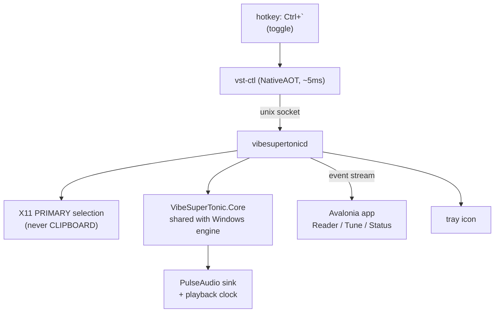

# VibeSuperTonic on Mint — port plan

Status: **Phases 0–5 done; Phases 6–7 not started.** Phase 1 and
Phase 2 exit gates cleared and verified on Windows; Phase 3 built, with one
exit criterion restated against measurement; Phase 4 built and measured, with
its application-level criteria still needing a person (ten minutes — item 4 of
[TODO-TOMORROW.md](TODO-TOMORROW.md)); Phase 5 built, and **in daily use on the
development machine**.

Two things a cold reader will otherwise get wrong, both decided by the user
after using the product rather than by this plan:

- **It is portable.** All state lives beside the executable; no XDG *data* path
  is used anywhere. Phase 4b specified `$XDG_CONFIG_HOME` and was wrong. See
  [the portability correction](#portable).
- **The hotkey contract changed.** Ctrl+backtick reads the selection *now*,
  always — it never means stop — and Ctrl+tilde stops. The one-key
  press-to-speak/press-again-to-stop contract survives only as the `toggle`
  verb, for the tray. See [the hotkey contract](#the-hotkey-contract).
Written 2026-08-14; last worked 2026-08-15. If you are picking this up cold,
read [Where to pick up](#where-to-pick-up) before anything else — the working
tree is in a state that will surprise you.

Port target is Linux Mint. The Windows product integrates with SAPI; the Linux
product does not integrate with anything. It is a background daemon with a
global hotkey that speaks whatever text you have highlighted, plus a window you
can open to follow along.

This is deliberately **not** a speech-dispatcher module. That option is analyzed
and deferred in [Non-goals](#non-goals-for-v1).

---

<a name="where-to-pick-up"></a>

## Where to pick up

Written for whoever works on this next, including a future me. Everything here
is either non-obvious or expensive to rediscover.

### Read this first: nothing is committed

`HEAD` is `95b8901 Model availability`. Roughly 47 paths — all of Core, the R-2
and R-14 fixes, the CPU backend, the prerequisite work, four shipped releases —
exist **only in the working tree**. A stray `git checkout` loses several days.

Land it before doing anything else. **Set a git identity first — there is none
on this machine and every commit would fail without one**; the script refuses up
front and prints the exact command.

```bash
bash docs/commit-tomorrow.sh                  # dry run, prints all three commits
bash docs/commit-tomorrow.sh --yes --verify   # execute, building after each step
```

Rehearsed end to end against a throwaway clone on 2026-08-15: three commits, each
built and tested from a clean worktree. The recipe for repeating that is in
[TODO-TOMORROW.md](TODO-TOMORROW.md), and it is worth running any time the script
changes — all three of the landing defects below were found that way, not by
reading it.

Three commits: `.gitattributes` alone, then all the *additions* (Core, the CPU
backend, the spike), then the *switch* that moves both hosts onto Core. The
sequence and the reasoning are in [COMMIT-PLAN.md](COMMIT-PLAN.md). Delete both
that file and the script once the commits land.

Three things about it are worth knowing before you touch it:

- **`.gitattributes` must be first, and alone.** The tree is CRLF while HEAD is
  LF, so without it `git status` reports 47 changed files where 13 are real,
  burying every change under a whole-tree whitespace rewrite and destroying
  `git blame` for the engine.
- **The script was repaired 2026-08-15 and had been silently wrong.** It was
  written before Phases 2 and 3 existed, and its commit-2 file list never grew
  to match: `Linux.Audio`, `Daemon` and `Ctl` — the entire output of both
  phases — appeared in none of the three commits. It would have reported three
  successes and left them untracked, which is the precise state the script
  exists to get out of. Worse, commit 2 does stage `VibeSuperTonic.linux.slnx`,
  which names all three, so the commit carried a solution file referencing
  projects that were not in the repository.

  `--verify` could not have caught it: it built the *working tree*, which does
  not change while the script runs, so it produced the same answer three times
  and proved nothing about any commit. It now builds each commit from a
  throwaway `git worktree`, and runs the tests there too. A `check_complete`
  pass also refuses to start unless every changed path is in a step list or a
  declared holdout — so the next phase that adds a directory gets a loud
  failure instead of a silent omission.
- **Do not re-split it into more commits without `git add -p`.** An earlier draft
  had nine, and they would not have built: git stages whole files, and several
  files here carry two changes belonging to different commits (`Registration.cs`
  needs both a Core type and the new runtime probes; `Checks.cs` needs Core's
  downloader and all four prerequisite checks; `SapiEngine.cs` carries the offset
  fixes and the Core switch). That draft also staged none of the seven files the
  move into Core *deleted*, so both hosts would have had two definitions of
  `Sonic` and `SupertonicLanguages` in scope. `--verify` builds after every
  commit so this class of mistake fails loudly instead of landing.

### Status by phase

| Phase | State |
| --- | --- |
| 0 · Prove the model runs | **Done.** RTF 0.193 on Linux vs a ≤ 0.5 gate; ~25% faster than Windows |
| 1 · Extract Core | **Exit gate cleared.** 14 files in Core, 187 tests green, TestHarness all-green on Windows, R-2 and R-14 verified. Two optional items left — see below |
| 2 · Audio + playback clock | **Exit gate cleared, and verified on Windows.** Worst clock residual 24.2 ms over a 2-minute read vs an 80 ms gate, no accumulation; stop flushes in 0.6 ms; 229 tests green; TestHarness 11 of 11 on the Win11 VM |
| 3 · Daemon + IPC | **Built.** Acknowledge 28 ms, stop 40 ms vs a 100 ms budget, auto-start 228 ms; 273 tests green. First-audio criterion restated — see [Phase 3](#phase-3) |
| 4 · Selection capture | **Done 2026-08-16.** PRIMARY capture works, including from a daemon with no `$DISPLAY`; R-9 cap measured. **The four-application sweep passes** — Firefox, xed, the Cinnamon terminal, xreader — plus Brave. One documented limit: an in-frame document viewer that never claims PRIMARY, for which `Ctrl+C` then the hotkey is the answer. See [the application pass](#phase-4-apps) |
| 4b · Linux host config | **Built 2026-08-15.** Portable data layout, pronunciation rules finally applied, `reload` + `config` verbs, and the DSP stage. Remaining gap: `InterChunkSilenceMs` — see [Phase 4b](#phase-4b-built) |
| 5 · Hotkeys | **Built and in daily use 2026-08-15.** `build/keybindings.sh`; bind / re-bind / conflict / unbind verified against Cinnamon 6.6.9, and the keys confirmed working by the user. Keys revised to Ctrl+backtick / Ctrl+tilde and the primary one now always speaks — see [the hotkey contract](#the-hotkey-contract) |
| 6 · App + tray | Not started. **Its two seams were prepared 2026-08-15** — the stream now carries the utterance text, and `seek` exists. See [Preparation](#phase-6-prep) |
| 7 · Packaging | Not started |
| 8 · Fit the machine | Not started, **added 2026-08-16**. `MaxCpuPercent` defaults to 20% after measurement, but a percentage is the wrong unit for a curve that is not monotonic — the benchmark replaces the guess, and decides CPU vs GPU with a battery rule. See [Phase 8](#phase-8) |

### The next three things, in order

**1 · Land the commits.** Above. Cheap, and everything else assumes it.

**2 · ~~Run the TestHarness on the Windows VM.~~ Done — 2026-08-15, all nine
steps green** against 0.2.7.5 on the Win11 VM. That is the Phase 1 exit gate and
it is cleared. The harness ships in `tools/`, so re-running it before and after
any change to the speak path costs one command.

It earned its keep on the first run: step 8 failed against 0.2.7.4 and the bug
was real — see the R-14 note above. Five releases had claimed that fix.

**What the baseline does and does not cover.** Steps 1–9 exercise COM activation,
voice enumeration, sync and async speech, cancellation, SSML bookmarks, prosody,
language tags, and word-boundary offsets under five whitespace layouts and a
length-changing pronunciation rule — **all on the CPU execution provider**. The
VM has no GPU, so DirectML falls back on every run:

```
DirectML init failed, falling back to CPU:
  ... C0262002 Specified display adapter handle is invalid.
```

That distinction decides the order of the two remaining items:

- **`SpeechSession` is now safe to attempt.** It is the COM speak loop, which is
  exactly what the harness drives end to end. Run it before and after.
- **`Onnx.DirectML` is still not verifiable here.** Its entire substance is the
  ~600 lines of device-loss recovery — TDR detection, the process-local GPU
  latch, the launcher reset channel, the CPU-retry path — and none of it executes
  on a machine whose adapter handle is invalid. Refactoring it against a harness
  that silently takes the CPU branch would prove nothing. Either do it on real
  hardware, or leave it: Way 2 is a perfectly good place to stop, and this is the
  one piece with no test to stand on.

**3 · ~~Then pick one.~~ Phases 2 and 3 are done — 2026-08-15.** Audio comes out
of the speakers, the playback clock tracks it, and a daemon holds the warm model
behind a control socket. Measurements under [Phase 2](#phase-2) and
[Phase 3](#phase-3).

Try it:

```bash
vibesupertonicd --models <dir> --preload &
vst-ctl speak "The sea is everything."
vst-ctl subscribe | jq          # in another terminal
vst-ctl toggle                  # press: speak, or stop if speaking
```

**~~Next: Phase 4 — selection capture.~~ Done 2026-08-15.** `toggle` now reads
the X11 PRIMARY selection and speaks it, including from a daemon with no
`$DISPLAY` of its own. Measurements and the two things it found are under
[Phase 4](#phase-4-built).

**~~Next: Phase 5 — hotkeys.~~ Done 2026-08-15.**
[build/keybindings.sh](../build/keybindings.sh) binds `Ctrl+`` and
Ctrl+~ through `gsettings`, warns rather than stealing a taken key,
and removes exactly its own entries. Verified against Cinnamon 6.6.9; see
[What was built](#phase-5-built). Nothing is bound on this machine right now —
that belongs to Phase 7's `install.sh`, which sources the file.

**~~Next: Phase 4b.~~ Done 2026-08-15.** The daemon reads `settings.json` and
`pronunciations.json` from the portable folder beside its executable, applies
the rules it had been silently ignoring since Phase 3, and picks up edits on
mtime with `reload` and `config` verbs on top. It also corrected this plan: see
[the portability correction](#portable).

**Next: [Phase 6](#phase-6) — app and tray**, the last phase with a contingency
ladder and the only one whose output a person uses directly, which are the two
properties that made Phase 1 overrun. The DSP gap Phase 4b named was closed the
same day, so nothing is outstanding ahead of it.

**Its two seams were prepared 2026-08-15, deliberately ahead of the phase** — the
event stream now carries the utterance text, and click-a-word-to-jump has a
`seek` verb rather than the `ApplySkip` this plan wrongly promised. Full account
under [Preparation](#phase-6-prep). Also confirmed while preparing them:
Avalonia 11.3.20 restores on this machine, and **tray contingency rung 1 is
viable** — `org.kde.StatusNotifierWatcher` *and* `org.x.StatusNotifierWatcher`
are both on the session bus via xapp-sn-watcher, with
`libayatana-appindicator3.so.1` installed as rung 2. So the ladder is very
unlikely to be needed past its first rung.

**Phase 7's layout is settled: binaries at the root** of the portable folder,
`models/` and `data/` beside them. Linux has no COM bitness problem, so the
`engine/` split the Windows packer needs has no purpose here — and `BaseDir`
then resolves directly to the folder with no walk-up.

Try it:

```bash
vibesupertonicd --models <dir> &
# highlight some text in any application, then:
vst-ctl toggle
```

**Readiness review, 2026-08-15 — the code is ready, the plan was not.** Phases
4–7 were re-read against what the daemon can actually do, and four things were
found and fixed before starting rather than during:

| Found | Where it is now |
| --- | --- |
| Phase 4's "re-check `$DISPLAY` per request" cannot work — a process's environment is fixed for its lifetime, so a daemon started without a session fails every selection forever | The client forwards it: `Request.Display`, populated by `vst-ctl` on `toggle`. See [Phase 4](#phase-4) |
| `ISelectionSource` had two outcomes where R-9 needs three — a truncated selection is a success that must still report what was dropped | Widened to `SelectionResult` with a `Notice`, carried to the client as `Response.Notice` |
| **The whole config seam belonged to no phase.** The daemon reads no `settings.json` and no `pronunciations.json`, so Linux applies no pronunciation rules and Phase 6's Tune tab would have had nothing to talk to — and no protocol verb to talk with | New [Phase 4b](#phase-4b), 0.5–1 day |
| A missing model set made the daemon exit 2, so a fresh install's first key press was 5 s of silence and an unhelpful message — the exact shape of the failure [R-5](#r-5) exists to prevent | The daemon starts anyway and the speak verb explains itself. See [Phase 7](#phase-7) |

Two of the four are in the class [trap 13](#where-to-pick-up) already names:
criteria and mechanisms written before anything measured them. The other two are
seams that were never asked what the *next* phase would need from them, which is
cheap to check and was not done.

Three more came out of **rehearsing the landing** against a throwaway clone
rather than reasoning about it — see item 1 of
[TODO-TOMORROW.md](TODO-TOMORROW.md) for the recipe:

- **There is no git identity on this machine**, local or global, so
  `git commit` fails outright. The first rehearsal staged `.gitattributes`,
  died on commit 1, and left an index that the script's own "something is
  already staged" guard would then refuse to retry over. It now prechecks, and
  prints the identity from the last commit as the command to run.
- **`vst-ctl`'s NativeAOT publish was exercised nowhere.** `PublishAot` only
  applies to `dotnet publish`, so CI's `dotnet build` compiled the client
  without ever touching the native toolchain — and [Phase 7](#phase-7) names the
  release run as the first place that can fail. CI now publishes it and asserts
  the result is a native ELF, which is the same guard shape as the win-x86 ORT
  assertion. It catches both a missing clang and the worse case: a silent
  fallback to a managed binary that works and costs 100 ms on every press.
- **The daemon hardcoded its version string** as `"0.2.7.5"` while
  `<VstVersion>` is documented as the single source of truth. `status` reports
  it so a stale client is diagnosable, which a hand-maintained copy defeats the
  first time it drifts. Now read from the assembly, and the fallback is
  `"unknown"` rather than a plausible-looking number.

`Onnx.DirectML` remains untouchable without real GPU hardware — see step 2.

*(The render-sanity test and the R-2/R-14 confirmation that used to sit here are
both done — see below and step 2.)*

### Verifying your work

```bash
dotnet build VibeSuperTonic.linux.slnx -c Release       # Linux half
dotnet test  VibeSuperTonic.linux.slnx -c Release       # 187 tests, ~0.5 s

# Windows half — builds from Linux, but the RID is NOT optional (see trap 2)
dotnet build src/VibeSuperTonic.Engine/VibeSuperTonic.Engine.csproj  -c Release -r win-x64
dotnet build src/VibeSuperTonic.Engine/VibeSuperTonic.Engine.csproj  -c Release -r win-x86
dotnet build src/VibeSuperTonic.Launcher/VibeSuperTonic.Launcher.csproj -c Release -r win-x64

# End-to-end on Linux through the real seam (models from the Phase 0 spike)
dotnet run --project spike/linux-render/LinuxRender.csproj -c Release -- \
    spike/phase0-linux/out/linux-x64/models /tmp/out.wav

# Phase 2: playback clock accuracy. No model needed — plays a click track and
# reports the residual against real time. This is the Phase 2 exit measurement.
dotnet run --project spike/linux-play/LinuxPlay.csproj -c Release -- --calibrate 120

# Phase 2: real speech with the word readout, and the stop path
dotnet run --project spike/linux-play/LinuxPlay.csproj -c Release -- \
    spike/phase0-linux/out/linux-x64/models
dotnet run --project spike/linux-play/LinuxPlay.csproj -c Release -- \
    spike/phase0-linux/out/linux-x64/models --stop-at 3000

# Phase 3: the daemon. NOTE the client is NativeAOT, so it only exists after a
# publish — `dotnet build` produces a daemon that cannot be driven.
dotnet publish src/VibeSuperTonic.Ctl/VibeSuperTonic.Ctl.csproj -c Release -r linux-x64 -o out/
```

Shipping is `build/pack-zip.ps1` only — never a hand-rolled `dotnet publish`. Ask
the user for the version first; see [CLAUDE.md](../CLAUDE.md).

### Traps

Each of these has already cost time.

1. **Core takes zero `PackageReference`s. Ever.** The DirectML and CPU builds of
   ONNX Runtime ship the *same managed assembly name* with *different managed API
   surfaces*, so an assembly shared by both hosts can reference neither. This is
   [R-13](#r-13) and it is a hard constraint, not a preference.
2. **The engine needs an explicit RID when built on Linux.** Without `-r win-x64`
   it fails `NETSDK1091` because the SDK cannot tell it is targeting Windows and
   `EnableComHosting` gives up. Only that project; nothing in the shipping path
   hits it, because the packer and CI always pass a RID.
3. **`VstPortable` strictness lives in `Directory.Build.targets`, not `.props`.**
   Props is imported before the project sets its own properties, so the condition
   evaluates against an empty value and silently does nothing — with the build
   green and the rule apparently in force. It was written in the wrong file first
   and only found by deliberately adding a `Registry` call to Core to watch it
   *not* fail.
4. **ORT is pinned at 1.22.1. Do not bump it without checking win-x86.** 1.23.0
   dropped the win-x86 native from the package; publish still succeeds and the
   32-bit engine dies with `DllNotFoundException` on first Speak. CI asserts
   `onnxruntime.dll` survives into the x86 publish — that step is the only thing
   standing between a Linux-motivated bump and a silently broken 32-bit product.
5. **Windows needs FOUR prerequisites, and getting this wrong is invisible.**
   .NET 10 runtime *and* the Visual C++ redistributable, **each in both
   architectures**. The engine is a COM in-process server, so it inherits its
   host's bitness — and most SAPI clients are still 32-bit. Missing .NET x86 means
   *no voices are listed*; missing VC++ x86 means *voices are listed and silent*.
   Three releases were spent on this. The Status tab checks all four and can
   install them. Do not "simplify" it away.
6. **The engine cannot be made self-contained.** `dotnet publish --self-contained`
   with `EnableComHosting` fails with `NETSDK1128`. This is why the prerequisites
   above cannot simply be bundled, and it is worth knowing before someone proposes
   it again. The Linux daemon *is* self-contained precisely because it is not an
   in-process component.
7. **`MaxChunkChars` / `MinChunkChars` are live as of 0.2.7.** They were dead
   settings for years. Defaults reproduce the old constants exactly (pinned by a
   test), but a non-default `settings.json` now re-chunks.
8. **Do not move `TelemetryWriter` into Core**, despite the older text in Phase 1
   listing it. Reasoning under [slice 3](#phase-1).
9. **CI has never actually run.** It now triggers on `Dev`, but everything is
   uncommitted, so no workflow has executed against any of this. Expect the first
   green run to require a fix or two.
10. **Version bumps are the user's decision.** Never infer one. `<VstVersion>` in
    `Directory.Build.props` is the *last shipped* version and is updated after a
    release, not before.
11. **Green Core.Tests does not mean the engine is right.** R-14 shipped broken
    in five consecutive releases while every relevant unit test passed, because
    each component was correct in isolation and the defect lived at the
    *composition point* in `SapiEngine` — a chunk index was resolved through one
    rewrite when two had been applied. Core.Tests cannot see that seam. When you
    touch anything that maps offsets between coordinate spaces, the TestHarness
    is the only thing that will tell you, and `--verify`-style unit coverage will
    happily agree with you while you are wrong.
12. **The audio is no guide to offset bugs.** A wrong word-boundary offset sounds
    exactly like a right one. Every offset defect in this repo was found by
    reading numbers, never by listening.
13. **Exit criteria written before measurement can be wrong, and one was.**
    Phase 3's "hotkey to first audible feedback under 150 ms" turned out to
    conflate acknowledgement (28 ms, achievable) with first speech (~750 ms,
    bounded by the model, with a ~600 ms floor no engineering removes). It was
    not a stretch goal that was missed — it was two different requirements
    written as one number, and the fix was to measure, split them, and restate.
    When a criterion is missed, check whether it was *measurable and wrong*
    before treating it as work outstanding. Two remaining criteria have the same
    shape and have not been measured: Phase 4's "works from Firefox, a GTK
    editor, the terminal and a PDF viewer", and Phase 6's tray latency.
14. **DirectML is unexercised everywhere.** The Win11 VM has no GPU
    (`C0262002 Specified display adapter handle is invalid`), so every harness
    run silently takes the CPU branch. The ~600 lines of device-loss recovery in
    `SupertonicAdapter` have no test anywhere, on any machine currently
    available. Treat that code as untestable-in-practice and change it only with
    real hardware to run it on.

---

## Confirmed environment

Verified on the target machine, 2026-08-14:

| Fact | Value | What it buys us |
| --- | --- | --- |
| Distro | Linux Mint 22.x (Ubuntu 24.04 base) | glibc 2.39, modern everything |
| Desktop | Cinnamon | tray via appindicator/XApp; gsettings keybindings |
| Session | `XDG_SESSION_TYPE=x11` | **PRIMARY selection and global hotkeys both work** |
| Audio | `PulseAudio (on PipeWire 1.0.5)` | one libpulse client API covers PipeWire *and* PulseAudio boxes |
| .NET 10 | not in Ubuntu repos | we ship self-contained; no user-side runtime install |

Cinnamon keeps X11 as its default session and Mint has said it stays that way
until Wayland reaches feature parity. Every design choice below still assumes
Wayland arrives eventually and avoids anything that would be a dead end there.

---

## What we're building



Three new components, one shared library:

- **`VibeSuperTonic.Core`** — `net10.0`, no Windows types. Model, chunker, DSP,
  settings, pronunciations. Used by *both* the Windows SAPI engine and the Linux
  daemon.
- **`vibesupertonicd`** — long-lived. Holds the warm ONNX session, owns the audio
  device, owns the tray icon and the window.
- **`vst-ctl`** — tiny client. Writes one line to a socket and exits.

The hotkey is registered with the desktop (gsettings), not grabbed by us.
Selection is read from X11 `PRIMARY`, so the clipboard is never touched.

---

## The hotkey contract

**Revised 2026-08-15, on the user's call, after using it.** Two keys, and the
primary one always speaks:

| Key | Means |
| --- | --- |
| **Ctrl+`** | read what is selected *now*, interrupting anything playing |
| **Ctrl+~** | stop, from any state |

**What changed and why.** The original contract is below and was built on "one
key does everything", which forced the rule that *selecting new text while
speaking does not switch to it* — press to stop, press again to read the new
selection. Two presses for the commonest action there is.

That rule was only ever defensible because a key that always speaks leaves no
way to be quiet. With `stop` bound to a key of its own — which it already was,
and which cost nothing — the objection evaporates, and the obvious behaviour
becomes available: highlight something, press once, hear it.

The `read` verb is **new rather than a change to `toggle`**. `toggle` keeps its
contract for the tray menu's single Speak/Stop item (Phase 6) and for anything
scripted against it. The gate's debounce is shared between the two, so
alternating keys cannot produce a burst that neither allows alone.

**The selection is captured before anything is stopped.** A press when PRIMARY
has no owner at all therefore leaves the current reading alone, rather than
silencing it and then failing — losing the user's place for a mis-press would be
a poor trade for slightly simpler code.

**And a press that captures the text already playing does nothing** — added
2026-08-15 after the first version shipped without it and was immediately caught
in use. **X11 has no "nothing is selected".** PRIMARY keeps its owner after the
user clicks away, so a press with nothing newly highlighted still captures the
*last* selection: the capture succeeds, it just succeeds with the same text, and
the reading the user was in the middle of restarted from the top. Ordering the
capture before the stop could not cover this on its own, because nothing failed.

So the rule the key actually implements is: *read what is selected now; if that
is already what you are hearing, do nothing.* Restarting the same passage
deliberately is then Ctrl+~ followed by Ctrl+`, which is two presses for
something nobody does by accident. The guard applies only to a captured
selection — an explicit `read <text>` is a caller asking for something by name,
and re-reading it is a reasonable thing to have asked for.

### The original one-key contract, kept for `toggle`

One key does everything. **Press to speak, press again to stop.**

| State | Press does | Next state |
| --- | --- | --- |
| Idle | capture PRIMARY, start speaking | Preparing |
| Preparing (model load / first chunk) | cancel | Idle |
| Speaking | stop | Idle |
| Stopping | ignored | Stopping |

Three details this table is hiding, all of which matter:

- **Preparing counts as active.** A cold model load is 2–5 s. If the second press
  only worked once audio started, the key would feel dead for exactly the window
  where the user is most likely to press it again. Cancelling during load is the
  whole point.
- **Presses inside 150 ms of the last are ignored.** Without debounce, an
  accidental double-tap reads as speak-then-immediately-stop, which looks
  identical to "broken."
- **Selecting new text while speaking does not switch to it.** Press stops the
  current read; a second press speaks the new selection. Two presses, not one.
  This is the accepted cost of one-key operation — it is a choice, not an
  oversight. *(Superseded for the primary key by the `read` verb above, which is
  exactly this cost being declined once a second key existed to pay it with.)*

An explicit stop binding (Ctrl+~) stays available for "I don't care
what state it's in, be quiet." It is bound by default and costs nothing.

Empty selection in Idle is a no-op with a tray blip — it does not change state.
Phase 3 implements that: a failed selection puts the gate back to Idle, so the
no-op does not silently consume the next press.

**Pause is deliberately not in this table (decided in Phase 3).** The daemon has
`pause` and `resume` verbs — they cost almost nothing, since not feeding the sink
lets it drain and the playback clock stays correct by itself — but pausing is
*not* a fifth state and the key does not reach it. A press while paused reads as
Speaking and therefore stops.

The reasoning is that a five-state toggle is not a toggle. With one key, the user
has to hold a model of what the next press will do, and "speak / stop" is a model
that survives being wrong; "speak / pause / resume / stop, depending" is not. So
pause stays available to the tray menu, to D-Bus and to scripts, where there is a
distinct control to point at, and the key keeps its two meanings. Revisit only
with a second binding, never by adding a state to this table.

---

<a name="isolation"></a>

## Platform isolation — where the split lives

**Decided 2026-08-15.** Resolves the open question at the end of [R-13](#r-13):
*"Either Core multi-targets with per-RID PackageReference and compilation
symbols, or EP selection is hoisted out of Core into the two host projects."*

Neither, exactly. **Hoist ORT out of Core now; converge on two independent trees
over shared source.** Way 2 first because it is the smaller step and it defines
the seam; Way 3 as the end state because the goal is that a Linux change cannot
reach the Windows product *at all*, not that it merely shouldn't.

### What can actually leak

| Leak | Consequence |
| --- | --- |
| **The ORT package** | `Microsoft.ML.OnnxRuntime.DirectML` and the CPU package ship the same managed assembly name with *different managed API surfaces*. One project cannot hold both. Not a preference — a hard constraint, and the whole of R-13 |
| **The win-x86 pin** | ORT dropped the win-x86 native in 1.23.0. The Linux port is the single most likely future reason anyone bumps ORT, and the failure is silent until a user opens a 32-bit SAPI host |
| **Shared state** | `settings.json` is rewritten wholesale by whichever host saved last. Keys the writer doesn't know about are dropped |

Measured, so the scale is on the record rather than assumed:

- **`SapiEngine.cs` contains zero ONNX references.** The `SpeechSession`
  extraction in Phase 1 step 3 is *already* ORT-free — the seam exists, it has
  just never been named.
- ORT types appear in exactly two files: `SupertonicSdk.cs` (25 sites) and
  `SupertonicAdapter.cs` (7).
- Windows-only `using`s across the entire Phase 1 move list: two files.
  [SupertonicAdapter.cs:2](../src/VibeSuperTonic.Engine/Synth/SupertonicAdapter.cs#L2)
  (an unused import) and
  [EngineSettings.cs:4](../src/VibeSuperTonic.Engine/Settings/EngineSettings.cs#L4)
  (a real legacy-registry reader, already isolated in one method).

The leak surface is small and sits almost where we want it. What is missing is
anything that *enforces* it.

### Way 2 — the shape Phase 1 builds

Core takes **zero** `PackageReference`s. ORT moves down into two backend
projects that share their source rather than a binary:

```
Core                 net10.0, no packages, VstPortable=true
                     ISynthesizer, SpeechSession, SentenceChunker, AudioBuffer,
                     Sonic, TimeStretch, Pronunciations, LogRotation,
                     telemetry, Manifest, downloader
  │
  ├── Onnx.DirectML  DirectML pkg · ORT_DIRECTML
  │                  device-loss latch, GPU enumeration      ← R-12 by construction
  └── Onnx.Cpu       CPU pkg                                 ← built, renders on Linux
                     both compile SupertonicSdk.cs as linked source

Engine (SAPI COM)  → Core + Onnx.DirectML
vibesupertonicd    → Core + Onnx.Cpu
```

Named for the execution provider rather than the OS: the CPU backend runs fine on
Windows, it just has no DirectML. Note that `SupertonicAdapter` is **not** in the
shared set — see correction 1 under Phase 1.

The shared-source mechanism is not novel here — [Phase0.csproj:40](../spike/phase0-linux/Phase0.csproj#L40)
already compiles the real `SupertonicSdk.cs` into a Linux project unmodified,
and that is what cleared the Phase 0 gate.

What this buys, beyond tidiness:

- Core **cannot express a platform**. With no ORT reference it is not possible
  to break the win-x86 pin from Core, or to drag DirectML toward Linux.
- `Core.Tests` (R-3) needs **no native libraries**, so it is fast and runs on any
  runner. That matters because R-2's regression test ships the day the fix does.
- R-8 gets a home: `ISynthesizer.RenderAsync(…, CancellationToken)`, with each
  backend mapping cancellation onto `RunOptions.Terminate` in its own code.

Cost: Phase 1 designs a seam instead of only moving files. Budget the top of its
2–3 day range.

### Way 3 — the end state

Identical file layout; the Core *assembly* dissolves. `src/shared/**` is
compiled into each platform's host by `<Compile Include>`, and the two trees
share no restore graph, no assembly, no version, no NuGet resolution.

The argument for going further is written in the codebase already:
[DataPaths.cs:22-26](../src/VibeSuperTonic.Engine/Settings/DataPaths.cs#L22-L26)
instructs the reader to *manually keep the file in sync* with the launcher's
mirror copy. That comment is the current isolation strategy, and it is a comment.
Linked source makes divergence impossible where a shared binary makes it merely
discouraged — and unlike a shared binary, it lets the 1.22.1 pin outlive any
decision Linux ever makes, because nothing connects them.

Cost: drift moves from compile time to CI time, and the R-2 fix must be proven
on both platforms rather than once. Both are acceptable *given* `Core.Tests`
runs on both runners, which is why Way 3 comes second.

### Why not the third option — one Core, two target frameworks

`<TargetFrameworks>net10.0;net10.0-windows</TargetFrameworks>` with conditional
package references is the cheapest change and Phase 1 would barely notice it.
It is rejected because the Windows and Linux builds stay in one project, so the
ORT bump that breaks win-x86 still lands on both flavors and CI is the only
thing standing between that and a shipped ZIP. It optimizes the step we are not
worried about.

### Way 2 must be written so Way 3 is a csproj edit

Four rules during Phase 1. Break any of them and the second migration becomes a
refactor rather than an afternoon:

1. **Core's sources live in one directory with no generated or per-project
   files.** Way 3 replaces a `ProjectReference` with a `<Compile Include>` glob;
   that only works if the glob is the whole truth.
2. **No `InternalsVisibleTo` across the Core boundary.** Under linked source
   `internal` becomes internal-to-each-host, which is simpler — but only if
   nothing depended on the cross-assembly form. The existing
   [InternalsVisibleTo to the TestHarness](../src/VibeSuperTonic.Engine/VibeSuperTonic.Engine.csproj#L56)
   stays inside the Windows tree, where it still works.
3. **No type from Core crosses a process or serialization boundary by assembly
   identity.** Type names are shared; `Assembly.GetType`, `typeof(x).AssemblyQualifiedName`
   in persisted data, and anything similar are not.
4. **`VstPortable=true` on every project that must build on both.** Promotes
   CA1416 to an error, so `using Microsoft.Win32;` fails on the machine that
   added it.

   The promotion has to live in [Directory.Build.targets](../Directory.Build.targets),
   **not** `Directory.Build.props`. Props is imported before the project sets its
   own properties, so a condition on `VstPortable` there evaluates against an
   empty value and does nothing at all — with the build still green and the rule
   apparently in force. It was written in the wrong file first and only found by
   deliberately adding a `Registry` call to Core to watch it fail; it did not.
   Verified working 2026-08-15: that probe now produces `error CA1416` and stops
   the build.

### The gate

Way 3 starts when all three hold, and not before:

- `Core.Tests` is green on Windows **and** on the Mint box, in CI, not locally.
- The Windows patch release carrying the R-2 fix has shipped from the Way 2
  layout and survived real use — Phase 1's existing exit criterion.
- The daemon speaks end-to-end on Linux (Phase 3 complete), so the seam has been
  exercised by a second host rather than only asserted.

Until then Way 2 is the shipping shape. If those never all hold, Way 2 is a
perfectly good place to stop — this is a sequence, not a commitment to arrive.

<a name="mechanics"></a>

### Cross-cutting mechanics

Independent of the shape above; all four are worth having under any of them.

**1 · One version number — done.**
[Directory.Build.props](../Directory.Build.props) holds `<VstVersion>`, and
[pack-zip.ps1](../build/pack-zip.ps1) reads it instead of a hardcoded default.
It had carried `0.2.0` as its param default through the 0.2.1–0.2.5 releases;
every caller had to remember `-Version`. Phase 7's `pack-tar.sh` reads the same
element, so one number produces both artifacts.

**2 · Separate solutions — done.**
[VibeSuperTonic.linux.slnx](../VibeSuperTonic.linux.slnx) alongside the Windows
[VibeSuperTonic.slnx](../VibeSuperTonic.slnx), so a build on the Mint box does
not fail on a COM host and a WinForms launcher. `EnableWindowsTargeting` in
Directory.Build.props means the Windows projects still build and restore from
Linux when you want them to — verified 2026-08-15: the engine compiles clean for
both win-x64 and win-x86 on the Mint box, which it could not do before.

*One Linux-only wrinkle worth knowing:* the engine must be built with an
explicit RID (`-r win-x64`) on Linux. Without one, `EnableComHosting` fails with
NETSDK1091 because the SDK cannot tell it is targeting Windows. On Windows the
host RID supplies that implicitly, which is why this has never come up. Not a
regression and nothing in the shipping path hits it — pack-zip.ps1 and CI both
always pass a RID — but a bare `dotnet build VibeSuperTonic.slnx` on the Mint
box will fail on that project and only that project.

**3 · CI guards both directions — done, and corrected 2026-08-15.**
[build.yml](../.github/workflows/build.yml) has an `ubuntu-latest` job for the
platform-neutral half, and — more importantly — a step asserting
`onnxruntime.dll` exists in the win-x86 publish. The pin comment in the engine
csproj was the only thing protecting 32-bit users from a Linux-motivated ORT
bump. Now it fails the build.

Two gaps in the first version, both found by re-reading it against the gate it
is supposed to enforce:

- **It never ran on the branch the work happens on.** Triggers were `main`-only
  while every commit below is on `Dev`, so the gate "green in CI, not locally"
  was unreachable from where the code lives. `Dev` added to `push` and
  `pull_request`. `.github/**` dropped from `paths-ignore` at the same time — a
  workflow edit that breaks the workflow should not wait for the next source
  commit to be discovered.
- **`Core.Tests` ran on Linux only.** The gate says *both* runners. "It passes on
  Linux" is not evidence it passes on Windows for this suite in particular: it is
  the text and offset code, where line endings, path separators and string
  comparison all differ. The Windows job now runs `Core.Tests` too, before the
  publishes so a regression fails in seconds rather than after two RID publishes
  and a ZIP.

The Linux job's `if [ -d src/VibeSuperTonic.Core.Tests ]` guard is gone — it was
there so the step would activate by itself when Phase 1 landed the project, which
it has, and a permanently-true guard only hides a restore failure.

**4 · `settings.json` round-trips unknown keys — done 2026-08-15.**
[EngineSettings.cs](../src/VibeSuperTonic.Engine/Settings/EngineSettings.cs) uses
a source-generated `JsonSerializerContext`, which **drops unknown properties on
read**. The launcher then writes the whole object back — so any key the Linux
daemon adds was erased the next time the Windows Control Panel saved, and vice
versa. That matters the moment a portable data folder crosses platforms: a USB
stick, a dual-boot mount, a synced directory.

`[JsonExtensionData] public Dictionary<string, JsonElement>? Extra` now sits on
`EngineSettings` in **both** the engine copy and the launcher's mirror at
[src/VibeSuperTonic.Launcher/EngineSettings.cs](../src/VibeSuperTonic.Launcher/EngineSettings.cs)
— the duplication Core is meant to dissolve, and a good illustration of why.
`PerVoice` nests the same type, so it inherits the behavior. The launcher's
`Clone()` copies the dictionary rather than sharing it, because the UI clones
settings to build a candidate it may discard.

Covered by `SettingsRoundTripTests` in Core.Tests. The real types are internal to
`net10.0-windows` projects and cannot be referenced from there, so the tests pin
the *mechanism* instead — which is the half that can break invisibly:
`[JsonExtensionData]` is not supported by the source generator's fast
serialization path, so the generator must fall back to metadata mode for any type
declaring it. If an SDK bump, a `JsonSourceGenerationMode.Serialization`
annotation or a trimming setting changes that, unknown keys stop surviving with
the build still green and every declared property still saving correctly.

The related rule stands on its own: **Linux never writes `UseDirectML`,
`DirectMLDeviceId`, or `OnnxThreads`** — Phase 0 concluded the Linux Tune tab
should not offer threads as a knob at all.

---

## Phases

Dependency-ordered. Phase 0 is a gate: everything after it assumes its result.
Each review finding from the [Review](#review) section is folded in as concrete
work, tagged with its ID.

<a name="phase-0"></a>

### Phase 0 — Prove the model runs · 0.5 day · **GATE**

**Goal.** Verify ONNX Runtime CPU renders Supertonic fast enough on linux-x64.
There is no DirectML on Linux, so CPU is the baseline case, not the fallback.

**Work.** Minimal console app referencing `Microsoft.ML.OnnxRuntime` 1.22.1 (CPU
package) plus `SupertonicSdk.cs` unchanged. Publish `-r linux-x64
--self-contained`, multi-file. Render a fixed sentence to WAV, play with
`paplay`. Report cold load time, RTF at totalStep 4 / 8 / 12, peak RSS, and the
effect of `OnnxThreads`.

**Exit criteria.** RTF ≤ 0.5 at totalStep 8. At 0.5 the synthesis pipeline stays
comfortably ahead of playback on a desktop that is also doing other things.

**Status — PASSED 2026-08-15.** Gate cleared on the Mint box itself (Mint 22.3
Zena, Cinnamon, X11, 20 logical CPUs, PipeWire's pulse server). See
[spike/phase0-linux/](../spike/phase0-linux/).

- ✅ `SupertonicSdk.cs` compiles and links against the **CPU-only** ORT package
  for `linux-x64` — but only after a real blocker was removed, see [R-13](#r-13).
- ✅ Self-contained multi-file `linux-x64` publish produces `libonnxruntime.so`
  and a working native host. 111 MB expanded, 46 MB packed. Runs on stock Mint
  with no .NET installed.
- ✅ **RTF 0.193 at totalStep 8 on Linux** (warm), against a gate of ≤ 0.5.
  0.102 at step 4, 0.278 at step 12. Load 0.43 s warm / 1.00 s cold.
- ✅ Manifest-driven model download works unmodified on Linux — all 16 entries,
  383 MB, first mirror, no fallbacks needed.
- ✅ Output is 44100 Hz mono s16le, 12.82 s, peak 0.46 FS, zero clipped samples
  — the engine's native format, so Phase 2's sink needs no resampling.
- ✅ **Audible, intelligible speech confirmed by ear**, and the render verified
  against the Windows output structurally — see the audio note below. The gate
  is closed with nothing outstanding.

| | Windows (warm) | Linux (warm) |
| --- | --- | --- |
| RTF @ step 4 | 0.130 | **0.102** |
| RTF @ step 8 | 0.252 | **0.193** |
| RTF @ step 12 | 0.356 | **0.278** |
| Load cold / warm | 3.35 s / 0.58 s | **1.00 s / 0.43 s** |
| Peak RSS cold / warm | 1154 MB / 642 MB | 1182 MB / **830 MB** |

Linux is **~25% faster than Windows on the same machine** at every step count,
and loads substantially quicker. The contingency ladder for RTF 0.5–1.0 (drop to
totalStep 4, raise `MinChunkChars`) is not needed; neither is quantization.
There is enough headroom that totalStep 12 would also be viable if quality
warrants it.

**Also measured: intra-op threads are not free — and Linux punishes them
harder.** At totalStep 8:

| `OnnxThreads` | Windows RTF | Linux RTF |
| --- | --- | --- |
| 0 (auto) | 0.248 | **0.189** |
| 10 (half the cores) | 0.240 | 0.393 |
| 20 (all cores) | 0.484 | 0.433 |

On Windows, half-the-cores was a wash with auto and only full pinning hurt. On
Linux **any** manual value is roughly 2× worse than letting ORT choose — even
the setting that was harmless on Windows. `OnnxThreads` defaults to 0 (auto),
which is right on both. The Linux Tune tab should not offer it as a knob at all;
the Windows one should keep its existing warning.

**✅ Audio confirmed 2026-08-15 — the last open item is closed.** The earlier
run of `paplay phase0-out.wav` exited 0 but was inaudible. Re-checked the same
day: a reference WAV and the Phase 0 render were played back to back to the
default sink and **both were heard as speech**. Nothing in the chain was
misconfigured — the machine has exactly one sink
(`alsa_output.pci-0000_00_1f.3.analog-stereo`, unmuted, 71%), its active port is
`analog-output-speaker`, and the headphones port reports *not available*. The
original silence was the audio arriving at the built-in speakers while nobody
was listening to them. No fix was required and none was made.

That was the cheap half. The expensive half was the plan's own objection — *a
fast render of garbage would still pass every number above* — which peak, RMS
and duration genuinely cannot answer. It was settled by comparing the Linux
render against the Windows render of the same text, voice and totalStep:

| Measure | Result |
| --- | --- |
| Envelope correlation, 500 ms windows | **0.93** (0.88 at 250 ms) |
| Pause structure (runs ≥ 120 ms below 3% peak) | **5 of 5** Linux pauses match a Windows pause within 300 ms |
| Amplitude-modulation rate | 3.59 Hz Linux / 3.67 Hz Windows — natural syllable range |
| Clipped samples | 0, peak −7.1 dBFS |

Correlation *rises* with window width (0.32 at 20 ms → 0.93 at 500 ms), which is
the signature of the same utterance carrying a different noise realization from
the stochastic sampler — not of two different renders. Prosody, sentence
boundaries and total duration are identical across platforms.

**Worth keeping: this is a render-sanity test that needs no ears.** Pause-position
alignment plus modulation rate distinguishes speech from plausible-looking
garbage, runs in a second with no dependencies, and would catch a silent
regression in the chunker or the vocoder that RTF and peak amplitude cannot.
Phase 1 should fold it into `Core.Tests` against a committed reference envelope
rather than a committed WAV.

**Contingencies.**

- *Single-file publish crashes ONNX* → publish self-contained **multi-file**.
  This exact failure already bit us on Windows and produced `RenderHost`. The
  portable-folder model wants a directory anyway, so multi-file is the default
  here, not the fallback.
- *RTF between 0.5 and 1.0* → drop the Linux default to totalStep 4, raise
  `MinChunkChars` to give the pipeline a longer lead, surface the tradeoff in
  the Tune tab.
- *RTF > 1.0* → **stop and decide before Phase 1.** Options in order: int8
  dynamic quantization of `vector_estimator.onnx` (the diffusion loop dominates
  cost), CUDA as an optional path for NVIDIA users, or reconsider the port.

<a name="phase-1"></a>

### Phase 1 — Extract `VibeSuperTonic.Core` · 2–3 days

**Goal.** One library both hosts share. This is a Windows refactor that happens
to enable Linux — worth doing on its own merits, and it carries a real bug fix.

**Status — slice 1 of 2 landed 2026-08-15, not yet shipped.** The R-2 fix is in,
with tests, as the smallest slice that stands the layout up end to end. Taking
it first was deliberate: the plan wanted R-2 shipped as its own bisectable patch
*before* the extraction, while R-3 wanted its regression test the day the fix
shipped — and `Core.Tests` did not exist until the extraction. Making R-2 the
first slice of Core satisfies both, and proves the Way 2 layout against two
files instead of twelve.

Landed:

- `VibeSuperTonic.Core` (`net10.0`, `VstPortable=true`, **zero** PackageReferences)
  with `TextOffsetMap`, `TextSanitizer`, `PronunciationsConfig`/`PronunciationRule`,
  and `SynthTextPipeline`.
- `VibeSuperTonic.Core.Tests` — **48 tests, green on Linux**, no native
  dependencies. Two of them failed on first run against a real bug in
  `TextOffsetMap.ToSource`, which short-circuited index 0 to source 0 and so
  reported the wrong offset whenever the *first* character was displaced.
- R-2 fixed at both sites: chunk construction no longer adds a rewritten-space
  index to a source-space offset, and word/sentence boundaries resolve through
  the map. Boundary *lengths* are now reported in source characters too, so
  "kilograms" highlights the two characters the user typed.
- The launcher's hand-maintained mirror of the pronunciation types is gone; the
  Test pane and the engine now run the same code. They previously had two
  `Apply` implementations that were only *intended* to agree — and compiled
  their regexes with different options.
- Engine x64 + x86, Launcher, RenderHost and TestHarness all build clean.

**Validated on Windows 2026-08-15.** 0.2.6 installed on a Win11 VM from the
Linux-built ZIP: all 10 voice tokens registered, both COM hosts resolved, 16
models fetched, and — after the .NET 10 Desktop Runtime was installed — speech
works through a real SAPI client. The engine is framework-dependent by design,
so the runtime is a prerequisite, not a defect; it is the one thing the portable
folder cannot carry. Worth noting that this is exactly what the Linux build
avoids by shipping self-contained, and worth asking later whether the Windows
engine should do the same.

**Slice 2 in progress — the backend split works end to end on Linux.**

- `SentenceChunker` moved into Core, pinned to the old implementation by a
  reference-oracle test over a 12-input corpus plus generated prose. Chunk
  boundaries are audible, so "it still chunks about the same" was not good
  enough.
- `ISynthesizer` + `SynthesisOptions` in Core, and `VibeSuperTonic.Onnx.Cpu`
  implementing it against the CPU ORT package, compiling `SupertonicSdk.cs` as
  linked source.
- `AudioBuffer` / `WavWriter` in Core — PCM conversion and a mono 16-bit writer
  both hosts need.
- [spike/linux-render/](../spike/linux-render/) renders through the real seam
  (Core chunker → `ISynthesizer` → Core WAV writer) with **nothing from the
  Windows engine referenced**. Measured 2026-08-15: load 0.56 s, **RTF 0.221–0.338
  at totalStep 8**, 12.89 s of audible, correct speech.
- Core.Tests now 90 tests, green.

**Three corrections to this plan, found by building it:**

1. **`SupertonicAdapter` does not move to shared code.** The plan assumed it went
   to `src/shared/` alongside the SDK. It is ~600 lines of which the great
   majority is DirectML device-loss recovery — TDR detection, the process-local
   GPU latch, the launcher reset channel, the CPU-retry path — plus a registry
   read. That is precisely the dead weight [R-12](#r-12) exists to keep out. What
   was genuinely shared inside it was the chunker and the PCM conversion, both
   now in Core; the rest stays Windows-side. `CpuSynthesizer` is what remains
   when it is removed, and it is a fraction of the size.
2. **The backends are named for the execution provider, not the OS.**
   `Onnx.Cpu` and `Onnx.DirectML`, not `Onnx.Linux`/`Onnx.Windows` — the CPU
   backend runs perfectly well on Windows, it simply has no DirectML. The
   provider is the axis that actually differs.
3. **`src/shared/` is deferred.** Linking `SupertonicSdk.cs` from its current
   location achieves the split today; moving a 990-line vendored file buys
   nothing until the Windows adapter is split too, and linked source is already
   the established pattern here (the launcher and the Phase 0 spike both use it).

**New finding for [R-8](#r-8): a terminated ONNX run does not report as
cancellation.** Setting `RunOptions.Terminate` makes ORT throw
`OnnxRuntimeException: [ErrorCode:Fail] Exiting due to terminate flag being set
to true`, not `OperationCanceledException`. Left alone, every stop would surface
in the daemon's log as an engine fault — and with one key doing both, stop is the
most-travelled path there is. `CpuSynthesizer` translates it at the seam.
Measured: cancellation requested at 150 ms, `OperationCanceledException` observed
at **157 ms**, so inference is interrupted about 7 ms after the ask. That is the
inference half of Phase 3's 100 ms stop budget, comfortably.

**Unrelated defect surfaced while moving the chunker: `MaxChunkChars` and
`MinChunkChars` do nothing.** Both are persisted settings with sliders in the
launcher's Advanced tab and per-voice overrides in Tune, and the chunker has
always read private constants instead. `SentenceChunker.Chunk` now takes them as
parameters, but callers still pass nothing: making a dead setting live would
silently re-chunk every install whose `settings.json` already holds a non-default
value. Wiring it through is a one-line change and a deliberate decision, not a
tidy-up. **Still undecided** — see [Open decisions](#open-decisions).

**Review pass 2026-08-15 — three defects found and fixed, none of them Linux.**
The slice built and its 90 tests passed; these were found by reading the seam
against what the phases after it will ask of it.

- **[R-14](#r-14) — chunk start offsets were recovered with `IndexOf` and missed
  on any text with a newline, a tab, or a double space between sentences.** Same
  family as R-2, one layer up, and it survived the R-2 fix because R-2 was about
  the *map* while this is about the *index handed to* the map. Fixed with
  `SentenceChunker.ChunkWithOffsets`, which reports each chunk's true span.
- **`CpuSynthesizer.Dispose` could free ONNX sessions with a `Run` still
  executing on them**, because the session was captured outside the lock and used
  after — the exact TOCTOU
  [SupertonicAdapter](../src/VibeSuperTonic.Engine/Synth/SupertonicAdapter.cs)
  documents having walked into once on the Windows side. It surfaces as a native
  access violation, not an exception, so it takes the daemon down rather than
  logging. Not hypothetical for Phase 3: releasing the session on an idle timeout
  is an open decision below, and stop is the most-travelled path in the product.
  Dispose now closes the door under the lock and drains in-flight renders before
  releasing anything.
- **`SupertonicAdapter.FloatToInt16` was a character-for-character duplicate of
  `AudioBuffer.FloatToPcm16`.** Two copies of the clamp-and-scale is precisely the
  drift Core exists to prevent — the platforms would have rendered the same model
  to different PCM the first time either changed rounding or clipping. The adapter
  now calls Core.

Re-verified after all three: engine x64 + x86, launcher, RenderHost and
TestHarness build clean; Core.Tests 135 green; `spike/linux-render` still renders
through the real seam at RTF 0.207 with cancellation observed at 161 ms.

**`MaxChunkChars` / `MinChunkChars` are now live — decided 2026-08-15.** The
settings are read by the chunker for the first time. Defaults are byte-identical
to the constants they replace (200 / 100) and a regression test pins that, so an
install that never touched the sliders chunks exactly as every prior release
did. An install that *did* will re-chunk, and chunk seams are audible — that is
a known, accepted consequence, called out in the release notes rather than
discovered by a user. Values are clamped at the point of use: the two sliders'
ranges overlap so `min > max` was always selectable, and the settings-file import
path range-checks nothing at all.

**Shipped 2026-08-15 and validated through real SAPI clients**, ending at
`dist/VibeSuperTonic-0.2.7.3-win.zip`. Speech works on the Win11 VM through both a
64-bit host (the Control Panel's own `SAPI.SpVoice` test) and 32-bit hosts
(Balabolka, Lingoes) — the first time any SAPI client has spoken through the Core
layout. Phase 1's exit criterion is met but for the *survives real daily use*
half, which is a matter of time rather than of work.

**Getting there took three hotfixes, none of them about speech**, and the pattern
is structural rather than bad luck. The engine is a COM in-process server, so it
inherits its host's bitness and every native dependency must exist *twice* — and
the 32-bit half is the half no current machine has by default. It cannot carry
its own copies either: `dotnet publish --self-contained` with `EnableComHosting`
fails outright with `NETSDK1128`.

| Release | Missing piece | How it presented |
| --- | --- | --- |
| 0.2.7.1 | .NET 10 runtime (x86) | no voices listed anywhere, and the Status tab reported success |
| 0.2.7.2 | *(the warning itself)* | told a user who had just installed it that it was missing |
| 0.2.7.3 | Visual C++ runtime (x86) | voices listed and **silent**; `0x8007007E` naming a file that was present |

Each was detectable before the user hit it, and each was found by reading their
log rather than by enumerating the dependency chain once. The Status tab now
checks all four prerequisites and can install any of them.

**The lesson lands on Phase 7.** The Linux daemon ships self-contained precisely
because it is *not* an in-process component — the one property that makes this
whole class of failure impossible there. Worth protecting when packaging, and
worth remembering if a speech-dispatcher module is ever built: that would put us
back inside somebody else's process.

**R-2 verified, R-14 verified after a second fix — 2026-08-15.** The TestHarness
now drives a real SAPI client and checks reported offsets against independently
computed word starts (steps 8 and 9, shipped in `tools/` from 0.2.7.4). R-2
passed first time, including the length check: a boundary on "kilograms" reports
2 characters, the "kg" the user typed.

**R-14 failed on first run, and the failure was real.** The 0.2.7 fix corrected
each chunk's *start* offset but not the whitespace the chunker collapses *inside*
a chunk, so callers adding an index-within-chunk to that start were right only
while every separator was one character. Single space, newline and tab passed;
double space and paragraph break drifted one character per separator. Fixed in
0.2.7.5 by having `ChunkWithOffsets` return a per-character map and composing it
with the pronunciation map in the engine.

Two things worth carrying forward. **Core.Tests could not have caught this** —
it tested the chunk map in isolation, and every unit-level assertion was true;
the defect only existed at the composition point in `SapiEngine`. And **the audio
is identical either way**, so no amount of listening would have found it. It took
a real client reporting real offsets, which is the entire argument for shipping
the harness rather than keeping it in the source tree.

**Slice 3 landed 2026-08-15 — the portable-file list is done.** Core now holds
fourteen files across Audio, Diagnostics, Models, Synthesis, Telemetry and Text.
Everything builds (engine x64 + x86, launcher, RenderHost, TestHarness) and
Core.Tests is **187 green** (see the render-sanity note below).

- `Sonic` and `TimeStretch` → `Core.Audio`, with the DSP coverage R-3 asked for:
  output length at 0.5×/0.75×/1.25×/1.5×/2.0×, energy preservation, and the
  pass-through cases. Three implementations of time-stretch have been judged by
  ear here; ears do not catch a length regression, and a length regression is
  what desynchronises word-boundary events from the audio.
- `SupertonicLanguages` → `Core.Synthesis`, `LogRotation` → `Core.Diagnostics`.
  Both were previously `<Compile Include>`-linked into the launcher; the links
  are gone now that Core is a real reference.
- `Manifest` and `ModelDownloader` → `Core.Models`. The only thing keeping them
  out was a direct call to `LockProbe` (Restart Manager), now an injected
  `FileLockDescriber` the launcher supplies and Linux simply omits — replacing an
  open file is legal there. The duplication was already costing: the Phase 0
  spike reimplemented manifest parsing and downloading from scratch, ~90 lines,
  precisely because it could not take the launcher's copy.
- The telemetry **DTO** → `Core.Telemetry`, with its serializer context. It
  existed twice — `SessionSnapshotDto` in the engine, `TelemetrySnapshot` in the
  launcher — twenty identical properties and a comment on each telling the reader
  to keep them in sync by hand. The same arrangement the pronunciation types had,
  failing the same way.

**Correction: `TelemetryWriter` should not move, and this plan was wrong to list
it.** Its entire design serves *N* SAPI hosts loading the engine at once: one
file per PID, liveness inferred from mtime, a reset marker polled per process.
The Linux daemon is a single process, and this plan already says so — Phase 6
collapses Monitor into Status because "with one daemon instead of N SAPI hosts,
per-host monitoring has lost its reason to exist". Moving the writer would carry
Windows-shaped multi-host machinery into Core for a consumer that will never want
it: R-12 pointed the other way. The DTO is the genuinely shared part, because it
is the on-disk contract any status UI reads.

**Still open before Phase 1 can close** — and both are a different kind of risk
from everything above:

- The `SpeechSession` extraction out of `SapiEngine`.
- An `Onnx.DirectML` backend so the Windows engine goes through `ISynthesizer`.
- 0.2.7.3 surviving real daily use.

**The render-sanity test is done** (2026-08-15), as `RenderSanity` in
`Core.Audio` plus `RenderSanityTests`.

Phase 0 asked for exactly this and named the reason: *a fast render of garbage
would still pass every number above.* RTF, peak, RMS and duration are all
satisfied by noise, by a stuck tone, and by a vocoder that has quietly
regressed into producing either. The checks are the two structural properties
speech has and those do not — irregular pauses at phrase boundaries, and
amplitude modulation in the 2–8 Hz syllable band.

Committed as an **envelope**, per Phase 0's instruction: 5.9 KB of RMS frames
rather than a 1.1 MB WAV, diffable in review, and the only part the checks read.

Two things the build of it turned up, both now pinned by tests:

- **Modulation rate alone is not a test.** The first version took the argmax over
  the band, which always returns something *inside* the band — white noise scored
  2.25 Hz and a 220 Hz sine scored 7.95 Hz, and both were declared speech. Every
  signal has a loudest bin; only speech has a loud one. The verdict now also
  requires modulation *strength* (share of envelope variance at that rate) and a
  minimum fraction of near-silent frames.
- **`Correlate` returns 0 for two identical inputs** when the window is wide
  enough to average their structure flat — Pearson is undefined without variance,
  and 0 reads as "unrelated" rather than "cannot tell". 500 ms against speech is
  safe because phrases are seconds long; it is not safe against anything slower.
  Documented on the method and pinned by
  `Correlation_is_undefined_not_zero_when_the_window_hides_the_structure`.

Thresholds are deliberately far from the measured values rather than tuned
between them — the real render scores 0.034 modulation strength and 29.8% silent
frames against floors of 0.005 and 3%, so each criterion has 6–10x headroom.
Splitting the difference with white noise would have given ~1.7x on a sample size
of one, which is how a test starts false-failing legitimate voices a year later.

| Signal | Verdict | Why |
| --- | --- | --- |
| the reference render | **speech** | 3.25 Hz, 7 pauses, 29.8% silent |
| white noise | rejected | no pauses, no silence, unprominent modulation |
| sustained tone | rejected | same |
| digital silence | rejected | silent, no modulation |
| full-scale square wave | rejected | clipped, no pauses |
| tone gated at exactly 4 Hz | rejected | textbook modulation, and never pauses |

Everything landed so far is a *move*: the code is byte-identical or nearly so,
and Core.Tests covers the behaviour that matters. Those first two are *rewrites*
— of the COM speak loop, and of ~600 lines of field-hardened DirectML
device-loss recovery — and neither can be executed from the Linux box. The
TestHarness is System.Speech-based, so this plan's own exit criterion ("the
existing TestHarness passes **unchanged** on Windows") is checkable only on the
VM. The contingency already anticipates this: *duplication you can see beats a
refactor you cannot verify.* Sequencing them behind a TestHarness run is the plan
following its own rule, not a reduction in scope.

**Work.**

1. New `src/VibeSuperTonic.Core`, TFM `net10.0` (not `-windows`),
   `VstPortable=true`, and **no `PackageReference`s** — see
   [Platform isolation](#isolation) for why that constraint is the design.
2. Move unchanged: `Sonic`, `TimeStretch`, `SupertonicLanguages`,
   `Pronunciations`, `LogRotation`, telemetry DTO + writer, `Manifest`,
   `ModelDownloader`. **`SupertonicSdk` and `SupertonicAdapter` do not move into
   Core** — they hold all 32 ORT call sites, so they go to `src/shared/` and are
   compiled into `Onnx.Windows` and `Onnx.Linux` instead.
   > **Done, with three corrections.** The telemetry *writer* stayed behind (it is
   > multi-host machinery a single daemon will never want); `src/shared/` was
   > deferred in favour of linking `SupertonicSdk.cs` from where it sits; and the
   > backends are named `Onnx.Cpu` / `Onnx.DirectML`, for the execution provider
   > rather than the OS. `ModelDownloader` needed a `FileLockDescriber` seam to
   > cross. See the slice notes above.
3. Extract from `SapiEngine.cs` into a host-agnostic `SpeechSession`:
   `BuildSpeakPlan`, the sentence chunker and balancer, `ComputeSpeed`,
   `ApplyVolume`, word-boundary offset math, and the synth/write pipeline. It
   raises events; it knows nothing about COM.
   > **Not done — and now unblocked.** This was gated on a TestHarness baseline,
   > which exists as of 2026-08-15. Run `tools\VibeSuperTonic.TestHarness.exe`
   > before and after.
4. **Fix the pronunciation offset corruption (R-2).**
   `PronunciationsConfig.Apply` gains an out parameter: an ordered edit list of
   `(rewrittenStart, lengthDelta)`. `SanitizeForSynth` produces the same. Word
   and sentence boundary math maps rewritten offsets back through the edit list
   to true source offsets. This is a live Windows bug, not Linux prep — see
   [R-2](#r-2).
   > **Done and verified on Windows.** Implemented as a per-character
   > `TextOffsetMap` rather than the edit list sketched here — rules apply in
   > sequence, and composing delta lists across passes is where the subtle version
   > of this bug lives. R-14 turned up alongside it and took two attempts; see
   > both records below.
5. **Add `VibeSuperTonic.Core.Tests` (R-3)** — cross-platform, runs on both
   OSes. Minimum coverage: chunker boundaries and balancing, Sonic output
   length at 0.5×/1.0×/2.0×, pronunciation offset mapping (regression test for
   step 4, including length-increasing, length-decreasing, and overlapping
   rules), speak-plan construction from a fragment list.
   > **Done — 187 tests.** Everything on that list is covered except speak-plan
   > construction, which lives in `SapiEngine` and moves to Core only with
   > `SpeechSession` (step 3). Also carries the Phase 0 render-sanity checks.
6. **Leave the Windows-only machinery behind (R-12).** `LockProbe`,
   `GpuEnumeration`, `RenderHost`, and the DirectML device-loss latch stay on
   the Windows side. No `OperatingSystem.IsWindows()` branches inside Core.
   > **Done, and enforced rather than intended.** `VstPortable=true` promotes
   > CA1416 to an error, so Windows-only code in Core fails to compile. Core has
   > no `OperatingSystem.IsWindows()` branch anywhere.

New seams:

| Interface | Windows impl | Linux impl | State |
| --- | --- | --- | --- |
| `ISynthesizer` | `Onnx.DirectML` | `Onnx.Cpu` | **Linux side built and rendering.** Windows still calls `SupertonicAdapter` directly |
| `FileLockDescriber` | Restart Manager | omitted — replacing an open file is legal | **done**, and it is what let `ModelDownloader` move |
| `IHostConfig` | registry | `$XDG_CONFIG_HOME/vibesupertonic` | not built; `DataPaths` is still Windows-side. **This row was the only one assigned to no phase** — now [Phase 4b](#phase-4b) |
| `IAudioSink` | `ISpTTSEngineSite::Write` | libpulse | **Phase 2** |
| `ISpeechEvents` | SAPI event structs | socket broadcast | **Phase 3** |

`ISynthesizer` replaces the `IExecutionProviderPolicy` this table used to list.
The provider choice is not a runtime seam at all: the DirectML API does not
exist in the CPU package, so it is a *build-time* split, and the `#if ORT_DIRECTML`
guard from Phase 0 lives inside a backend that only ever compiles one way. See
[R-13](#r-13) for the discovery and [Platform isolation](#isolation) for the
resulting layout.

`ISynthesizer` takes a `CancellationToken` from the outset — that is what R-8's
stop maps onto, and retrofitting cancellation through a synthesis interface is
considerably worse than starting with it.

**Exit criteria — cleared 2026-08-15**, except one item that lands with the first
commit.

- ✅ The existing TestHarness passes **unchanged** on Windows. All nine steps
  green against 0.2.7.5 on the Win11 VM — the original seven unchanged, plus two
  new offset steps. Note the baseline is **CPU-provider only**: the VM has no GPU
  and DirectML falls back on every run.
- ⚠️ `Core.Tests` passes on Windows and on the Mint box. **187 green on Mint;
  never run on Windows**, because nothing is committed and CI has therefore never
  executed. This clears itself on the first push.
- A Windows patch release built from Core — carrying the R-2 fix — ships and
  survives real daily use before Linux work starts. Skip this and the first Core
  regression gets misdiagnosed as a Linux bug.

**Contingencies.**

- *Harness can't be kept green* → the extraction is too aggressive. Reduce scope
  to moving the already-portable files and let the Linux host duplicate the
  `SapiEngine` logic for v1. Duplication you can see beats a refactor you can't
  verify.
- *Core drags in Windows-only types* → it will be `Registry` leaking through
  `DataPaths`. That is the seam; fix it there rather than widening the TFM.
- *The R-2 fix turns out to be invasive* → ship it as its own Windows patch
  **before** the extraction starts, so the two changes are separately
  bisectable. Do not bundle a behavior fix with a large file move.

<a name="phase-2"></a>

### Phase 2 — Audio out and the playback clock · 1 day

**Status: done 2026-08-15, exit gate cleared.** Measurements and the three
things this phase found are at the end of the section.

**Goal.** PCM to the speakers, plus an accurate answer to "what has the user
actually *heard*?" The second half is what makes the Reader tab work.

**Work.** `PulseAudioSink` P/Invoking `libpulse-simple.so.0`: `pa_simple_new`,
`pa_simple_write`, `pa_simple_get_latency`, `pa_simple_drain`,
`pa_simple_flush`, `pa_simple_free`. Format 44100 Hz mono s16le — the engine's
native output, so there is no resampling anywhere in the chain.

Playback clock: `playedFrames = writtenFrames − latencyUsec × rate / 1e6`,
sampled at ~50 Hz. A word boundary fires when `playedFrames` crosses that word's
frame offset. Calibrate against a known click track under pipewire-pulse and
record the residual.

**Suppress the clock until the stream primes (R-7).** Reported latency is zero
or nonsensical before the buffer fills, which would throw the highlight to a
wrong word at every utterance start — the most visible moment there is. Hold
boundary events until ~200 ms has been written *and* latency reads sane, then
fast-forward to the correct position.

`Flush()` on the sink drops buffered audio immediately; it is one of the three
things stop has to do (see Phase 3).

**Exit criteria.** Highlight-to-audio drift ≤ 80 ms sustained across a 2-minute
read, and no visible jump in the first second.

**Contingencies.**

- *`pa_simple_get_latency` is inaccurate under pipewire-pulse* → move to the
  async `pa_stream` API and use `pa_stream_get_time`. More code, authoritative
  clock.
- *Both are inaccurate* → degrade the highlight to sentence granularity, where
  drift is invisible. Audio quality is unaffected; only the follow-along
  resolution drops.
- *`libpulse-simple.so.0` missing* → it ships with `libpulse0`, present on any
  Mint desktop. dlopen-probe at startup and fail with an install hint rather
  than crashing.
- *Flush doesn't kill buffered audio fast enough on stop* → shrink
  `pa_buffer_attr.tlength`, trading a little underrun headroom for stop latency.

#### What was built

| Where | What |
| --- | --- |
| `Core/Audio/PlaybackClock.cs` | The subtraction, R-7 priming suppression, the monotonic guard |
| `Core/Audio/BoundaryScheduler.cs` | Queue of planned events, released as their audio is heard |
| `Core/Audio/BoundaryPlanner.cs` | Chunk + offset map → boundary events, in frames |
| `Core/Audio/BoundaryEvent.cs`, `IAudioSink.cs` | The two coordinate spaces, and the sink seam |
| `src/VibeSuperTonic.Linux.Audio` | `PulseAudioSink` + the P/Invoke surface |
| `spike/linux-play` | End to end: render → plan → play → read the words back |

Only the sink is Linux-only. The clock, the scheduler and the planner are all in
Core, are platform-neutral, and have **41 new tests** — Core.Tests went from 187
to 228. That was deliberate: the clock is the piece most likely to be subtly
wrong and the least likely to look wrong, so it holds no wall-clock and starts no
timer, and is driven entirely by what it is told. Every pathological latency
curve a real sink only produces on someone else's machine is therefore a unit
test here, and the whole thing runs on a Windows CI box with no speakers.

#### Measured on the Mint box, 2026-08-15

| Check | Result |
| --- | --- |
| Clock residual vs real time, 120 s | **worst 24.2 ms**, gate is 80 ms |
| Residual trend | **none** — oscillates ±20 ms, does not accumulate |
| Drain accuracy | 120.032 s wall for 120.000 s audio (32 ms over) |
| Priming | 111–156 ms, i.e. one buffer |
| Stop | `Flush` returns in **0.6 ms** |
| Word readout, 21 s of speech | 56 of 56 events fired, every one on a real word |
| Core.Tests | 229 passed |

#### Verified on the Win11 VM, 2026-08-15

The harness grew two steps and ran **11 of 11 green** against 0.2.7.5.

**Step 10 is the one that could not be written anywhere else.** It reads that
machine's `pronunciations.json` and chunk-size settings, predicts every word
boundary with the same `BoundaryPlanner` the Linux daemon uses, and holds the
prediction against what the live engine reported over five text layouts:
`engine=10 predicted=10 unmatched=0` on all five. The unit oracle proves the
planner matches a *transcription* of the engine's source; this proves it matches
the engine as installed and running. Both platforms now demonstrably place the
same boundaries on the same sentences.

Step 11 covers the clock and scheduler, which need no audio device.

**It failed on its first run, and the failure was in the test, not the product.**
Step 11 seeded the scheduler from frame 0 and then made four `Advance` calls
against one shared instance, so the first event was already due on the "releases
nothing early" check and every later count was off by what the previous call had
consumed. Worth recording because the unit tests could not have caught it — each
of those starts with a clean scheduler, and the defect lived in the *sequence*.
`BoundarySchedulerTests.The_harness_step_11_sequence_holds` now pins the exact
sequence on Linux, so the harness's arithmetic is checkable on the machine that
writes it rather than only on the VM.

**The 80 ms gate is met with room to spare, and the contingency does not need
spending.** `pa_simple_get_latency` is accurate enough under pipewire-pulse that
moving to the async `pa_stream` API would buy nothing — the residual is bounded
by the 20 ms poll interval, not by the reading. Sentence-granularity degradation
is likewise off the table.

One thing the measurement cannot see: it compares the clock against the *wall
clock*, not against a microphone, so a **fixed** offset between what libpulse
reports and when sound leaves the speakers would be invisible. That is the
benign case — it shifts every highlight by the same amount — and drift, the case
that would make a paragraph unreadable by the end, is exactly what is measured.
Worth re-reading `spike/linux-play --calibrate` output on any machine that
behaves oddly rather than assuming this generalises.

#### Three things this phase found

1. **A terminated `pa_simple` stream cannot be flushed from another thread.**
   `pa_simple` is not thread-safe, so the obvious stop implementation — call
   `pa_simple_flush` from the hotkey thread while the writer sits inside
   `pa_simple_write` — is a data race in native code, which presents as the
   daemon vanishing rather than as an exception. `PulseAudioSink.RequestFlush`
   sets a flag the writer observes between blocks instead. This is why `Write`
   feeds the device in 20 ms pieces rather than handing over a whole chunk: a
   sentence is seconds of audio and a stop that waited for it would be no stop.

2. **The write loop *is* the clock's poll loop.** `pa_simple_write` blocks until
   the device has room, so the loop is already paced by playback at exactly the
   rate the clock wants to be sampled. The plan's "sampled at ~50 Hz" was
   written assuming a separate timer; a timer would add jitter, a second thread
   and a race, and measure nothing better. Phase 3's daemon should keep this
   shape.

3. **Boundary placement had to be *ported*, not reimplemented.** The Windows
   engine places a word proportionally within its chunk — 40% of the way through
   the characters is 40% of the way through the audio. It is crude, and it is
   what five shipped releases do. A better rule on Linux would make the two
   platforms disagree about the same sentence with no way to say which was
   wrong, and every future field report would have to establish which product it
   came from before it could be read. `BoundaryPlannerTests` holds the port
   against a transcription of `SapiEngine.EmitWordBoundaries`, and harness step
   10 holds it against the running engine.

   (The rule's real weakness is that it assumes an even speaking rate within a
   chunk, so a chunk containing a long pause drifts. Chunks are sentence-sized,
   which bounds it. Fixing it needs per-token durations out of the model, which
   the vendored SDK does not surface.)

#### Not done here, deliberately

`SapiEngine` still has its own copy of the boundary-emitting code, now provably
equivalent to `BoundaryPlanner`. Adopting it is real work with a real reason and
belongs to [the Windows convergence](#convergence), not to a Linux phase.

<a name="phase-3"></a>

### Phase 3 — Daemon and IPC · 1–2 days

**Status: built 2026-08-15. Two of three exit criteria met; the third was wrong
and is restated below with the measurement that shows why.**

**Goal.** One process holding the warm model, a client that feels instant, and a
stop that actually stops.

**Work.** `vibesupertonicd` listening on
`$XDG_RUNTIME_DIR/vibesupertonic/ctl.sock`, mode 0600, single-instance lock.
JSON-lines protocol: `toggle`, `speak {text}`, `stop`, `pause`, `resume`,
`status`, `subscribe`. `vst-ctl` is NativeAOT — connect, write one line, exit.
Optional D-Bus `org.vibesupertonic.Daemon` mirroring the same verbs, which makes
the whole thing scriptable.

**The state machine from [the hotkey contract](#the-hotkey-contract) lives
here**, in the daemon — not in the client. The client is stateless and sends
`toggle`; the daemon decides whether that means speak or stop. Debounce lives
here too, so it works identically whether the request arrives from the hotkey,
the tray menu, or D-Bus.

**Stop is three operations, not one (R-8).** The pipeline renders ahead, so on
stop there is typically an ONNX `Run` in flight that can take seconds:

1. `RunOptions.Terminate` on the in-flight inference — the mechanism already
   exists in `SupertonicAdapter` for the watchdog path, reuse it.
2. `Flush()` the pulse buffer.
3. Discard queued PCM and the remaining exec plan.

Stopping the audio feed alone leaves the daemon busy and queues the next speak
request behind a dead utterance.

**Define `subscribe` before anything consumes it (R-1).** The event stream —
Started, WordBoundary, SentenceBoundary, Finished, StateChanged, Error — is the
*only* way anything learns what the daemon is doing, including the in-process
UI in Phase 6. Building it here, with a `vst-ctl subscribe` that just prints
events, forces it to be a real interface rather than a convenience wrapper over
internal state.

**Client auto-starts a dead daemon (R-5).** If autostart didn't fire or the
daemon crashed, `vst-ctl` finds no socket, spawns the daemon, and retries within
a 5 s budget. The user then waits through a cold load — slow, but audibly
*something*, versus a hotkey that does nothing at all.

**Exit criteria.** Hotkey to first audible feedback under 150 ms with the model
warm. Stop silences audio within 100 ms from any state, including mid-inference.
`vst-ctl subscribe` prints a coherent event stream for a full utterance.

**Contingencies.**

- *NativeAOT is a build hassle* → a ~40-line C client, or ship the .NET client
  non-AOT and accept ~70 ms. Do **not** depend on `socat`, `xclip`, or `xsel` —
  none are installed on stock Mint, and a hotkey tool that requires
  `apt install` before it works has already lost.
- *`$XDG_RUNTIME_DIR` unset* (rare — some `su`'d sessions) →
  `/tmp/vibesupertonic-$UID`, mode 0700.
- *D-Bus slips* → the socket alone is sufficient for v1. D-Bus is additive.

#### What was built

| Where | What |
| --- | --- |
| `Core/Session/SpeechSession.cs` | The pipeline: chunk, render ahead, write, clock, boundaries, stop |
| `Core/Session/ToggleGate.cs` | The hotkey contract and debounce, with time as a parameter |
| `Core/Session/SpeechState.cs`, `SessionEvent.cs` | The four states and the one event channel |
| `Core/Ipc/Protocol.cs` | JSON-lines wire format, socket path, source-generated serializer |
| `src/VibeSuperTonic.Daemon` | `vibesupertonicd` — socket, dispatch, subscriber fan-out |
| `src/VibeSuperTonic.Ctl` | `vst-ctl` — NativeAOT, stateless, auto-starts a dead daemon |

The protocol is JSON, one object per line, both directions:

```
$ vst-ctl subscribe                      # opened while a read is in progress
{"State":"Speaking","Text":"The sea is everything. It covers...","SourceOffset":39,"SourceLength":6,...}
{"Kind":"WordBoundary","SourceOffset":46,"SourceLength":2,"AudioSeconds":3.48}
{"Kind":"WordBoundary","SourceOffset":49,"SourceLength":3,"AudioSeconds":3.69}
```

The first line is the snapshot, the rest are events — see finding 6.

The session and the gate are in Core and platform-neutral, so the stop sequence
and the state machine are driven by fakes in **31 new tests** rather than by
getting lucky with real hardware. Core.Tests is now **273**.

D-Bus was not built. The socket is sufficient for v1 and D-Bus is additive; it
belongs with Phase 6, where something other than a hotkey wants to drive it.

#### Measured on the Mint box, 2026-08-15

| Check | Budget | Result |
| --- | --- | --- |
| Press → daemon acknowledges | — | **28 ms** |
| Press → first audio, warm | 150 ms | **792 ms** — see below |
| Press → silence, mid-utterance | 100 ms | **40 ms** |
| Stop, daemon side only | — | 18 ms |
| `vst-ctl` process start | — | **6 ms** (107 ms before AOT) |
| Auto-start a dead daemon and answer | 5 s | **228 ms** |
| `vst-ctl subscribe` over a full utterance | coherent | 18 events, ordered, no gaps |

#### The 150 ms exit criterion was wrong

**First audio cannot be 150 ms, and no amount of engineering gets it there.**
Measured by sweeping the length of the first chunk:

| First chunk | Press → first audio |
| --- | --- |
| 3 characters | 707 ms |
| 22 characters | 747 ms |
| 61 characters | 1112 ms |

Extrapolating to zero gives a **fixed floor of roughly 600 ms** per utterance
that has nothing to do with how much text was asked for. It is the model's
minimum cost for one inference at `totalStep` 8 — voice styles are already
cached, and this is with the session preloaded and warm. Above that floor the
cost is about 6 ms per character.

So the criterion conflated two things the product needs separately:

- **Acknowledgement**, which is what stops a key feeling dead, and which is
  **28 ms**. That is the number the tray blip and icon state in Phase 6 hang
  off, and it comfortably beats 150 ms.
- **First speech**, which is bounded by the model and is ~750 ms for a short
  opening sentence.

**Revised criterion: acknowledgement within 150 ms, first speech under 1 s.**
Both are met. If first speech has to come down further, the only lever left is a
lower `totalStep` for the opening chunk alone — a quality trade on one sentence,
and a product decision rather than an implementation one. Recorded under
[Open decisions](#open-decisions).

#### Six things this phase found

1. **Chunk size is press-to-speech latency, and nothing in the chunker says so.**
   The merge pass exists to keep chunks evenly sized, and it does that by gluing
   short sentences together — so a passage opening "The sea is everything."
   produced a first chunk of three sentences and **1.45 s** of silence after the
   press. `SentenceChunker` now takes a `leadChars` cap that splits the first
   chunk back at a sentence boundary the text already had, which cost nothing
   audible and took first audio to 792 ms. Off by default, so the Windows engine
   — which hands SAPI a whole stream and has no press to answer — is unchanged,
   and the reference-oracle test confirms it.

2. **NativeAOT for the client was not optional, and it needs source-generated
   JSON.** The same client starts in **107 ms** on the runtime and **6 ms**
   compiled. 107 ms is most of the acknowledgement budget spent before any work
   begins, and it is comparable to the 150 ms debounce window — a hotkey would
   have spent most of its life waiting for a process to exist. AOT disables
   reflection-based serialization, so the first AOT build compiled cleanly and
   then aborted on its first message; `ProtocolJson` is the fix, and it lives in
   Core because the daemon must serialize identically. **Add new protocol types
   to it** — a missing one fails only on the shipped binary, never in a test.

3. **A debounced press is a success that does nothing**, which is correct for a
   finger and indistinguishable from a press that worked for everything else. It
   made "the key sometimes does nothing" undiagnosable. `Response.Action` now
   reports which of speak/stop/ignored a toggle turned out to mean.

4. **`ToggleGate`'s first press was silently dropped.** The debounce timestamp
   started at `long.MinValue`, so `now - last` overflowed to a negative number,
   read as "well inside the window", and dropped the first press of every
   session — a freshly started daemon whose key did nothing until pressed twice.
   Found by the unit tests, which is the argument for the gate being a class with
   time as a parameter rather than three lines inside the daemon.

5. **The daemon shut down cleanly and then core-dumped.** An `AppDomain
   ProcessExit` handler cancelled the lifetime token — but it runs *after* `Main`
   has returned and disposed it, so it threw `ObjectDisposedException` on a
   thread with no handler. The socket was removed, the log said "stopped", and
   the exit code was 134 with a core file: a clean shutdown that every tool
   downstream would read as a crash, and that a systemd restart policy would act
   on. Removed; `SIGTERM`/`SIGINT`/`SIGHUP` are handled explicitly instead.
   **`SIGHUP` matters** — the daemon is often started from a shell that then
   exits, and the default action for it is to terminate, which killed the daemon
   mid-utterance with no cleanup and cost half an hour of confusion during
   development.

6. **An event stream alone cannot serve a subscriber that arrives late** — and
   Phase 6's exit criterion is exactly that subscriber. "Open the window mid-read
   and the highlight snaps to the correct word" was unsatisfiable as built: the
   stream carries only what happens after you connect, so a window opened during
   a read would receive `WordBoundary offset 46` with nothing to index it into.
   Fetching state first and *then* subscribing does not fix it either — at three
   to four boundaries a second, everything in the gap is lost.

   The `subscribe` reply now carries a snapshot — state, the full utterance text,
   and the current offset — on the same connection, before the first streamed
   event, so there is no gap to race. Found by asking what Phase 6 would actually
   need, which is the entire reason [R-1](#r-1) says to build this stream before
   anything consumes it.

#### Not done here

- **D-Bus.** Additive; the socket covers v1.
- **Selection capture.** Phase 4. `ISelectionSource` is the seam and ships with a
  null implementation that says so, so `toggle` with no text reports a sentence
  the user can act on rather than speaking nothing.
- **`SpeechSession` is not yet used by the Windows engine.** It was extracted so
  the daemon would not duplicate `SapiEngine`'s speak loop, and it does not — but
  pointing the engine at it belongs to [the Windows convergence](#convergence),
  which is now a single named job rather than a deferral repeated per phase.

<a name="phase-4"></a>

### Phase 4 — Selection capture · 0.5 day

**Status: built 2026-08-15.** The protocol half is verified against a synthetic
owner; the application half — Firefox, a GTK editor, the terminal, a PDF viewer
— still needs a person. See [What was built](#phase-4-built) at the end of this
section.

**Goal.** Read the highlighted text without touching the clipboard.

**Where it plugs in (new, from Phase 3).** `ISelectionSource` in the daemon is
the seam; it ships with a `NullSelectionSource` that reports "not implemented
yet" rather than speaking nothing. Phase 4 is one implementation of one
one-method interface, and `DaemonServer.Toggle` already handles the failure path
— including putting the gate back to Idle so an empty selection is a no-op that
does not consume the next press.

**The seam was widened before starting, 2026-08-15, because it could not express
what this phase is required to report.** It was
`bool TryGetSelection(out string text, out string reason)` — two outcomes, where
there are three. R-9 caps a selection at 100 KB, truncates at a sentence
boundary and says to *report what was dropped*: that is a capture that
succeeded and was changed, and the old shape had nowhere to put it. Reporting it
through `reason` would have meant failing a request that in fact started
speaking; reporting nothing would leave a user watching the reading stop early
with no explanation. Phase 6's R-9 tray tooltip would then have had to reach
around the interface to find out, which is the coupling [R-1](#r-1) exists to
prevent.

Now `SelectionResult Capture(string? display)` returning
`Ok` / `Text` / `Reason` / `Notice`, with `Response.Notice` carrying the third
outcome to the client — distinct from `Error`, and pinned by
`ProtocolTests.A_notice_rides_on_a_successful_response_without_becoming_an_error`.
Found by writing Phase 4's exit criteria against the interface it plugs into
rather than against the prose, which is worth doing for every remaining phase.

**The daemon has no X11 connection today, and may not be able to get one.** It is
a background process that can legitimately start before or without a session
bus and display — from a shell, from systemd, or from `vst-ctl`'s autostart
(R-5), which inherits whatever environment the caller had. So:

- Open the display lazily, on first selection request, not at startup. A daemon
  that refuses to start without `$DISPLAY` cannot be used to render to a file or
  driven from a script, and it would turn a missing variable into "the hotkey is
  broken".
- Treat a missing or unopenable display as a selection failure with a readable
  reason, which the existing seam already carries to the client.
- **The client sends the display; the daemon does not look it up.** This
  sentence used to read "re-check per request rather than caching a failure,
  because the daemon outlives individual X sessions" — which sounds right and
  accomplishes nothing. A process's environment is fixed for its lifetime, so
  re-reading `$DISPLAY` returns the same answer forever: a daemon started by
  `systemd --user` or from a display-less shell would fail every selection
  until someone restarted it, and the re-check would faithfully produce the
  same failure each time. The session identity has to travel *with the
  request*, from a process that by construction runs inside the session.
  `Request.Display` carries it and `vst-ctl` populates it on `toggle`; the
  daemon's own environment is the fallback, not the source.

  **`XAUTHORITY` is a trap if it turns out to be needed.** `.NET`'s
  `Environment.SetEnvironmentVariable` updates a managed copy and does not call
  `setenv`, so libX11 — which reads the real environment with `getenv` at
  `XOpenDisplay` time — will not see a value set that way. If a cookie path has
  to be forwarded too, it needs a `setenv` P/Invoke, and the failure without one
  is an authorisation error that looks exactly like a missing display.

**Work.** In-process X11 against `libX11.so.6`: `XOpenDisplay`,
`XConvertSelection(PRIMARY, UTF8_STRING)`, wait for `SelectionNotify`,
`XGetWindowProperty`. Roughly 150 lines of P/Invoke. 300 ms timeout when no
owner answers. Empty selection is a no-op — never fall back to re-reading the
last thing, which is surprising and feels broken.

**Ignore our own windows (R-6).** Reader-tab text is selectable, so selecting
any of it makes us the PRIMARY owner and the next press re-reads our own window.
Check the owner via `XGetSelectionOwner`; if it belongs to this process, treat
the request as "no new selection" and leave the current text alone.

**Cap the selection (R-9).** 100 KB of text, roughly a long article. Beyond
that, truncate at a sentence boundary and report what was dropped. Ctrl+A in a
book should not produce an unbounded queue.

**Exit criteria.** Works from Firefox, a GTK text editor, the Cinnamon terminal,
and a PDF viewer. Selecting text inside our own Reader tab does not hijack the
next press. `vst-ctl toggle` with no display available reports why instead of
failing silently.

**Contingencies.**

- *App doesn't export PRIMARY* (some Electron, some Java/Swing) → documented
  limit. An opt-in Ctrl+C fallback via XTEST sits behind a setting, **off by
  default**, text-only, with the clipboard caveat stated plainly where the user
  enables it.
- *INCR protocol* — selections above ~256 KB arrive in chunks. The 100 KB cap
  makes this mostly moot; truncate with a visible notice rather than
  half-implementing the protocol.
- *Wayland later* → same interface, a `wl-paste --primary` /
  `ext-data-control-v1` implementation behind it. Nothing else changes.

<a name="phase-4-built"></a>

#### What was built

| Where | What |
| --- | --- |
| `Daemon/Interop/X11Native.cs` | The libX11 surface — twelve entry points, no more |
| `Daemon/X11SelectionSource.cs` | `ISelectionSource` over PRIMARY: owner check, request, 300 ms wait, property read, R-9 cap |
| `Core/Text/TextCap.cs` | The R-9 cap, with 8 tests. Core.Tests now **286** |
| `spike/x11-select` | A synthetic PRIMARY owner, so any of this can be tested at all |

**A folder in the daemon, not a `Linux.X11` project — decided on evidence.**
`Linux.Audio` is a separate project and this is not, which is the first thing a
reader will ask about. Three things settled it. Every *other* native surface in
this repository is already a folder inside its owning project — `Engine/Interop`
for SAPI, `Launcher/Export` for Media Foundation, `Launcher/Integrity` for DXGI
and Restart Manager — so `Linux.Audio` is the exception rather than the rule,
and a folder is also the ordinary .NET convention. `Linux.Audio`'s own stated
reason ("Phase 6's app is a second consumer") does not transfer: [R-1](#r-1)
requires the Phase 6 UI to drive the daemon over the socket like any external
client, so nothing else will ever capture a selection. And the isolation that
actually matters is `ISelectionSource`, which already exists — it is what makes
Wayland an implementation swap and what lets the daemon run headless. A project
boundary would have added a compile-time barrier on top, at the cost of moving
that seam out of its only consumer.

The condition on that decision was `unsafe`: promoting `AllowUnsafeBlocks` to
the whole daemon would have been a real widening, and would have made the
separate project the better trade. **It was not needed.** `XGetWindowProperty`'s
`unsigned char**` marshals as `out IntPtr` and is read back with `Marshal.Copy`;
the 192-byte `XEvent` union is declared with explicit field offsets rather than
a `fixed` buffer. The daemon has no `unsafe` anywhere.

**Xlib's default error handler calls `exit()`, and that would have killed the
daemon in normal use.** `XGetSelectionOwner` followed by a property read on that
window is a race the user wins routinely — select text, close the window, press
the key. The owner is gone by the second call, Xlib raises `BadWindow`, and the
default handler prints to stderr and terminates the process: the daemon
disappears mid-utterance, with no exception to catch and nothing in its own log.
Exactly the shape of the `pa_simple` threading hazard from [Phase 2](#phase-2),
and just as invisible to testing, since nothing about a deliberate test closes a
window at the wrong microsecond. `XSetErrorHandler` is installed once, process
wide. *Phase 6 note: Avalonia installs its own and whichever runs last wins.*

**Measured on the Mint box, 2026-08-15**, against `spike/x11-select`:

| Case | Result |
| --- | --- |
| Ordinary selection → toggle | captured and spoken |
| **Daemon started with no `$DISPLAY` at all**, client forwards its own | **captured and spoken** |
| Neither has a display | "no X display. The daemon was started outside a graphical session…" |
| 200,000-character selection (R-9) | cut at a sentence boundary: read 102,338, dropped 97,662, reported as a `Notice` |
| Owner refuses every target | "the application holding the selection could not provide it as text." |
| Nothing owns PRIMARY | "nothing is selected." |
| Whitespace-only selection | "the selection is empty." |
| Daemon survived all of the above | clean shutdown, no core dump |

The second row is the one worth keeping: that daemon has no `$DISPLAY` in its
environment and never will, and it read the selection anyway. It is the case the
plan's original "re-check per request" wording could not have handled.

**`spike/x11-select` exists because stock Mint has no `xclip` and no `xsel`** —
this plan refuses to depend on them at runtime, which leaves nothing on the
machine able to put text on PRIMARY on demand. It owns PRIMARY and serves
`UTF8_STRING`, with `--size N` for the R-9 case and `--refuse` for the
Java/Swing behaviour. Roughly eighty lines, and it turns "select something and
press the key" into a scripted check.

#### Stress and fuzz, 2026-08-15 — four defects, none of them in Phase 4

`spike/daemon-stress/` holds the two scripts, because none of this is reachable
from `Core.Tests`: the protocol lives behind a socket, the selection path behind
a display, and both are in the daemon, which `Core.Tests` deliberately does not
reference. Everything the scripts do is something a real client does.

Every one of these had passed every unit test:

- **A UTF-16 byte-order mark hung the connection.** `StreamReader` defaults to
  `detectEncodingFromByteOrderMarks: true`, so a request beginning `0xFF 0xFE`
  switched that connection's decoder to UTF-16 and the newline that frames the
  protocol never appeared again. Out of nineteen malformed inputs it was the
  only one that produced *no reply at all* rather than "unparseable request" —
  which is how it was noticed.
- **The accept backlog was 16.** A unix socket whose queue is full fails
  `connect()` with EAGAIN immediately; it does not wait. Twenty threads issuing
  status calls lost **158 connections out of 400**.
- **`vst-ctl` treated every connect failure as "no daemon is listening"** — the
  trigger for auto-starting one ([R-5](#r-5)). So a *busy* daemon produced a
  *second* daemon.
- **`ClearStaleSocket` deleted the socket file on any `SocketException`**, which
  is where that second daemon went next: unlink the live daemon's socket, bind
  its own, and now there are two processes with one holding the audio device and
  no client able to reach it. The method's own comment already said that outcome
  was "far worse than refusing to start". Only `ConnectionRefused` proves nobody
  is listening, and it is now the only error that justifies the delete.

The last two compose into one chain, which is the interesting part: none of the
four is visible from inside its own file, and the pair that matters only becomes
dangerous when a load condition meets an error-handling shortcut two projects
apart.

After the fixes — 400/400 concurrent calls with zero failures, every malformed
input answered, 50 connect-and-abandon rounds, 1,800 subscribers opened and
dropped mid-utterance, 120-press toggle storms, and 40 rounds of the selection
owner being killed mid-transfer. The daemon survived all of it and shut down
clean.

**Worth knowing: these four have no unit coverage and cannot have any** at the
current layout — they live in `VibeSuperTonic.Daemon`, and `Core.Tests` is
platform-neutral by construction. The stress scripts are the regression test,
and they only run when someone runs them. Same argument the TestHarness won on
the Windows side.

**What is still unverified**, and cannot be verified from here:

- ~~The exit criteria proper — Firefox, a GTK editor, the Cinnamon terminal, a
  PDF viewer.~~ **Done 2026-08-16** — see [the application pass](#phase-4-apps)
  below. All four pass, and the sweep found one limit worth knowing about.
- **R-6 has no real test.** `spike/x11-select` sets no `_NET_WM_PID`, so it
  exercises the "treat as foreign" fallback rather than the match. The match
  cannot be exercised until Phase 6 gives this process a window of its own,
  which is also the first moment the bug it prevents becomes possible.
- The INCR path reports honestly rather than being implemented; the R-9 cap
  makes it reachable only for a selection above 4 MB.

<a name="phase-4-apps"></a>

#### The application pass — 2026-08-16

The exit criteria, run by the user against live applications. **All four pass**,
and so does an application that was not on the list.

| Application | Result |
| --- | --- |
| Firefox | Reads the selection |
| xed (GTK editor) | Reads the selection |
| Cinnamon terminal | Reads the selection |
| xreader (PDF) | Reads the selection |
| Brave — Gmail message body | Reads the selection. Instrumented: PRIMARY owned by Brave, `UTF8_STRING` offered, and the daemon's text matched PRIMARY byte for byte at 580 and 2150 characters |

**The limit: an in-frame document viewer never claims PRIMARY.** Selecting
inside Gmail's attachment preview in Brave and pressing the key reads the
*previous* selection. The product is reading PRIMARY correctly — the viewer
renders selectable text and never takes ownership, and X11 has no empty state
for a selection, so whatever the last owner put there stays until someone else
claims it.

**The failure mode is worse than wrong text.** The stale content is usually the
utterance already playing, so re-reading it is indistinguishable from the hotkey
doing nothing. Pressed repeatedly it reads as a dead key, and the field report
that produces is "the hotkey stops working in Gmail" — which points at the
hotkey, the daemon and the socket, none of which are involved.

**The route that works: `Ctrl+C`, then the hotkey.** Verified. Brave claims
PRIMARY *and* CLIPBOARD in the same instant on copy — both showed the same
owner, the same ownership timestamp and the same 856 bytes — so the ordinary
path reads the right text with no fallback involved. This is the documented
answer for any viewer of this kind.

**What was built in response** — see `SelectionFreshness` in Core:

- **Staleness is now detectable, via ICCCM's `TIMESTAMP` target.** Every owner
  must answer it with the time it acquired the selection, so "has this been
  re-established since I last looked" has an answer. An unchanged selection is
  reported through the `Notice` channel and still read, because pressing the key
  twice on purpose is legitimate and X11 cannot distinguish that from an
  application which published nothing.
- **`ClipboardFallback`, off by default.** Reads CLIPBOARD when the selection is
  provably stale and the clipboard was claimed more recently. It is *not* what
  makes the Gmail case work — Brave updates PRIMARY on copy — and it carries a
  real surprise for a user who copies something unrelated between presses, which
  is why it is opt-in.
- **A latent bug fixed on the way in:** `SelectionNotify` replies are matched on
  target as well as requestor. A capture now makes two conversions on one window,
  and matching the requestor alone hands the text read four bytes of server time
  that decode as plausible garbage rather than as an error.

**What the detection does *not* cover, measured rather than assumed.** It
compares against *the daemon's previous read*, which is not the same as *the
user's last selection*. If any other window claims PRIMARY in between, a stale
read looks fresh and no notice fires — observed directly: one press had PRIMARY
held by an unrelated window with 1393 bytes of unrelated content while the user
had just selected inside the viewer. Closing that gap is not possible from X11:
the daemon cannot know what was highlighted in a window that published nothing.

**The notice is invisible in the hotkey path.** `vst-ctl` writes it to stderr and
the hotkey runs detached from any terminal. Phase 6's tray is the right home for
it; a `notify-send` call in the client would do until then.

**Two facts for Phase 6, both from instrumenting rather than reading code:**

- **Chromium's PRIMARY owner is an unmapped window with no `WM_CLASS` and no
  `_NET_WM_PID`.** Any check that compares the selection owner against the
  focused window is unusable there — which bears directly on **R-6**, whose
  `_NET_WM_PID` match has the same blind spot for a Chromium-based owner.
- **The X server's own selections cannot be tested on the live display.** The
  user selecting text while a test runs takes PRIMARY away mid-case; the
  end-to-end cases run on a nested `Xephyr` display for that reason.

<a name="phase-4b"></a>

### Phase 4b — Linux host config · 0.5–1 day · **added 2026-08-15**

**Status: built 2026-08-15**, and it changed shape on the way in — see
[The product is portable](#portable) immediately below, then
[What was built](#phase-4b-built).

**Why this exists.** It is the one seam in the table above that is listed
as *not built* and was assigned to no phase, while two later phases assume it
works. Found by reading Phase 6's tab list against what the daemon can actually
do.

<a name="portable"></a>

#### Correction: the product is portable, and this phase had it wrong

**Stated by the user, 2026-08-15, and it invalidates what this phase originally
specified.** VibeSuperTonic is a *portable* application: everything it saves
lives under the directory of the executable, and on first run it picks up
whatever the last usage left there. Copy the folder to a USB stick or another
machine and it resumes with every setting intact.

This phase as written said `$XDG_CONFIG_HOME/vibesupertonic` for the config and
`$XDG_DATA_HOME/vibesupertonic` for models and logs. Those are the correct
answer for a distro-packaged application and the **wrong** answer for this one:
state under `$HOME` does not travel with the folder, so a portable install would
have silently lost every setting the moment it moved — which is the one thing
the product promises. **No XDG path is used for data anywhere.** (`$XDG_RUNTIME_DIR`
still holds the control socket, which is correct and unrelated: a socket is
per-boot session state, not saved state, and it must not travel.)

Worth recording that the Windows side has been portable since long before this
plan existed, and nobody checked: `DataPaths.BaseDir` is `AppContext.BaseDirectory`
and `DataDir` is `<BaseDir>\data`, with the registry holding only an *optional*
override pointer. So this was never a new requirement — it was an existing
product contract that the Linux plan failed to read before specifying a
different one. The layout is now mirrored exactly, taken from a real portable
install rather than from the packer:

```
VibeSuperTonic/
  vibesupertonicd            <- BaseDir
  vst-ctl
  models/onnx/               <- ModelsRoot
  models/voice_styles/
  data/settings.json         <- DataDir
  data/pronunciations.json
  data/logs/
```

**The daemon's own default was worse than the plan's.** It resolved models to
`Environment.SpecialFolder.LocalApplicationData/vibesupertonic/models` — i.e.
`~/.local/share` — so a portable folder carrying 383 MB of models beside the
binary would have ignored them and looked in the home directory. That is now
`<BaseDir>/models`, and `VST_MODELS` / `--models` remain as escape hatches
rather than as the default.

`AppContext.BaseDirectory`, never `Environment.CurrentDirectory`: the daemon is
started from a hotkey, from `vst-ctl`'s autostart, or from a shell sitting
anywhere at all, so the working directory is whatever it happened to inherit.
Verified by running the daemon from `/` and watching it resolve its folder
correctly.

The daemon has **no configuration at all**. Voice, language and step count come
from `argv`; `DaemonServer.StartSpeaking` constructs
`new SynthesisOptions(voice, language, totalStep)` and leaves `Pronunciations`
null. Three consequences, none of them visible until the phase that trips over
them:

- **The Linux product applies no pronunciation rules.** `SpeechSession` already
  threads them through `SynthTextPipeline` — the wiring is there and nothing
  fills it in. So the two platforms speak the same text differently, and harness
  step 10's cross-platform boundary agreement holds only while the Windows side
  has no rules either. That is the drift Core exists to prevent, arriving through
  the one door Core does not cover.
- **Phase 6's Tune and Pronunciations tabs have nothing to read or write**, and
  no way to tell a running daemon that anything changed.
- **`settings.json` round-tripping unknown keys** — [mechanic 4](#mechanics),
  built and tested — currently protects a file the Linux side never opens.

**Work.**

1. ~~`LinuxDataPaths` on the daemon side: `$XDG_CONFIG_HOME/vibesupertonic` …
   `$XDG_DATA_HOME/vibesupertonic` for models and logs.~~ **Superseded — see
   [the portability correction](#portable).** `LinuxDataPaths` resolves
   everything against `AppContext.BaseDirectory`: `<BaseDir>/data` for
   `settings.json` and `pronunciations.json`, `<BaseDir>/models` for the model
   set, with `--data` / `VST_DATA_DIR` and `--models` / `VST_MODELS` as explicit
   overrides. It is the `IHostConfig` row of the seam table. **Not in Core** —
   it is the counterpart of the registry reader that [R-12](#r-12) keeps out,
   and Core already refuses to express a platform.
2. Load both files at startup and on demand, through Core's existing
   `PronunciationsConfig` types — the same code the Windows engine runs, which is
   the entire point of Phase 1 having collapsed the launcher's duplicate.
3. Feed `SynthesisOptions.Pronunciations` / `CompiledPronunciations` from it.
   Compile once and cache; recompiling per utterance would put a regex compile
   inside the press-to-speech budget.
4. **A protocol verb, and this is the part to get right first.** There is no way
   to change a setting on a running daemon: the verbs are `toggle`, `speak`,
   `stop`, `pause`, `resume`, `status`, `subscribe`. [R-1](#r-1) says the UI
   "sends the same verbs any external client would" — and for settings there are
   none, so Phase 6 would have reached into daemon state exactly as R-1 predicts,
   because the alternative would be no Tune tab. Add `reload` (re-read both
   files) at minimum; `config` get/set if the tab is to write through the daemon
   rather than to the file. Decide which **before** Phase 6, for the same reason
   `subscribe` was built before anything consumed it.

   **Add new types to `ProtocolJson`.** Phase 3, finding 2: NativeAOT disables
   reflection-based serialization, so a type the generated context does not know
   about fails only on the shipped `vst-ctl` and never in a test.
   `ProtocolTests.New_protocol_fields_reach_the_source_generated_serializer`
   pins the mechanism; extend it alongside the verb.

**Exit criteria.** A pronunciation rule set on Windows and a rule set on Linux
produce the same spoken text and the same word-boundary offsets for the same
input — which is checkable without a Windows machine, because
`BoundaryPlanner` is in Core and harness step 10 already holds it against the
running engine. Changing a rule and sending `reload` takes effect on the next
utterance without restarting the daemon.

**Contingency.** *This turns out to be bigger than a day* → ship Phase 5 first
and let the hotkey work against `argv` defaults. Nothing in Phases 4 or 5 needs
config; only Phase 6 does. It is placed here because doing it before Phase 6
starts is what keeps the Tune tab from being written against daemon internals,
not because Phase 5 waits on it.

**The one rule that carries over.** Linux never writes `UseDirectML`,
`DirectMLDeviceId`, or `OnnxThreads` — see [mechanic 4](#mechanics). Phase 0
measured that any manual `OnnxThreads` value is about 2× worse on Linux, so the
Tune tab should not offer it as a knob at all. As built, Linux does not even
*read* those four keys.

<a name="phase-4b-built"></a>

#### What was built

| Where | What |
| --- | --- |
| `Daemon/LinuxDataPaths.cs` | Portable path resolution — `BaseDir`, `data/`, `models/`, `~`/`$VAR` expansion, a writability probe |
| `Daemon/HostConfig.cs` | Loads both files, compiles the rules once, builds `SpeechSessionOptions`, mtime-cached |
| `Core/Session/SpeechSession.cs` | `Options` is now settable, and snapshotted per utterance |
| `Core/Ipc/Protocol.cs` | `reload` and `config` verbs, `ConfigPayload`, both in `ProtocolJson` |
| `Ctl/Program.cs` | The two verbs; `config` prints one JSON line for `jq` |
| `Core/Audio/SpeechRate.cs` | The rate split and volume trim, ported from `SapiEngine` |
| `Core/Session/SpeechSession.cs` | DSP stage in the renderer: time-stretch + gain |
| `Core.Tests` | `SessionOptionsReloadTests`, `SpeechRateTests` — Core.Tests is now **768** |

**The defect this phase existed for, in one line:** `SpeechSession` had threaded
pronunciation rules through `SynthTextPipeline` since Phase 3 and **nothing ever
filled them in**, so the Linux product applied no rules at all. Every unit test
passed, because each component was correct in isolation and the gap was that no
caller supplied the input — the same shape as [trap 11](#where-to-pick-up), one
layer out. `Pronunciation_rules_reach_the_model` is the test that would have
failed.

**Reload is both automatic and explicit, and the automatic half is the one that
matters.** The Windows engine re-reads on mtime, once per Speak, for the cost of
one `stat`. Matching that means an edit saved in the UI applies on the next
utterance on *both* platforms with no verb involved and no way to forget. The
`reload` verb sits on top for scripts, and because "did it pick up my change"
deserves an answer that is not "speak something and listen".

**Decided: there is no `config set`.** The plan left this open. The Windows
Control Panel writes `settings.json` and the engine only reads it; Phase 6's app
is the same shape, so keeping the UI as the single writer costs nothing and
leaves the daemon with no concurrency story to get wrong. `config` is
**read-only** and reports where configuration came from and what was made of it
— which is chiefly a *portability* answer, since "which data directory is this
instance actually using, and is it writable" is the first question when a copied
folder misbehaves.

**`SpeechSession.Options` is snapshotted, not re-read.** A reload landing
between the pipeline's rewrite and the chunker's would let the offset maps
disagree about the same text — R-2 and R-14 with a new cause. One utterance sees
exactly one generation of config; a change takes effect on the next one.
`An_utterance_in_flight_keeps_the_options_it_started_with` pins it.

**The DSP stage landed here too, on the user's call.** It was written up as a
known parity gap and then closed the same day rather than deferred, because the
gap was audible: the real portable install carries `DspRate: 1.35`, and Linux
was ignoring it, so the two platforms spoke the same `settings.json` at
noticeably different speeds.

`SpeechRate` is a **port** of `SapiEngine.ComputeSpeed` and `ApplyVolume`, not
an improvement on them — the identical argument Phase 2 settled for boundary
placement, and `SpeechRateTests` holds it against a transcription of the
engine's version across a 450-case grid. The model is driven only in its safe
range and a pitch-preserving time-stretch absorbs whatever was asked for beyond
it, which is how the DSP knob reaches past the model's 1.3× ceiling at all.

**The stage runs in the renderer, and that placement is the whole design.** The
stretch *changes the frame count*, and the consumer plans word boundaries from
`pcm.Length` — so stretching before the queue means boundaries are planned
against the audio that will actually be heard, and nothing needs retiming.
Applying it after planning would desynchronise every highlight by the stretch
ratio, silently, because [a wrong offset sounds exactly like a right
one](#where-to-pick-up). It also keeps CPU work off the write path, where it
would present as an underrun rather than as slowness.

**Still unread: `InterChunkSilenceMs`.** The Windows engine writes explicit
silence between chunks through the SAPI site; the Linux session has no
equivalent step, and adding one changes chunk timing and therefore boundary
scheduling. Audible only as slightly tighter gaps, and worth doing deliberately.

#### Verified on the Mint box, 2026-08-15

Against a published portable folder — daemon, client, `models/` and `data/`
beside each other — with **no arguments at all**:

| Case | Result |
| --- | --- |
| Portable resolution | voice `F1`, `TotalStep` 6, chunk 180/90, 2 rules — every value from the folder |
| Run from `/` | `BaseDir` still resolved from the executable, not the working directory |
| Edit `pronunciations.json`, ask anything | rule count went 2 → 3 with **no verb sent** (mtime) |
| Edit `settings.json`, `vst-ctl reload` | voice changed `F1` → `M2` on a running daemon |
| **The real Windows `settings.json`** (copied from the portable install on this machine) | parsed on Linux: `TotalStep` 6 preserved, both rules loaded, absent `Language` key defaulted cleanly |
| Fresh install, no files | defaults, no crash, `SettingsFound: false` |
| Malformed `settings.json` | defaults **and a note naming the file and the parse error**, on stderr and in `config` |
| Read-only data directory | `DataDirWritable: false` with a note — **and the settings still loaded and applied** |
| `SIGTERM` | exit 0, "stopped", no core dump |
| **Speech, by ear, with the real rules loaded** | "3 **equal** 4", "pi **about** 3.14" — the rules audibly reach the model. This is also what found [R-15](#r-15) |

The read-only row is the one worth keeping: a portable folder can legitimately
sit on a read-only mount, and the failure mode to avoid is refusing to start,
which would turn it into a hotkey that does nothing — the same rule
[Phase 7](#phase-7) already applies to missing models.

**Exit criteria.** *"Changing a rule and sending `reload` takes effect on the
next utterance without restarting"* — met, and it also takes effect without
sending anything. *"A rule set on Windows and a rule set on Linux produce the
same spoken text and the same word-boundary offsets"* — the text half is met and
is now covered by tests through the real `SynthTextPipeline`; the offsets half
follows from `BoundaryPlanner` already being shared and pinned by harness step
10, but **has not been measured with rules active on both platforms**, and the
`DspRate` gap above means the audio is not yet identical regardless.

### Phase 5 — Hotkeys · 0.25 day

**Status: built 2026-08-15, on estimate.** Deliverable is
[build/keybindings.sh](../build/keybindings.sh). Everything except the key press
itself is verified; see [What was built](#phase-5-built) at the end of the
section.

**Goal.** A global toggle key that survives desktop upgrades and a possible
Wayland future.

**Halved by Phase 3.** All the behaviour — the state machine, debounce, the
decision that a press means speak or stop — is in the daemon and tested. What is
left is writing two `gsettings` entries and checking for conflicts. There is no
new logic here at all; if this phase starts growing behaviour, something has been
put in the wrong place.

**Point the binding at an absolute path.** `vst-ctl` is NativeAOT and lives in
the install directory; a bare `vst-ctl` in a keybinding depends on the desktop
session's `PATH`, which is not the shell's and is a classic source of "works in
the terminal, does nothing on the key".

**Where the code lives — settled 2026-08-15, because two phases claimed it.**
This phase says it writes the keybindings; [Phase 7](#phase-7) says `install.sh`
writes "the autostart entry, keybindings, and desktop file". One file, two
owners, and the absolute path above is only knowable at install time — so the
answer follows from the requirement: **`build/keybindings.sh`, written here,
sourced by Phase 7's `install.sh` and `uninstall.sh`.** Two functions,
`vst_bind <install-dir>` and `vst_unbind`, plus a `main` so it can be run
standalone for anyone installing by hand or on a desktop other than Cinnamon.
Phase 5's deliverable is that file and the conflict scan; Phase 7 calls it and
does not reimplement it.

**Work.** Write Cinnamon custom keybindings through the `gsettings` CLI: append
to `org.cinnamon.desktop.keybindings custom-list`, then set `name`, `command`,
and `binding` on the new path.

- `Ctrl+`` → `vst-ctl toggle` — the primary interaction.
- Ctrl+~ → `vst-ctl stop` — unconditional silence.

The client sends the verb and nothing else; all state lives in the daemon.

Scan existing bindings first and warn on conflict instead of stealing the key.
Uninstall removes exactly the entries we added, by name.

**Append, never rewrite** the `custom-list` array. Clobbering a user's existing
shortcuts is both unforgivable and very easy to do by accident.

**Exit criteria.** Shortcuts appear in System Settings → Keyboard, are editable
there, and survive a reboot. Toggle behaves per [the contract](#the-hotkey-contract)
from all four states, including a double-tap during model load.

**Contingencies.**

- *Cinnamon's `binding` key type differs from GNOME's* (array-of-strings vs
  string; it has changed across versions) → detect the schema type at write
  time, fall through to the manual path on mismatch.
- *gsettings schema path differs on this Cinnamon version* → show the exact
  command to paste into System Settings → Keyboard → Custom Shortcuts. This path
  gets documented regardless: it is the supported route for anyone on KDE, XFCE,
  or any other desktop.
- Explicitly **not** building an `XGrabKey` grabber. It dies on Wayland, fights
  other apps for keys, and can't be discovered or changed in system settings.

**Known limit (R-11).** Screen lockers, some fullscreen games, and open menus
take an X11 keyboard grab, and global shortcuts don't fire under one. Not
fixable, and not worth chasing as a bug.

<a name="phase-5-built"></a>

#### What was built

One file, [build/keybindings.sh](../build/keybindings.sh): `vst_bind
<install-dir>`, `vst_unbind`, a `vst_kb_status`, and a `main` so it runs
standalone. `VST_KB_DRY_RUN=1` prints every mutating call instead of making it,
which is how the conflict path below was exercised without touching the desktop.

No behaviour, as the phase required. The script contains no rule about what a
press means — it writes two `gsettings` entries pointing at `vst-ctl toggle` and
`vst-ctl stop`, and the daemon decides the rest.

**Three mechanics were read out of Cinnamon's own settings code**
(`/usr/share/cinnamon/cinnamon-settings/bin/KeybindingTable.py`) rather than
guessed. Each would have produced a shortcut that does not work, and none is
discoverable from the schema:

- `custom-list` holds **bare ids** (`custom0`), not paths. The path is built
  from the id and read through a relocatable schema.
- The id is the **lowest free integer**, which is how Cinnamon allocates.
  Appending `custom<count>` collides the first time a user deletes a shortcut
  from the middle of their list.
- **`keybindings.js` rebuilds its grabs only when `custom-list` changes
  *value*.** Re-binding an already-registered shortcut therefore writes an
  identical list and appears to succeed while doing nothing until the next
  login. Cinnamon forces the change by toggling a `__dummy__` entry in and out
  of the list; so do we, and skip it everywhere we read.

The entry is filled in **before** its id joins `custom-list` — the reverse of
Cinnamon's own order. Cinnamon can do it the other way because its GUI creates
an entry and then waits for the user to type an accelerator; a script doing both
at once would otherwise expose a half-built entry to a rebuild triggered by its
own list write.

**The contingency about the `binding` key type was real.** On Cinnamon 6.6.9 it
is `as`, an array of strings; GNOME's equivalent is `s`. The type is detected at
write time, and anything unrecognised falls through to printed manual
instructions — the route that is documented regardless, because it is the
supported one on KDE, XFCE and everything else.

**Conflicts warn instead of stealing.** An accelerator already spoken for leaves
the entry registered with *no* accelerator, so it still appears in System
Settings for the user to assign a key to. Accelerators are normalised before
comparison, since Ctrl+~ and `<Shift>Ctrl+`` are the same key to
the desktop and different strings to a comparison — verified against real data,
where a query for `<Shift><Super>Left` correctly matched the stored
`<Super><Shift>Left`.

Neither of our two keys is taken on a stock Mint 22.3 Cinnamon session.
`<Alt>Ctrl+`` is the screen reader and is a different accelerator.

#### One bug, found by the script disagreeing with itself

`status` passed the "are we on Cinnamon" check while `bind` **failed it in the
same second**. `gsettings list-schemas | grep -q X` under `set -o pipefail` is a
race: `grep -q` exits the moment it matches, `gsettings` is still writing and
takes SIGPIPE, and the *pipeline* reports failure depending on which finished
first. The symptom is an installer intermittently telling a Cinnamon user they
are not on Cinnamon, and then printing the manual fallback.

This is the same shape as the `pa_simple` and Xlib hazards from Phases 2 and 4:
correct-looking code whose failure depends on timing, invisible to a single
test run. Reading into a variable removes the pipeline and the race with it;
20 consecutive runs then pass.

#### Verified on Mint 22.3 / Cinnamon 6.6.9

| Case | Result |
| --- | --- |
| `bind` from a clean list | two entries, correct ids, `binding` written as `as` |
| Re-`bind`, twice | **updates in place** — no duplicates, dummy toggles each run |
| Conflict against real bindings (`<Super>d`, `<Alt>Ctrl+``) | warned, named the holder, left the accelerator unassigned |
| `unbind` | removed exactly ours, keys reset to defaults |
| `unbind` with an unrelated user shortcut present | **the user's shortcut survived untouched** |
| An entry of ours the user had renamed | still found, by command rather than name |
| Missing install dir / no `vst-ctl` in it | refused, exit 64 |
| Accelerator normalisation | order, case, `<Primary>`/`<Control>`, `<Mod4>`/`<Super>` all fold correctly |

**Not verified, and it needs a person:** that the shortcuts appear in System
Settings → Keyboard, are editable there, survive a reboot, and that a real press
drives the toggle contract from all four states including a double-tap during
model load. The storage is `dconf` and the schema/path/id convention is
Cinnamon's own, so all four follow from what is verified above — but "follows
from" is not "observed", and this plan has been wrong that way before
([trap 13](#where-to-pick-up)).

**Nothing is bound on this machine right now.** The bind was tested against the
scratch `vst-ctl` from a NativeAOT publish and then unbound, because binding a
key to a binary in a temporary directory is precisely the silent-no-op this
phase exists to avoid. The real bind belongs to Phase 7's `install.sh`, which
sources this file.

### Phase 6 — App and tray · 2–3 days

**Goal.** The window you open to follow along and change knobs.

**Work.** Avalonia 11. Tabs: **Reader** (new), Tune, Pronunciations, Status,
About. Monitor collapses into Status — with one daemon instead of N SAPI hosts,
per-host monitoring has lost its reason to exist.

Reader tab shows the selection text with a live highlight driven by the playback
clock, click-a-word-to-jump (the `seek` verb — **not** `ApplySkip`, see the
preparation note below), and a short history of what was
read. Tray icon carries the daemon's state — idle, preparing, speaking — so the
one-key toggle is never a guess, and its tooltip shows "speaking N sentences"
for long selections (R-9). Menu: Speak/Stop (the same toggle), Open, Quit.
Clicking it opens the Reader tab, not Status: this is a reader that has
settings, not a control panel that shows text. Autostart via
`~/.config/autostart/vibesupertonic.desktop`.

**The UI is a subscriber, not an insider (R-1).** It consumes the Phase 3
`subscribe` stream and sends the same verbs any external client would. Build the
Reader tab against that stream *before* wiring the tray, so the coupling never
has a chance to form. Splitting the UI out later — or adding the
speech-dispatcher front-end — then costs nothing.

**What Phase 3 already gives it.** The first line of `subscribe` is a snapshot —
state, the full utterance text, current offset — so opening the window mid-read
needs no extra call and has no gap to race. The UI should render from that line
and then apply events. A batch of events in one read means the clock jumped
(priming, or a late poll); **paint the last one, do not animate through them** —
see `BoundaryScheduler`.

<a name="phase-6-prep"></a>

#### Preparation done 2026-08-15 — three things this phase would have hit on day one

The first two were found by reading the stream Phase 6 consumes against what the
Reader tab actually has to do; the third by running the daemon. All three fixed
*before* the phase rather than during it. The first two are the class the
readiness review names: seams never asked what the next phase would need from
them.

**1 · The event stream never said what its offsets indexed into.** Every
boundary reports a `SourceOffset`, and nothing on the stream carried the text.
The `subscribe` snapshot answers the *arriving mid-read* case — the one the plan
designed for — but not the *staying subscribed across utterances* case, which is
the normal one for a window left open. Confirmed against the live daemon: a
subscriber saw `Preparing`, `Speaking`, then word boundaries into a string it had
never been shown. The only workaround was a `status` round trip on every
`Preparing`, which races the next utterance.

`SessionEvent.Text` now rides on the `Preparing` transition, and on that
transition only — a selection may be 100 KB ([R-9](#r-9)) and repeating it on
Speaking and Idle would triple that on the wire to say nothing new. It is also
the earliest possible moment: it arrives with the 28 ms acknowledgement rather
than the ~750 ms first audio, so the Reader tab can paint text during exactly the
gap the tray's Preparing state exists to cover.

A latent ordering bug came with it. `CurrentText` was assigned *after* the
Preparing event was emitted, so a subscriber whose handler asked the session what
it was speaking got the **previous** utterance — or null, on the first. Harmless
while nothing subscribed; not harmless the moment a UI does.

**2 · `ApplySkip` is not reusable, and this plan was wrong to say it was.**
The text above said click-a-word-to-jump could reuse it. It cannot:
[SapiEngine.cs:678](../src/VibeSuperTonic.Engine/SapiEngine.cs#L678) is
`private static`, lives in the Windows COM host, and walks the SAPI exec plan
(`List<object>` of `SpeakChunkExec` and bookmark items, re-aligning a prefetch
task). Nothing in Core resembles it and `SpeechSession` had no seek at all.

What made it cheap anyway is that **`BoundaryPlanner.PlanChunk` already takes a
`sourceBase` that nothing had ever passed anything but `0`**. So seeking is:
render `text[offset..]`, pass the offset as `sourceBase`, and keep the whole text
as `CurrentText`. Boundaries stay in **whole-text coordinates** — there is still
exactly one coordinate space on the wire, which is the [R-2](#r-2)/[R-14](#r-14)
discipline. Speaking the fragment and letting the UI add the offset back would
have put a second space on the wire, which is precisely what both of those bugs
were.

New `seek` verb, `Request.Offset`. The daemon snaps to the start of the word
containing the offset via `BoundaryPlanner.SnapToWordStart`, which shares
`IsWordChar` with the highlighter — so a click lands on the word the highlight
drew, hyphens and apostrophes included ("well-known" is one highlight, so it is
one click target). Snapping is daemon-side for the reason the state machine is:
every client gets the same behaviour.

Seek works **after** a reading has finished as well as during one, via
`SpeechSession.LastText`, which survives the terminal event that clears
`CurrentText`. That is the ordinary Reader gesture — the text is still on screen
and the user clicks a word in it.

`seek` is deliberately **not debounced**, the one place it departs from the other
speaking verbs. The 150 ms window exists because a finger double-taps a key; a
click is aimed at a specific word, and dropping it silently would leave the user
having clicked and heard nothing.

**3 · The daemon core-dumped when the audio device was unavailable** — found by
running it against an unreachable PulseAudio server while testing the above, not
by reading anything. `PulseAudioSink` was constructed in `Main`, so the throw was
unhandled: **exit 134, a core file, and no control socket**. Every verb that
could have explained it died with the daemon, and with [R-5](#r-5)'s autostart on
top that is precisely a hotkey that silently does nothing — the failure
[Phase 7](#phase-7) already fixed for a missing model set and then generalised:
*anything the daemon refuses to start for is a hotkey that silently does nothing,
and the set of such conditions should stay at "the socket is already held by
another daemon"*. An absent audio device had quietly joined that set.

`LazyAudioSink` (Core, so `Core.Tests` covers it) defers the open to the first
request that needs to play. The daemon starts, `status` / `config` / `subscribe`
answer, and `speak` fails with libpulse's own reason — "Connection refused" and
"No such entity" send a reader somewhere different, and that is the first thing a
field report needs. Retried per request rather than latched, because a server
that was down at start may be up by the time anyone presses a key. It also
refuses a device that opens at an unexpected sample rate: the clock is built from
the declared rate before the first write, and a mismatch would desynchronise every
boundary by the ratio — which [trap 12](#where-to-pick-up) says nobody would hear.

Verified both ways against the real daemon: with `PULSE_SERVER` pointed at a
nonexistent socket it **stayed up**, answered `status`, and refused `speak` with
`no audio device available: could not open a PulseAudio playback stream:
Connection refused`; with a working server, speech and seek are unchanged.

The three speak paths' duplicated model check collapsed into one
`NotReadyToSpeak` on the way past — it was about to become three copies of two
conditions.

**Measured end to end** against the real daemon and a real model. Speaking
"Alpha beta gamma. Delta epsilon zeta. Eta theta iota." reported word offsets
0, 6, 11, 18, 24, 32, 38, 42, 48. Then `vst-ctl seek 20` — mid-word, inside
"Delta" at 18 — snapped to 18 and reported 18, 24, 32, 38, 42, 48: **identical to
the corresponding offsets of the full read**, which is the property that matters
and the one a fragment coordinate space would break. 785 Core tests green (17
new), and the whole-text-coordinates test was confirmed to fail when `sourceBase`
is reverted to `0`, so it is testing the mechanism rather than agreeing with it.

**The tray has 28 ms to work with, and ~750 ms to cover.** The daemon
acknowledges a press in 28 ms but first speech is ~750 ms (Phase 3, and it is
model-bound). That gap is precisely what the icon state and blip exist for, and
it is larger than the plan originally assumed — so the Preparing state is not a
detail, it is the thing standing between the user and "did that even register?".
Drive the icon off `StateChanged`, which arrives immediately, never off the first
audio.

**Exit criteria.** Open the window mid-read and the highlight snaps to the
correct word. Killing the UI window leaves speech running; killing the daemon
takes both down. The tray shows Preparing within 150 ms of a press.

**Contingencies** — tray, in descending preference:

1. Avalonia `TrayIcon` (StatusNotifierItem over D-Bus).
2. `libayatana-appindicator3` via P/Invoke.
3. Cinnamon's own XApp status-icon D-Bus interface.
4. No tray at all — autostart and the hotkey still work, window opens from the
   app menu. The product survives this outcome; it just gets less discoverable,
   and state feedback falls back to the window.

Avalonia is a new dependency, and the README says the engine avoids
dependencies. It lives in the Linux app project and never in Core, so the engine
stays clean — worth stating in the README rather than letting it read as drift.

<a name="phase-7"></a>

### Phase 7 — Packaging · 1–1.5 days

**Work.** `build/pack-tar.sh` mirroring the discipline of
[pack-zip.ps1](../build/pack-zip.ps1): self-contained linux-x64 multi-file,
portable folder layout, generated `LICENSE-MODELS.txt` and `INSTALL.txt`, no
models inside the archive. `install.sh` writes the autostart entry, keybindings,
and desktop file; `uninstall.sh` reverses exactly those. Output
`dist/VibeSuperTonic-<version>-linux-x64.tar.gz`.

**Two binaries, built two different ways (new, from Phase 3).** This is the part
that grew, and it is the same class of trap as the Windows packer's x86 half:

- `vibesupertonicd` — ordinary self-contained publish.
- `vst-ctl` — **NativeAOT**, which needs `clang` and the platform's development
  headers on the build machine. `dotnet build` does not exercise this, so the
  first place it can fail is the release run.
- The client must be published, not copied from `bin/`. A `dotnet build` leaves a
  managed `vst-ctl` that starts in ~107 ms instead of 6, and it works — so the
  slow one ships silently and only shows up as a hotkey that feels sluggish.
  **The packer should assert the shipped client is a native binary**, the way CI
  asserts `onnxruntime.dll` survives into the win-x86 publish.

*Contingency:* if a build machine cannot do AOT, publish the client
framework-dependent and accept ~107 ms — but say so in the release notes, because
it is user-visible on every press.

**Version comes from `<VstVersion>` in
[Directory.Build.props](../Directory.Build.props)**, the same element
[pack-zip.ps1](../build/pack-zip.ps1) reads — see
[mechanic 1](#mechanics). A second script with its own default is precisely how
two platforms ship "the same" release under two numbers.

**Models download on first run of the app, never from `install.sh`.** The
OpenRAIL-M acceptance has to be something a human agrees to. A silent
install-script download breaks the licence chain the Windows flow deliberately
maintains. Core's `ModelDownloader` and `Manifest` are already portable and
already work on Linux — Phase 0 fetched all 16 entries, 383 MB, unmodified — so
the app is wiring, not new code.

**The window between install and first download had a hole, fixed 2026-08-15.**
The daemon exited with status 2 when `onnx/` was missing. Combined with
[R-5](#r-5), that turned a fresh install's first key press into the exact
failure R-5 exists to prevent: `vst-ctl` finds no socket, starts a daemon, the
daemon exits immediately, and the client waits out its full 5 s budget before
printing *"started a daemon but it did not accept a connection"* — a message
that names neither the cause nor the fix, to a terminal that nobody pressing a
hotkey is looking at. The daemon now starts anyway, and the speak verb fails
with a sentence that says what to do. The check is per request, not at startup,
so downloading models into a running daemon works without a restart.

Worth generalising: **anything the daemon refuses to start for is a hotkey that
silently does nothing.** The set of such conditions should stay at "the socket
is already held by another daemon", which is the one case where continuing is
worse.

*Contingency:* a `.deb` later if people ask for one. Not v1 — it fights the
portable-folder model that already works.

#### Two gaps found by a user double-clicking the daemon, 2026-08-15

Worth recording because neither is visible from inside the code, and both were
found in about four seconds by someone doing the obvious thing with a file
manager.

**1 · There is no user-facing entry point, and the failure is silent.** Double
clicking `vibesupertonicd` starts a second daemon, which correctly refuses
because the socket is held — the one case [Phase 7](#phase-7) says it is right
to refuse — and prints that to stderr, which a file manager discards. So the
product looks broken while working perfectly. A headless daemon has nothing to
open, which is precisely what Phase 6's window and tray are for; until then two
`.desktop` entries in `~/.local/share/applications` (Speak selection / Stop)
give the menu something that does the product's actual job.

`install.sh` should write these, alongside the keybindings it already sources
from [build/keybindings.sh](../build/keybindings.sh). Note the asymmetry with
Windows, where the Control Panel *is* the entry point and the engine is loaded
by somebody else's process.

**2 · The daemon logs only to stderr, so a GUI-launched run leaves no trace.**
`LinuxDataPaths.LogsDir` exists and nothing writes to it. Every diagnostic the
daemon produces — "another daemon is listening", "no models under…", a
pronunciation rule that did not compile — is invisible unless it was started
from a terminal, which is not how a user starts it. The Windows side has
`DiagLog` and Core already carries `LogRotation`, so this is wiring rather than
new code, and it is what a field report will need. Not done here.

<a name="convergence"></a>

<a name="phase-8"></a>

### Phase 8 — Fit the machine it runs on · 1 day + a gated spike · **added 2026-08-16**

Everything above assumes one execution profile for every machine. The CPU work
on 2026-08-16 showed that assumption is wrong, and wrong in a way no amount of
reasoning recovers: **the cost curve is not monotonic, so the right setting
cannot be derived from the core count.** Median of three runs, 28.4 s of audio,
20-thread i7-12800H:

```
threads   median wall   RTF     avg cores   core-seconds
auto      5.64 s        0.199   14.3        81
8        11.78 s        0.415    8.2        97
6         6.12 s        0.216    6.4        39
4         5.08 s        0.179    4.3        22
2         5.21 s        0.184    2.1        11
1         9.22 s        0.325    1.0         9
```

Four threads beats ORT's own pick on wall clock while using a quarter of the
machine, and **eight is the worst row on the board** — slower than two, and
burning more total CPU than auto. A model this small stops scaling after a
handful of threads and spends the rest on synchronisation.

**`MaxCpuPercent` is the wrong unit and its own documentation should say so.**
A percentage assumes the curve scales with the machine. It does not: 20% of a
64-core server is 12 threads, which on the shape above is past the knee and into
the slow region. The default shipped on 2026-08-16 is correct for the machine it
was measured on and is a guess everywhere else. That is what this phase exists
to replace.

#### The benchmark

A sweep the machine runs on itself, once, and records the answer.

| Decision | Shape |
| --- | --- |
| Where the engine lives | Core, with a `vst-ctl benchmark` verb driving it. Not the UI: it has to work headless, on a server, and before Phase 6 exists. Phase 6's Tune tab button calls the same verb |
| What it sweeps | Threads 1, 2, 3, 4, 6, 8 and auto — plus each available GPU provider, see below |
| Sample | ~5 s of audio, median of three, warm session. Long enough to escape per-call noise, short enough that the whole sweep is under a minute |
| How it picks | Fastest within a few percent, then **fewest cores** among those. The point is not peak speed; it is peak speed that leaves the desktop alone |
| What it writes | An **absolute** thread count, plus the chosen provider. `MaxCpuPercent` stays as the fallback for a machine that has never run it |
| Auditability | The result is stored with its date, machine identity and the full table. A number in a settings file with no provenance is a number nobody dares change |

**Guard: refuse to trust a loaded machine.** A sweep run while a build is going
will pick a profile shaped by the build. Measure idle CPU first and say so rather
than silently recording a bad answer — this is the same failure the Xephyr
lesson taught in [Phase 4](#phase-4-apps), where a live desktop turned a real
result into a coin toss.

#### GPU, as a gated spike

An RTX A2000 8GB with a working driver is present on the development machine, so
CUDA EP is genuinely available and the benchmark should include it. **Whether it
wins is an open question, not an assumption** — these models are small and run at
totalStep 6, GPU per-inference overhead is fixed, and the ~600 ms first-audio
floor may barely move. That is exactly the shape [Phase 0](#phase-0) had, so it
gets the same treatment: a spike and a gate before any commitment.

**Gate:** at least 30% off first-audio latency, no RTF regression, and a clean
fall back to CPU when the driver or libraries are missing. Fail any of the three
and the answer is CPU-only, recorded, and not revisited until the hardware
changes.

Three constraints the spike has to design around:

- **[R-13](#r-13) applies unchanged.** The GPU package ships the same managed
  assembly name with a different managed surface, so this is another backend
  project beside `Onnx.Cpu`, not a flag inside it.
- **It fights the portable-folder contract.** CUDA and cuDNN are gigabytes
  against a base ZIP that is currently 76 MB. It cannot ride in the default
  download. The model downloader already built for the ONNX weights is the
  obvious mechanism — an optional provider pack, fetched on request, verified by
  manifest, and absent by default.
- **The failure modes are why `Onnx.DirectML` does not exist.** Device loss,
  driver/runtime mismatch and out-of-VRAM all have to degrade to CPU and *say
  so*. A GPU path that dies silently is worse than no GPU path, because the
  symptom is a hotkey that stopped working — the same shape as the selection
  finding above, and just as misleading in a field report.

#### On battery, use the CPU

**Requested explicitly, and it is the right default.** A discrete GPU on a laptop
is the difference between a machine that lasts an afternoon and one that does
not, and the CPU path at four threads is fast enough that nothing is lost by
switching: RTF 0.179 with 4.3 cores busy.

| Decision | Shape |
| --- | --- |
| Detection | `/sys/class/power_supply/AC*/online`, read per decision. No daemon, no D-Bus dependency, no polling — it is one file read and it is always current |
| When it switches | At the **start of an utterance**, never during one. Changing provider means disposing the ORT session and building another, roughly a second, and doing that mid-sentence to chase a power event the user did not notice would be indefensible |
| What the user sees | `status` and `config` report the provider in use and why — "CPU (on battery)" is a different answer from "CPU (no GPU found)" and from "CPU (GPU benchmark lost)". Three causes, one symptom, and only the daemon can tell them apart |
| The setting | `Provider = auto \| cpu \| gpu` with `GpuOnBattery = false`. `auto` means "what the benchmark chose, subject to the battery rule". Someone plugged into a dock permanently can set `gpu` and mean it |

**The cost of switching is why this is not per-request.** Two loaded sessions
would avoid the rebuild at the price of holding both the CPU and GPU copies
resident. Worth measuring during the spike, not deciding now.

#### Exit criteria

- `vst-ctl benchmark` completes in under a minute on the development machine and
  writes a profile that reproduces its own measurement when re-run.
- A machine with no GPU, and a machine with a GPU whose driver is broken, both
  benchmark cleanly to a CPU profile without erroring.
- Unplugging the power lead changes the provider on the next utterance and is
  visible in `status`, with no gap or glitch in the utterance in progress.
- The profile survives a portable-folder copy to another machine as a *stale*
  profile that is detected as such — the recorded machine identity is what makes
  that possible, and a profile measured on someone else's hardware is exactly the
  guess this phase exists to remove.

### Not a phase — the Windows convergence

Three separate pieces of Core now duplicate code the Windows engine still has its
own copy of. Each was deferred for the same reason and they have accumulated into
one job, so it is written down once here rather than as a footnote in three
places.

| Core has | `SapiEngine` still has | Proven equivalent by |
| --- | --- | --- |
| `BoundaryPlanner` | `EmitWordBoundaries` / `EmitSentenceBoundary` | unit oracle + harness step 10 |
| `SpeechSession` | the COM speak loop | — |
| `AudioBuffer.FloatToPcm16` | (already adopted) | Phase 1 |

**Why it has not been done.** Every one of these is a behaviour-affecting change
on the *shipping* platform, to no user-visible end, at the seam
[trap 11](#where-to-pick-up) exists to warn about: R-14 shipped broken in five
consecutive releases while every unit test passed, because the defect lived at
the composition point in `SapiEngine` that Core.Tests cannot see. Doing this as a
tidy-up at the end of a Linux phase is exactly how that happens again.

**Why it is still worth doing.** Two implementations of one rule is the drift
Core exists to prevent, and the platforms will diverge the first time either side
changes rounding, word characters, or chunking. Harness step 10 currently catches
that — but only for boundaries, only while someone runs it.

**Do it as its own piece of work**, on its own branch, with a TestHarness run
before and after on the Win11 VM, and nothing else in the diff. Not while a Linux
phase is open. `Onnx.DirectML` is explicitly **not** part of this — see
[Open decisions](#open-decisions); it needs hardware nobody here has.

---

## Effort

| Phase | Days | State | Includes |
| --- | --- | --- | --- |
| 0 · Prove the model runs | 0.5 | **done** | |
| 1 · Extract Core | 2–3 | **done, verified on Windows** | R-2 fix, R-14 fix (×2), R-3 tests, R-12 |
| 2 · Audio + playback clock | 1 | **done, verified on Windows** | R-7 |
| 3 · Daemon + IPC | 1–2 | **done** | R-1, R-5, R-8, toggle state machine |
| 4 · Selection capture | 0.5 | **done** | R-6 (untestable until Phase 6), R-9 |
| 4b · Linux host config | 0.5–1 | **done** | pronunciation parity, the settings verb, portable data layout |
| 5 · Hotkeys | 0.25 | **done** | R-4 (toggle), R-11 |
| 6 · App + tray | 2–3 | not started | R-1 enforcement, R-9 tooltip |
| 7 · Packaging | 1–1.5 | not started | AOT publish |
| 8 · Fit the machine | 1 + spike | not started | `vst-ctl benchmark`; GPU is a gated spike, not in the estimate |
| **Remaining** | **4–5.5** | | |

**Phase 1 ran well past the top of its range**, and it is worth knowing where the
time went: not the extraction, which was mostly mechanical, but four Windows
releases spent on prerequisite detection that had nothing to do with Linux, plus
two attempts at R-14. Both were found only by putting a build in front of a real
user on a real machine. Budget the same for any phase whose output a person
actually runs.

**Phases 2 and 3 came in on estimate.** Both were mostly new code against
interfaces that already existed, with nothing to discover about someone else's
machine — which is exactly the property Phase 1 lacked. The bugs they did produce
(an overflowing debounce sentinel, a core dump after clean shutdown, a swallowed
synthesizer exception) were all caught by tests or by running the thing, within
the estimate.

**Phase 5 drops to 0.25 day and Phase 7 rises.** Phase 3 delivered a working
`vst-ctl toggle`, so hotkeys are now a `gsettings` write and a conflict check
rather than any behaviour. Packaging picked that day back up: the tarball now
carries two binaries, one of which needs a NativeAOT publish — see Phase 7.

**Phase 5 came in on that estimate**, and the reason is worth keeping: the
prediction that it had no behaviour left in it held exactly. What time it did
take went on reading Cinnamon's settings source to find three conventions that
the schema does not express — which is the same lesson as Phase 1, one layer
down. The cost is in somebody else's undocumented contract, not in our code.

**Plan against the top of the range, not the bottom (R-10).** What is left is
dominated by Phase 6, which is the only remaining phase with a contingency ladder
(the tray) and the only one whose output a person uses directly — the two
properties that made Phase 1 overrun. If the tray ladder goes past step 2, add a
day.

---

## Non-goals for v1

- **A speech-dispatcher module.** Deferred, not rejected. It is what Orca and
  Firefox talk to, so it is the right way to serve screen-reader users — but it
  needs the same warm-model daemon this plan builds, so it becomes a thin
  front-end later at low cost. Building it first would serve a narrower audience
  for more work.
- **Wayland.** X11 is Mint's default and will stay so for a while. Every
  interface here is shaped so Wayland is an implementation swap, not a redesign.
- **GPU.** No DirectML equivalent exists. CUDA is possible for NVIDIA users but
  is not a v1 commitment.
- **Word highlighting inside third-party apps.** Nothing on Linux lets us push a
  cursor into someone else's window. The Reader tab is the answer.
- **32-bit, and ARM.** No SAPI-host reason for x86 on Linux. `linux-arm64` is a
  plausible later target with unknown ORT performance.

---

<a name="review"></a>

## Review — issues found, and where each is handled

Every item below is now planned work in a phase above. Kept here as the record
of *why* each exists, since the reasoning won't be obvious from the task list.

<a name="r-14"></a>

### R-14 · Chunk offsets were recovered by `IndexOf`, which the chunker's own whitespace normalisation defeats — **found and fixed during Phase 1**

R-2 fixed the *map* from spoken text back to source text. It did not fix the
*index handed to* that map, and the two failures compose: a correct map applied
to a wrong index is still a wrong highlight.

[SapiEngine.cs](../src/VibeSuperTonic.Engine/SapiEngine.cs) located each chunk in
the fragment with `speakItem.Text.IndexOf(chunkText, offsetWithin)`, falling back
to a running `offsetWithin` when that returned −1. But the chunker normalises
whitespace — it splits on `\s+`, rejoins sentences with a single space, and trims
paragraphs — so a chunk built from text separated by anything other than one
space is **not a substring of its own input**. `IndexOf` then misses every time
and the fallback accumulates in rewritten coordinates, drifting against the
source by one character per collapsed separator.

Measured on the real reconstruction, against an independently-computed ground
truth:

| Input | Chunks with a wrong start offset |
| --- | --- |
| 12 sentences, single-space separated | 0 of 6 |
| 12 sentences, newline separated | **5 of 6** |
| 12 sentences, double-space separated | **5 of 6** |

Newline-separated is not an edge case; it is what a paragraph of prose looks like
in most SAPI clients, and it is what a Linux PRIMARY selection will almost always
contain.

**Fixed** with `SentenceChunker.ChunkWithOffsets`, which returns each chunk
alongside its span in the input. It relies on one invariant of the three passes —
they only ever drop or substitute *whitespace*, so the non-whitespace characters
of the chunks, concatenated, are exactly those of the input — and walks both
strings skipping whitespace to recover the true span. `Chunk` is unchanged, so
the reference-oracle tests still pin the boundaries; the invariant itself is
pinned by `ChunkWithOffsets_spans_are_exact` over the same corpus, so a future
chunker change that breaks it fails loudly instead of silently mis-highlighting.

Worth noting for Phase 6: this is exactly the bug class the Reader tab would have
made obvious and self-inflicted-looking, which is the same argument R-2 was
written on. Finding it before the Reader tab exists cost an afternoon.

<a name="r-16"></a>

### R-16 · A stop during *Preparing* left the sink holding a flush request, killing the next utterance — **found in real use 2026-08-15**

Reported as *"Ctrl+` works, Ctrl+~ stops, then Ctrl+` again does nothing until I
press it a couple more times."* The key was not unreliable; it was reliably
eating exactly one press after every stop.

`SpeechSession.Stop` sets the sink's flush flag from the *stopping* thread —
`PulseAudioSink.RequestFlush`, which exists precisely because `pa_simple` is not
thread-safe and the flush cannot happen on the caller ([Phase 2](#phase-2),
finding 1). Only the writer consumes that flag, between blocks, inside `Write`.

But a stop arriving during **Preparing** unwinds through the renderer and the
cancellation token **without ever entering `Write`**, so nothing consumed the
flag and it survived the utterance. The next utterance's first write then
tripped it, flushed, and threw `OperationCanceledException` — so that utterance
died silently, reporting `Stopped` rather than an error, and the press *after*
it worked, because tripping the flag is also what clears it.

The observable sequence, from `vst-ctl subscribe`:

```
{"Kind":"StateChanged","State":"Preparing"}
{"Kind":"Stopped"}                             <- never spoke
{"Kind":"StateChanged","State":"Idle"}
```

**Fixed** by clearing the sink in the worker's teardown on the cancelled path —
the writer thread, after the write loop has finished, which is the one place it
is both safe and guaranteed to run.

Two things worth carrying forward. **The existing tests could not have found
this**: every stop test drives the session through `Speaking`, where `Write`
does the clearing for you as a side effect, so the leak only exists on the path
the fakes never took. And it is the *third* defect in this family — a flag or
handle set on one thread and consumed on another, where the consuming path
turns out to be skippable. The others are the `pa_simple` flush that started it
and the Xlib error handler in [Phase 4](#phase-4-built). `SessionOptionsReloadTests`
now pins both halves, and both were confirmed to fail without the fix.

<a name="r-15"></a>

### R-15 · `WholeWord` silently kills every symbol rule — **existing Windows bug, found from Linux 2026-08-15**

`PronunciationsConfig.Compile` wrapped a `WholeWord` rule as `\bMATCH\b`. But
`\b` is a *transition* between a word and a non-word character, so it cannot
anchor a side that is not a word character to begin with. `\b=\b` therefore
never matches `3 = 4` — the spaces on either side are already non-word, and
there is no transition to find. It matches only `3=4`, where the digits supply
the boundaries.

The Pronunciations tab **defaults `WholeWord` to true**
([PronunciationsTab.cs:232](../src/VibeSuperTonic.Launcher/Ui/PronunciationsTab.cs#L232)),
so every symbol rule any user has ever added was born dead — and appeared to
work intermittently, on exactly the inputs where the symbol was jammed against
text.

Found by running the Linux daemon against the **real** `pronunciations.json`
from the portable install on the development machine. Both of its rules are
symbols:

| Rule | Compiled to | Fires on `3 = 4`? |
| --- | --- | --- |
| `≈` → ` about ` | `\b≈\b` | no |
| `=` → ` equal ` | `\b=\b` | no |

The user heard `3 = 4` spoken as "three dot four" — the raw `=` reaching the
model, which vocalises it as "dot". Not a Linux defect at all: this is shared
Core code and has been live on Windows for as long as the feature has existed.

**Fixed** by anchoring each side independently — `\b` is prepended only when the
match *starts* with a word character and appended only when it *ends* with one.
Word rules are completely unaffected (`kg` still compiles to `\bkg\b`, and still
does not match inside `kgs`). Covered by eight cases in
`PronunciationOffsetTests`, including the mixed case (`%s`, symbol one side and
word the other) where exactly one anchor is correct.

**Confirmed by ear, 2026-08-15**, against the real rules on the real machine:
`It weighs 5 kg and 3 = 4 and pi ≈ 3.14` was spoken with "equal" and "about" in
place, where the same sentence had previously produced "three dot four". Worth
noting how it was found — not by a test, and not by reading the code, but by a
person listening to one sentence. Every unit test passed both before and after,
because the rules under test were word rules and the defect only exists for
symbol ones. [Trap 12](#where-to-pick-up) says the audio is no guide to *offset*
bugs; the converse also holds, and this is the case for it.

**This changes what the Windows product speaks**, for any install carrying a
symbol rule — in the direction the rule's author obviously intended, but it is a
behaviour change and belongs in the release notes rather than being discovered.
It wants a TestHarness run before the next Windows release; the offsets are
already covered, since a length-changing replacement is exactly what
[R-2](#r-2)'s `TextOffsetMap` handles.

<a name="r-13"></a>

### R-13 · The DirectML seam is build-time, not runtime — **found and fixed during Phase 0** → Phase 1

The plan listed `IExecutionProviderPolicy` alongside the other seams as though
the DirectML/CPU choice were a runtime decision. It is not.
`SessionOptions.AppendExecutionProvider_DML` is declared **only** in
`Microsoft.ML.OnnxRuntime.DirectML`; the CPU-only package a Linux build must use
does not have the method at all. So
[SupertonicSdk.cs:799](../src/VibeSuperTonic.Engine/Synth/SupertonicSdk.cs#L799)
does not merely take a dead branch on Linux — the file **cannot compile**.

Discovered on the first `dotnet build -r linux-x64` of the Phase 0 spike, which
is exactly the kind of thing a half-day gate is for: as written, Phase 1 would
have hit a wall on its first hour.

**Fixed already**, minimally: the DML block sits behind `#if ORT_DIRECTML`, and
the symbol is defined in
[VibeSuperTonic.Engine.csproj](../src/VibeSuperTonic.Engine/VibeSuperTonic.Engine.csproj),
so the Windows engine compiles to the same IL as before. The `#else` branch logs
and falls through to the CPU provider. Windows engine build verified green after
the change.

**Consequence for Phase 1:** `IExecutionProviderPolicy` cannot be a plain
interface with two implementations in one assembly. Either Core multi-targets
with per-RID `PackageReference` and compilation symbols, or EP selection is
hoisted out of Core into the two host projects. Decide before starting the
extraction, not during it.

**Resolved 2026-08-15 → [Platform isolation](#isolation).** Hoisted: Core takes
no ORT reference at all, and the two backend projects own both the package and
the provider choice. `IExecutionProviderPolicy` does not survive as a named
seam — there is nothing left for it to abstract once the EP decision lives
entirely inside the assembly that can compile it.

<a name="r-2"></a>

### R-2 · Pronunciation rules silently corrupt word-boundary offsets — **existing Windows bug** → Phase 1

`BuildSpeakPlan` rewrites the text through the pronunciation rules and the
sanitizer, then stores the *original* source offset alongside the *rewritten*
string:

- [SapiEngine.cs:957](../src/VibeSuperTonic.Engine/SapiEngine.cs#L957) —
  `spoken = SanitizeForSynth(pron.Apply(text, pronCompiled))`
- [SapiEngine.cs:966](../src/VibeSuperTonic.Engine/SapiEngine.cs#L966) —
  `new SpeakTextItem(spoken, frag.ulTextSrcOffset, …)`
- [SapiEngine.cs:770](../src/VibeSuperTonic.Engine/SapiEngine.cs#L770) —
  `lParam = chunk.SourceCharOffset + (uint)start`, where `start` indexes the
  rewritten string

`PronunciationsConfig.Apply` returns a plain `string` with no offset map, so any
length-changing rule ("kg" → "kilograms", +7 chars) shifts every subsequent word
boundary in that fragment by the accumulated delta. `SanitizeForSynth` has the
same problem in the other direction when it strips characters.

This is live on Windows today — highlight-while-reading drifts in any SAPI
client once a length-changing rule is enabled. It has gone unreported because
few users combine both features and the drift starts small. Our Reader tab makes
it obvious and self-inflicted-looking.

<a name="r-4"></a>

### R-4 · One key, not two — **superseded by product decision** → Phase 5

Originally raised as an objection to a same-key toggle: if the key means "speak
what's highlighted now," then a second press is ambiguous when the selection has
changed.

**Overruled, correctly.** The state is not hidden — the user can *hear* whether
it is speaking. The rule is simply: speaking → stop, not speaking → speak. The
one genuine gap in the original objection was the Preparing window, which is now
explicit in [the hotkey contract](#the-hotkey-contract): a press during model
load cancels, and presses inside 150 ms are debounced.

<a name="r-8"></a>

### R-8 · Stop must cancel in-flight inference, not just stop feeding audio → Phase 3

The pipeline renders ahead, so on stop there is typically an ONNX `Run` in
flight that can take seconds. Stopping the audio feed without cancelling it
leaves the daemon busy and the next request queued behind a dead utterance.
`RunOptions.Terminate` already exists in `SupertonicAdapter` for the watchdog
path — reuse it. This gets sharper with a toggle key, where stop-then-speak is
the normal two-press pattern rather than a rare one.

<a name="r-7"></a>

### R-7 · The playback clock is garbage during the initial buffer fill → Phase 2

Before the stream primes, reported latency is zero or nonsensical, so the
highlight jumps to a wrong position at every utterance start — the most visible
moment possible.

<a name="r-3"></a>

### R-3 · Core would have zero automated coverage after extraction → Phase 1

The TestHarness is System.Speech-based, so it is Windows-only and tests the
*SAPI* path. Once shared logic moves into Core, that logic has no coverage on
Linux at all, and Phase 1's own exit criteria depend on the harness. `Core.Tests`
has to land inside Phase 1, not "later" — R-2's fix needs a regression test the
day it ships.

<a name="r-5"></a>

### R-5 · Hotkey with a dead daemon is silence → Phase 3

If the daemon crashed or autostart didn't fire, the key does nothing at all,
with no feedback anywhere. Worse with a toggle: the user presses again, still
nothing, and concludes the feature is broken.

<a name="r-1"></a>

### R-1 · In-process UI will quietly couple itself to the daemon → Phase 3 + Phase 6

Putting the tray and window in the daemon process is right (the tray must
outlive the window), but it makes it trivially easy for the UI to reach into
daemon state directly instead of going through the event stream. Then splitting
them later — or adding the speech-dispatcher front-end, or any external
subscriber — turns into a rewrite. Enforced by building `subscribe` in Phase 3
and the Reader tab against it in Phase 6, in that order.

<a name="r-6"></a>

### R-6 · The Reader tab will steal its own PRIMARY selection → Phase 4

Reader text is selectable. Select any of it and our own window becomes the
PRIMARY owner, so the next press re-reads our own window instead of the document
the user was on.

<a name="r-10"></a>

### R-10 · The estimate has no slack → Effort table

The range assumes Phase 0 passes cleanly and the first tray option works.

<a name="r-9"></a>

### R-9 · Nothing stops someone selecting a whole book → Phase 4 + Phase 6

Ctrl+A in a long document then hotkey produces an unbounded queue and a lot of
RAM.

<a name="r-11"></a>

### R-11 · X11 grabs will swallow the hotkey sometimes → Phase 5, documented limit

Screen lockers, some fullscreen games, and open menus take a keyboard grab, and
global shortcuts don't fire under one. Not fixable and not worth fixing.

<a name="r-12"></a>

### R-12 · Dead weight must not follow us across → Phase 1

`LockProbe` (Restart Manager), `GpuEnumeration` (DXGI), `RenderHost`, and the
DirectML device-loss latch have no meaning on Linux, and would arrive in Core as
`OperatingSystem.IsWindows()` branches if nobody is watching.

---

<a name="open-decisions"></a>

## Open decisions

- ~~How Core handles the DirectML/CPU package split ([R-13](#r-13)).~~
  **Resolved: hoist ORT out of Core entirely, then converge on two trees over
  shared source — [Platform isolation](#isolation).**
- ~~Default `totalStep` on Linux, pending the Phase 0 RTF number.~~ **Resolved:
  keep 8**, matching the Windows default in
  [EngineSettings.cs:24](../src/VibeSuperTonic.Engine/Settings/EngineSettings.cs#L24).
  RTF 0.193 leaves ~5× headroom; no platform-specific default is warranted.
- ~~Whether `pa_simple_get_latency` is accurate enough, or Phase 2 must move to
  the async `pa_stream` API.~~ **Resolved 2026-08-15: it is accurate enough.**
  Worst residual 24.2 ms over two minutes against an 80 ms gate, with no
  accumulation. See [Phase 2](#phase-2).
- ~~**Does `SapiEngine` switch to `BoundaryPlanner`?**~~ **Folded into
  [the Windows convergence](#convergence)**, along with `SpeechSession`, which
  raised the identical question in Phase 3. Recommendation unchanged — do it, on
  its own branch, with a harness run either side — but it is one job, not two
  deferrals in two phase write-ups.
- **New, from Phase 0: the warm daemon's resident set is ~830 MB.** Phase 3's
  daemon holds the ONNX session for the life of the login session, so that is
  830 MB permanently resident on a desktop — far more consequential than on
  Windows, where the engine lives only as long as the SAPI host does. This
  strengthens the lazy-load recommendation below and raises a second question:
  whether the daemon should release the session after an idle timeout (say
  15 min) and pay the 0.43 s warm reload on the next press. 0.43 s is cheap
  enough that the answer is probably yes, but it is a Phase 3 decision.
- ~~Whether the R-2 offset-mapping fix ships as its own Windows patch **before**
  the Core extraction (recommended — separately bisectable) or inside it.~~
  **Overtaken by events: they shipped together in 0.2.7.** Not by decision — the
  two turned out to be entangled at file level, so git could not separate them
  without interactive staging. The consequence is recorded in
  [COMMIT-PLAN.md](COMMIT-PLAN.md): the landing sequence collapsed from nine
  commits to three for the same reason. Both fixes are now verified on Windows,
  so the bisectability this was protecting has no remaining customer.
- ~~**`MaxChunkChars` / `MinChunkChars`: wire the dead sliders through, or retire
  them?**~~ **Resolved 2026-08-15: wired through, shipped in 0.2.7.** Defaults are
  unchanged and pinned by a test, so only installs that had customised the values
  hear a difference. Called out in the release notes.
- **New, from Phase 3: a lower `totalStep` for the opening chunk only?** First
  speech is ~750 ms, of which ~600 ms is the model's fixed cost for one inference
  at `totalStep` 8. Halving it for the first short sentence would roughly halve
  the wait, at the cost of an audible quality step between the first sentence and
  the rest. That is a product judgement, not an implementation one — and it is
  the only lever left, since text length is already down to one sentence.
- ~~**Preload-at-login vs load-on-first-use as the shipped default.**~~
  **Partially resolved by Phase 3: lazy is the default, `--preload` is a flag.**
  The recommendation to make the wait legible with tray state stands and is
  Phase 6's to honour; what Phase 3 adds is that the daemon acknowledges in
  28 ms either way, so the tray has something to react to immediately.
- **New, 2026-08-15: should `Onnx.DirectML` be built at all?** Its entire
  substance is device-loss recovery that no available machine can execute — the
  Win11 VM reports an invalid adapter handle and falls back to CPU on every run.
  Building it means refactoring ~600 lines of field-hardened code against a test
  that silently takes the other branch. [Platform isolation](#isolation) already
  says Way 2 is a fine place to stop; this is the strongest argument for stopping
  there. Revisit only with real GPU hardware to test on.
- **New, 2026-08-15: should the Windows engine ship the verification harness
  permanently?** It is in `tools/` as of 0.2.7.4 and immediately found a live bug.
  Cost is ~900 KB in the ZIP and a `tools/` folder end users have no reason to
  open. Keeping it means field reports can include harness output, which is worth
  considerably more than a bug report saying "the highlight looks wrong".
